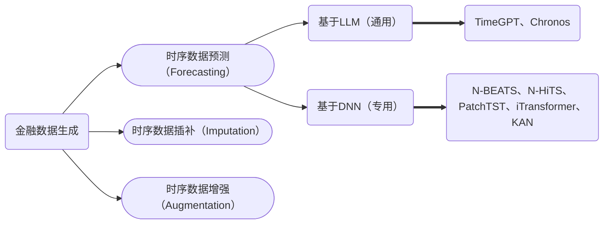

```mermaid
graph LR
    A(金融数据生成) --> B([时序数据预测（Forecasting）])
    B --> B1(基于LLM（通用）) ==> C1(TimeGPT、Chronos)
    B --> B2(基于DNN（专用）) ==> C2(N-BEATS、N-HiTS、PatchTST、iTransformer、KAN)
    A --> C([时序数据插补（Imputation）])
    A --> D([时序数据增强（Augmentation）])
```

## 时序数据预测

## 时序数据插补

## 时序数据增强
