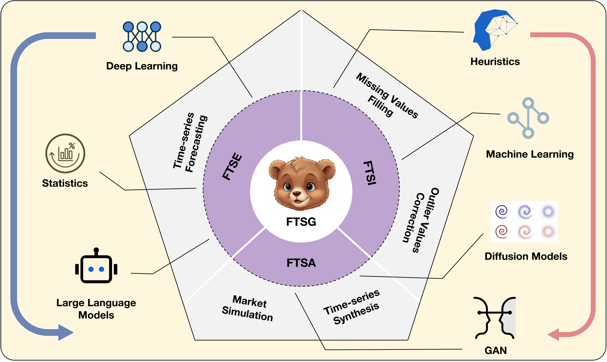
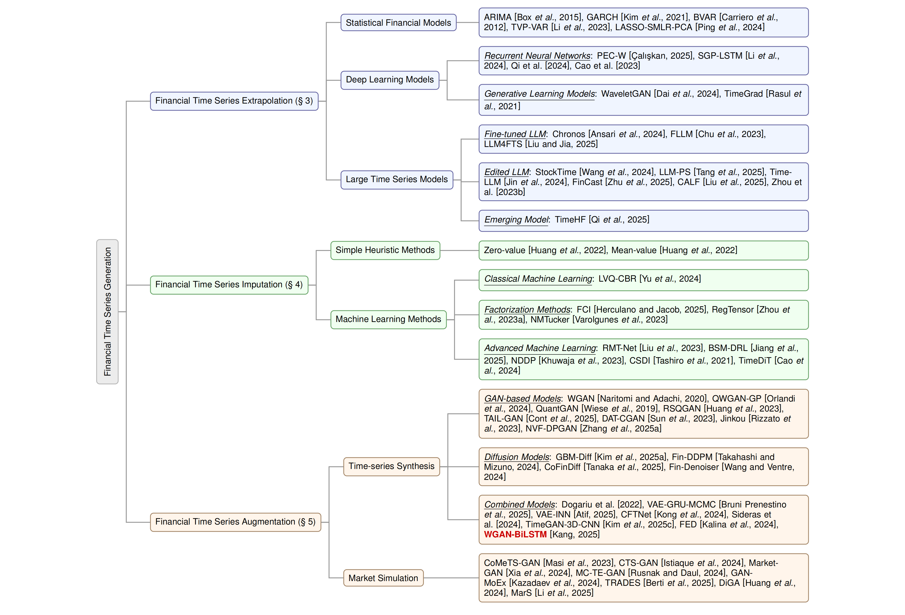

## Recent Advanced Technologies in Financial Time-Series Generation: A Survey

> This repository displays a paper collection of the survey of recent financial data-generation technologies.

  

### Motivations
Time-series generation (TSG) is a crucial technology for enhancing the development of time-series foundation models. 
However, in the financial context, previous surveys have only focused on temporal forecasting or a specific learning paradigm, e.g., deep learning, GAN, LLM, etc., lacking a comprehensive overview of the recent advances in financial time-series generation (FTSG).

### Highlights
1. A two-level taxonomy, covering orthogonal task types and task-agnostic techniques.
2. An overview of the recent advances in FTSG from 2020 to 2024, including 40+ papers.
3. A collection of data resources, including raw data sources, databases, and benchmark datasets for FTSG.
4. Identification of key challenges and potential future research directions in FTSG.

### Taxonomy

----
## Literature Collection

### Financial Time Series Extrapolation

#### [[FINMEM]]() FINMEM: A PERFORMANCE-ENHANCED LLM TRADING AGENT WITH LAYERED MEMORY AND CHARACTER DESIGN
- **Authors**: Yangyang Vu, Haohang Li, Zhi Chen, Yuechen Jiang, Yang Li, Denghui Zhang, Rong Liu, Jordan W. Suchow, Khaldoun Khashanah
- **Year**: 2024
- **Task**: 量化交易策略开发
- **Abstract**: 为解决传统金融交易代理在处理多源异构金融数据时缺乏可解释性、记忆能力不足和无法自适应市场变化的问题，本文提出FINMEM，一种基于大语言模型（LLM）的自主交易代理框架，通过分层记忆模块模拟人类工作记忆与长期记忆结构，结合动态角色配置（如风险偏好自适应）和多层信息处理机制，实现对新闻、财报等时序金融数据的高效整合与优先级排序，显著提升交易收益与决策鲁棒性。

#### [[Financial TimesFM]]() Financial Fine-tuning a Large Time Series Model
- **Authors**: Xinghong Fu, Masanori Hirano, Kentaro Imajo
- **Year**: 2024
- **Task**: 股票价格预测
- **Abstract**: 为解决金融价格数据的非平稳性和极端波动导致基础时间序列模型TimesFM预测性能差的问题，本文提出对TimesFM进行金融数据持续预训练，通过对价格数据进行对数变换稳定损失函数并优化掩码策略，使模型在多种金融市场中显著提升预测准确率，并在模拟交易中实现优于基准模型的收益、夏普比率和最大回撤表现。

#### Large Language Models for Financial Aid in Financial Time-series Forecasting
- **Authors**: Md Khairul Islam, Ayush Karmacharya, Timothy Sue, Judy Fox
- **Year**: 2024
- **Task**: 财政援助资金预测
- **Abstract**: 为解决金融援助领域因数据稀缺导致传统深度学习模型效果不佳的问题，本文提出利用预训练大语言模型（LLM）作为基础模型，在仅使用少量训练数据（少样本）或完全不微调（零样本）的情况下，对州级财政援助资金进行年度预测，实验表明TimeLLM和PatchTST在少样本场景下表现最优，而GPT4TS在零样本场景下表现相对较好，但整体零样本效果仍有限。

#### [[PEC-W]]() Enhancing Recurrent Neural Networks For Stock Market Forecasts through PEC-W Framework
- **Authors**: Bus¸ra C¸ alıs¸kan
- **Year**: 2024
- **Task**: 股票价格预测
- **Abstract**: 为解决股票市场短期预测中LSTM和GRU模型存在的过拟合与训练时间长问题，本文提出一种基于PEC-W预处理框架的方法，通过滚动窗口均值聚合、均值减法归一化和离散小波变换（DWT）增强时序特征并降低数据维度，同时结合SHAP可解释性分析验证模型有效性，显著提升了预测精度并大幅缩短训练时间。

#### A semi-heterogeneous ensemble forecasting method for stock returns based on sentiment analysis
- **Authors**: Xiao Zhang, Peide Liu, Jing Feng
- **Year**: 2023
- **Task**: 股票收益预测
- **Abstract**: 为解决股票收益预测中传统模型忽视投资者情绪与特征多样性的问题，本文提出一种基于情感分析的半异构集成预测方法，通过监督数据增强构建注意力-PCA情感指数，结合变量扰动生成多样化的基模型（MLR与BPNN），并采用加权集成策略融合异构与同构优势，显著提升了S&P 500收益预测的准确性与泛化能力。

#### [[ALN]]() Adversarial Learning Networks for FinTech Applications Using Heterogeneous Data Sources
- **Authors**: Parus Khuwaja, Sunder Ali Khowaja, Kapal Dev
- **Year**: 2023
- **Task**: 股票价格预测
- **Abstract**: 为解决金融市场上由于数据异构性、缺失值和市场崩盘期间预测性能下降的问题，本文提出一种基于对抗学习网络（ALN）的股票价格预测框架，通过融合股票价格、推文和全球宏观指标构建异构知识库，采用改进的牛顿插值多项式（NDDP）进行缺失值插补，利用LSTM提取时序特征，并设计HDFM Q-learning（批评者）与对抗性Q-learning（参与者）网络进行对抗训练，显著提升了在市场波动和崩盘场景下的预测准确率，相比现有方法在准确率上提升5.58%以上。

#### [[SGP-LSTM]]() Forecasting stock prices changes using long‑short term memory neural network with symbolic genetic programming
- **Authors**: Qi Li, Norshaliza Kamaruddin, Siti Sophiayati Yuhaniz, Hamdan Amer Ali Al-Jaif
- **Year**: 2023
- **Task**: 股票收益跨截面预测
- **Abstract**: 为解决中国股票市场跨截面收益预测中特征工程薄弱和传统深度学习模型精度不足的问题，本文提出一种结合符号遗传编程（SGP）与长短期记忆网络（LSTM）的混合模型，通过SGP自动生成并优化融合基本面与技术面指标的非线性特征，再输入LSTM进行时序模式学习，显著提升了预测准确率和风险调整收益，Rank IC和ICIR分别提升1128%和5360%（基本面）及20%和2752%（技术面），年化超额收益超越CSI 300达31.00%

#### [[StockTime]]() StockTime: A Time Series Specialized Large Language Model Architecture for Stock Price Prediction
- **Authors**: Shengkun Wang, Taoran Ji, Linhan Wang, Yanshen Sun, Shang-Ching Liu, Amit Kumar, Chang-Tien Lu
- **Year**: 2024
- **Task**: 股票价格预测
- **Abstract**: 为解决传统金融大语言模型（FinLLMs）在股票价格预测中忽视时序特征、依赖冗余文本信息且效率低下的问题，本文提出StockTime，一种专门针对股票价格时序数据的LLM架构，通过将股票价格分块为令牌、提取其相关性与统计趋势等文本信息，并与自回归编码器提取的时序特征在嵌入空间融合，利用冻结的LLM进行下一令牌预测，从而在不微调LLM的情况下实现更高精度、更低资源消耗的多周期股票价格预测。

#### [[FinSrag]]() Retrieval-augmented Large Language Models for Financial Time Series Forecasting
- **Authors**: Mengxi Xiao, Zhengyu Chen, Lingfei Qian, Zihao Jiang, Yueru He, Yijing Xu, Yuechen Jiang, Dong Li, Ruey-Ling Weng, Jimin Huang, Min Peng, Sophia Ananiadou, Jian-Yun Nie, Qianqian Xie
- **Year**: 2024
- **Task**: 股票价格走势预测
- **Abstract**: 为解决金融时序数据中传统检索方法难以捕捉复杂时序依赖与隐含市场信号的问题，本文提出FinSrag框架，通过引入基于LLM反馈训练的领域专用检索器FinSeer，从包含28个金融指标的增强数据集中检索最具预测价值的历史序列，并将其注入微调的StockLLM中进行股票涨跌预测，显著提升了预测准确率并超越了现有文本和距离基检索方法。

#### [[Hierarchical-LSTM]]() Nonlinear Regression with Hierarchical Recurrent Neural Networks Under Missing Data
- **Authors**: S. Onur Sahin, Suleyman S. Kozat
- **Year**: 2023
- **Task**: 股票价格预测
- **Abstract**: 为解决序列数据中存在缺失值导致传统神经网络性能下降的问题，本文提出了一种层次化LSTM架构，通过将输入空间根据历史输入的‘存在模式’划分为多个区域，并为每个模式分配独立的LSTM专家网络，仅利用实际存在的输入进行预测，避免数据插补带来的误差累积，从而在金融和真实世界数据集上显著提升了预测精度且计算复杂度与传统LSTM相当。

#### [[Chronos]]() LLMs for Time Series: an Application for Single Stocks and Statistical Arbitrage
- **Authors**: Sebastien Valeyre, Sofiane Aboura
- **Year**: 2024
- **Task**: 量化交易策略开发
- **Abstract**: 为解决金融时间序列预测中传统模型难以识别微弱市场无效性的问题，本文提出使用预训练和微调的LLM模型Chronos对美国个股残差收益进行日度预测，通过零样本和在线微调方式构建多空投资组合，实证表明Chronos能在不依赖金融数据预训练的情况下识别出可盈利的交易信号，实现高达4.21的夏普比率，虽仍低于专用模型但证明了LLM在噪声金融数据中提取Alpha的潜力。

#### [[Wavelet-GAN]]() A Novel Wavelet based Generative Model for Time Series Prediction
- **Authors**: Chaofan Dai, Xiaoguang Yuan, Zongkai Tian, Xinyue Hu, Zhen Luan, Youchen Wang
- **Year**: 2024
- **Task**: 股票价格预测
- **Abstract**: 为解决股票市场非线性、非平稳时间序列预测精度低的问题，本文提出一种基于小波变换的生成对抗网络（Wavelet-GAN），通过小波分解将原始股价序列分解为多尺度频域分量，对各分量分别建立ARMA模型预测其系数，再将预测系数输入Wasserstein GAN框架进行生成对抗训练以重建高精度股价序列，实验表明该方法在预测准确率上显著优于GRU、LSTM和传统GAN模型。

#### [[TimeS]]() Text2TimeSeries: Enhancing Financial Forecasting through Time Series Prediction Updates with Event-Driven Insights from Large Language Models
- **Authors**: Litton Jose Kurisinkel, Pruthwik Mishra, Yue Zhang
- **Year**: 2023
- **Task**: 股票价格预测
- **Abstract**: 为解决金融时序预测中传统模型忽略事件驱动非数值因素导致预测不准确的问题，本文提出Text2TimeSeries方法，利用大语言模型（LLM）预测事件对股票价格的多步变化趋势（离散标签），并通过门控循环单元计算股票状态，生成价格放大/衰减值，动态更新时间序列模型的预测结果，从而在小盘、中盘和大盘股票上显著降低预测误差（RMSE和MAE）。

#### [[Time-LLM]]() Large Language Models for Financial Time Series Forecasting
- **Authors**: Miguel Noguer i Alonso, Rodolfo Pereira Franklin
- **Year**: 2025
- **Task**: 股票价格预测
- **Abstract**: 为解决传统时间序列模型在金融数据中泛化能力差和依赖大量标注数据的问题，本文评估了包括Time-LLM在内的多种大语言模型（LLM）在股票价格预测中的表现，其基本思路是通过文本重编程（patch reprogramming）和提示引导（Prompt-as-Prefix）将连续时间序列转化为语言模型可处理的离散文本表示，无需微调基础LLM即可实现零样本或小样本预测，实验表明Time-LLM、PatchTST和KAN在稳定与波动市场中均能超越传统模型如NBEATS和NHITS。

#### [[AssetGANs]]() Distributed Generative Adversarial Networks for Fuzzy Portfolio Optimization
- **Authors**: Xueying Yang, Chen Li, Zidong Han, Zhonghua Lu
- **Year**: 2023
- **Task**: 多步 ahead 股票收益模拟与模糊投资组合优化
- **Abstract**: 为解决金融时间序列多步预测精度低、训练效率差及模糊投资组合优化计算耗时的问题，本文提出基于WGAN-GP的分布式生成对抗网络AssetGANs，通过卷积神经网络生成器与判别器联合训练模拟未来多日资产收益，并结合模糊模拟与MPI并行化遗传算法优化模糊Mean-CVaR投资组合模型，实现了比LSTM更低的RMSE（0.4615 vs 0.6638）和8 GPU下573倍的训练加速，同时模糊组合优化并行效率达96.3%。

#### Large Scale Financial Time Series Forecasting with Multi-faceted Model
- **Authors**: Defu Cao, Yixiang Zheng, Parisa Hassanzadeh, Simran Lamba, Xiaomo Liu, Yan Liu
- **Year**: 2023
- **Task**: 收入与EBITDA预测
- **Abstract**: 为解决金融时序预测中因分布偏移导致的模型泛化能力差的问题，本文提出一种基于松弛不变风险最小化的多面统一模型，通过引入优化驱动的正则化项放宽传统IRM的严格约束，在S&P 500多行业数据上联合训练线性/非线性模型，显著提升对已见和零样本行业的预测准确性，EBITDA预测误差平均降低27.87%。

#### [[LLM4FTS]]() LLM4FTS: Enhancing Large Language Models for Financial Time Series Prediction
- **Authors**: Renjun Jia, Zian Liu, Peng Zhu, Dawei Cheng, Yuqi Liang
- **Year**: 2024
- **Task**: 股票收益预测
- **Abstract**: 为解决金融时间序列中低信噪比与多尺度模式难以建模的问题，本文提出LLM4FTS框架，通过基于DTW的K-means++聚类识别尺度不变模式、自适应分段策略保留模式完整性、动态小波卷积模块实现多尺度时频特征提取，结合两阶段预训练与微调，在四个真实金融市场数据集上实现了超越现有SOTA方法的股票收益预测精度与风险调整收益，并成功部署于实盘交易系统获得持续超额收益。

#### [[GraphSAGE-CTGAN]]() Graph-Based Inductive Learning for Credit Risk Prediction with Imbalance Mitigation
- **Authors**: Sogand Pourkhoshgoftar, Asadollah Shahbahrami, Nima Esmi
- **Year**: 2025
- **Task**: 信用风险评估
- **Abstract**: 为解决信用风险预测中极端类别不平衡和非线性借款人关系建模不足的问题，本文提出一种结合条件表格生成对抗网络（CTGAN）与图采样与聚合图神经网络（GraphSAGE）的混合方法，先通过CTGAN生成合成违约样本以平衡数据分布，再构建借款人相似性图并利用GraphSAGE进行归纳式关系学习，最终在GMSC和GC数据集上显著提升了准确率、F1分数和AUC指标，同时通过SHAP增强模型可解释性。

#### [[ORGAN-FVT]]() An Efcient GAN‑Based Multi‑classifcation Approach for Financial Time Series Volatility Trend Prediction
- **Authors**: Lei Liu, Zheng Pei, Peng Chen, Hang Luo, Zhisheng Gao, Kang Feng, Zhihao Gan
- **Year**: 2023
- **Task**: 金融时序波动趋势多分类预测
- **Abstract**: 为解决金融时间序列中短期、中性、长期波动趋势的多分类预测问题，本文提出了一种基于序回归生成对抗网络（ORGAN-FVT）的方法，通过ConvLSTM生成器学习时序数据分布，结合引入序回归惩罚机制的MLP判别器，优化预测结果对误判方向（如将短期误判为长期）的敏感性，显著提升了在MSFT、TSLA和PAICC三个股票数据集上的AUC和F1分数，最高提升达20.81%

#### [[LASSOSMLR-PCA-LSTM]]() Price Forecast of Treasury Bond Market Yield: Optimize Method Based on Deep Learning Model
- **Authors**: WEIYING PING, YUWEN HU, LIANGQING LUO
- **Year**: 2023
- **Task**: 国债收益率预测
- **Abstract**: 为解决国债收益率预测中多变量时间序列高噪声、非线性和多重共线性导致的传统模型精度不足的问题，本文提出一种基于LASSO-SMLR-PCA降维与贝叶斯优化LSTM的深度学习模型框架，通过逐步筛选和降维处理输入变量，再利用贝叶斯优化调整LSTM超参数，实现了对国债收益率的高精度滚动预测，显著提升了模型拟合效果与实际应用稳定性。

#### [[MVO-BiGRU]]() A Novel Hybrid Deep Learning
- **Authors**: Farhat Iqbal, Dimitrios Koutmos, Eman A. Ahmed, Lulwah M. Al-Essa
- **Year**: 2024
- **Task**: 外汇汇率预测
- **Abstract**: 为解决低频金融时间序列数据中过拟合和预测精度低的问题，本文提出了一种名为MVO-BiGRU的混合深度学习模型，该方法通过变分模态分解（VMD）将汇率序列分解为多个子序列，利用防过拟合模块（Prevention module）随机组合子序列进行数据增强，结合预测模块（Prediction module）使用全部子序列进行建模，并通过Optuna优化超参数，最终融合两模块输出通过全连接网络预测汇率，实现了显著优于基准模型的预测精度和泛化能力。

#### [[MVO-BiGRU]]() A Novel Hybrid Deep Learning Method for Accura
- **Authors**: Farhat Iqbal, Dimitrios Koutmos, Eman A. Ahmed, Lulwah M. Al-Essa
- **Year**: 2024
- **Task**: 外汇汇率预测
- **Abstract**: 为解决低频金融时间序列数据中过拟合和预测精度低的问题，本文提出了一种名为MVO-BiGRU的混合深度学习模型，通过变分模态分解（VMD）将汇率序列分解为多个子序列，利用预防模块随机组合子序列进行数据增强以提升泛化能力，再结合预测模块使用全部子序列进行建模，并通过Optuna优化超参数，最终在EUR/SAR和EUR/CNY汇率预测中实现了显著优于基准模型的预测精度和稳定性。

### Financial Time Series Imputation

#### Stripping the Swiss discount curve using kernel ridge regression
- **Authors**: Nicolas Camenzind, Damir Filipović
- **Year**: 2024
- **Task**: 无风险贴现曲线估计
- **Abstract**: 为解决瑞士国债市场中无风险贴现曲线估计的鲁棒性与灵活性不足问题，本文提出基于核岭回归（KR）的方法，通过在再生核希尔伯特空间中最小化定价误差与曲线平滑性的加权和，实现数据驱动、可解释且优于传统方法（如Smith–Wilson、SST和SNB）的曲线拟合与外推效果。

#### [[RegTensor]]() A Fast Non-Linear Coupled Tensor Completion Algorithm for Financial Data Integration and Imputation
- **Authors**: Dan Zhou, Ajim Uddin, Zuofeng Shang, Cheickna Sylla, Xinyuan Tao, Dantong Yu
- **Year**: 2023
- **Task**: 金融数据缺失值插补
- **Abstract**: 为解决金融数据中高稀疏张量的缺失值插补问题，本文提出了一种名为RegTensor的正则化非线性耦合张量完成算法，通过引入多层感知机（MLP）建模嵌入向量间的非线性交互，并结合正交正则化抑制过拟合与特征冗余，同时耦合辅助张量增强嵌入学习，实现在债券特征和分析师盈利预测等金融数据集上显著优于线性和现有非线性模型的插补精度（提升2%-52%）。

#### [[NMTucker]]() NMTucker: Non-linear Matryoshka Tucker Decomposition for Financial Time Series Imputation
- **Authors**: Uras Varolgunes, Dan Zhou, Dantong Yu, Ajim Uddin
- **Year**: 2023
- **Task**: 金融时序数据插补
- **Abstract**: 为解决金融时间序列中高稀疏性数据的缺失值插补问题，本文提出NMTucker方法，通过递归分解Tucker核心张量并引入多层非线性激活函数模拟复杂非线性交互，显著降低过拟合并提升插补精度，在多个真实金融数据集上比现有模型降低最高53.91%的RMSE。

#### Missing value imputation and the effect of feature normalisation on financial distress prediction
- **Authors**: Kuen-Liang Sue, Chih-Fong Tsai, Hau-Min Tsau
- **Year**: 2024
- **Task**: 财务困境预测
- **Abstract**: 为解决财务困境预测中缺失值插补和特征归一化对模型性能的影响问题，本文比较了KNN、随机森林、MICE和深度神经网络等多种插补方法，并评估了最小-最大归一化对不同分类器（SVM、RF、DNN）预测效果的影响，发现随机森林插补效果最优，且归一化显著提升SVM和DNN性能但对RF无显著增益。

### Financial Time Series Augmentation

#### [[DiGA]]() Controllable Financial Market Generation with Diffusion Guided Meta Agent
- **Authors**: Yu-Hao Huang, Chang Xu, Yang Liu, Weiqing Liu, Wu-Jun Li, Jiang Bian
- **Year**: 2023
- **Task**: 订单流生成
- **Abstract**: 为解决金融市场上订单流生成缺乏可控性与高保真度的问题，本文提出Diffusion Guided meta Agent (DiGA)模型，通过条件扩散模型建模市场状态（如中价回报率和订单到达率）的时变分布，并结合具有金融经济先验的元代理按分布采样订单，实现了对市场场景（如收益、波动率）的精准控制与高保真订单流生成。

#### [[MarS]]() MARS: A FINANCIAL MARKET SIMULATION ENGINE POWERED BY GENERATIVE FOUNDATION MODEL
- **Authors**: Junjie Li, Yang Liu, Weiqing Liu, Shikai Fang, Lewen Wang, Chang Xu, Jiang Bian
- **Year**: 2024
- **Task**: 金融市场的高保真仿真
- **Abstract**: 为解决传统金融市场模拟器缺乏订单级细粒度、可控性与交互性的问题，本文提出基于生成基础模型LMM的MarS仿真引擎，通过订单序列与订单批次的双尺度建模，结合条件生成机制和模拟撮合引擎，实现高保真、可控制、可交互的市场行为仿真，显著提升预测、风险检测、市场影响分析和智能体训练等金融任务的性能与实用性。

#### [[TRADES]]() TRADES: Generating Realistic Market Simulations with Diffusion Models
- **Authors**: Leonardo Berti, Bardh Prenkaj, Paola Velardi
- **Year**: 2025
- **Task**: 限价订单簿市场模拟
- **Abstract**: 为解决金融市场上真实限价订单簿（LOB）数据稀缺且现有生成模型缺乏 realism、responsiveness 和 usefulness 的问题，本文提出 TRADES，一种基于 Transformer 的去噪扩散概率模型，通过条件化历史订单和 LOB 快照生成高保真、可响应的订单流时间序列，显著超越现有方法，在预测得分上提升 3.27–3.48 倍，并能复现金融市场的典型统计特征（stylized facts）。

#### Generating Synthetic Time-Series Data on Edge Devices Using Generative Adversarial Networks
- **Authors**: Md Faishal Yousuf, MD Shaad Mahmud
- **Year**: 2021
- **Task**: 股票价格预测
- **Abstract**: 为解决边缘设备上隐私保护与数据稀缺的金融时序数据生成问题，本文提出一种基于LSTM-GAN的合成时间序列生成方法，通过在边缘设备iBUG上部署经过剪枝和量化优化的生成器，在保留真实数据统计特性的同时实现低资源实时生成，实验表明合成数据与真实数据在PCA和t-SNE分析中高度相似，且参数趋势高度吻合。

#### Management Analysis Method of Multivariate Time Series Anomaly Detection in Financial Risk Assessment
- **Authors**: Yongshan Zhang, Weifang University of Science and Technology, China, Zhiyun Jiang, Weifang University of Science and Technology, China, Cong Peng, Guizhou University of Commerce, China, Xiumei Zhu, Weifang University of Science and Technology, China, Gang Wang, Imperial College London, UK
- **Year**: 2023
- **Task**: 风险评估
- **Abstract**: 为解决金融多变量时间序列异常检测中模型过拟合与泛化能力不足的问题，本文提出一种结合对比学习与生成对抗网络（GAN）的创新方法，通过几何分布掩码进行数据增强，利用Transformer自编码器学习正常模式分布，并在判别器中引入对比损失以增强对正常模式的判别能力，实验表明该方法在四个真实金融数据集上显著优于现有主流方法，有效提升了异常检测的准确性和鲁棒性。

#### [[RSQGAN]]() Regime-Specific Quant Generative Adversarial Network: A Conditional Generative Adversarial Network for Regime-Specific Deepfakes of Financial Time Series
- **Authors**: Andrew Huang, Matloob Khushi, Basem Suleiman
- **Year**: 2023
- **Task**: 风险评估
- **Abstract**: 为解决金融时间序列在市场危机等罕见 regimes 下数据稀缺和非平稳性导致的风险评估困难问题，本文提出了一种名为RSQGAN的条件生成对抗网络，通过结构断点算法（贪婪高斯分割）识别市场 regimes 并将其作为条件标签，利用时序卷积网络（TCN）生成符合特定 regimes 特征的合成资产回报数据，并引入Z-裁剪超参数控制合成数据保真度与多样性，实验证明其在危机 regimes 下的合成数据质量显著优于无条件GAN模型。

#### [[SGP-LSTM]]() Integrating Symbolic Genetic Programming With Lstm for Forecasting Cross-Sectional Price Returns: A Comparative Analysis of Chinese And Japanese Stock Market
- **Authors**: Li Qi, Norshaliza Kamaruddin, Xun Gong, Chen Peng
- **Year**: 2024
- **Task**: 跨市场股票收益排序预测
- **Abstract**: 为解决传统深度学习模型在跨市场股票收益排序预测中因特征数量有限和过拟合导致的精度不足问题，本文提出一种融合符号遗传编程（SGP）与长短期记忆网络（LSTM）的混合模型，通过SGP自动生成高质量金融因子并进行数据增强，再输入LSTM进行跨截面股票收益排序预测，在中国和日本市场分别实现Rank IC提升588.03%和194.27%，并获得显著超额收益。

#### Data Augmentation of High Frequency Financial Data Using Generative Adversarial Network
- **Authors**: Yusuke Naritomi, Takanori Adachi
- **Year**: 2020
- **Task**: 股票执行价格预测
- **Abstract**: 为解决高频金融数据非平稳性导致的预测模型训练数据不足问题，本文提出一种基于Wasserstein GAN的合成数据增强方法，通过结合LSTM与1D-CNN的生成器模拟真实订单事件序列，并利用判别器优化生成数据的分布相似性，最终在人工市场模拟中生成执行价格数据，使股票价格涨跌预测准确率显著高于无数据增强的基线模型。

#### [[CoFinDiff]]() CoFinDiff: Controllable Financial Diffusion Model for Time Series Generation
- **Authors**: Yuki Tanaka, Ryuji Hashimoto, Takehiro Takayanagi, Zhe Piao, Yuri Murayama, Kiyoshi Izumi
- **Year**: 2023
- **Task**: 深度对冲策略训练
- **Abstract**: 为解决金融领域因真实数据稀缺导致的极端事件模拟不足与合成数据可控性差的问题，本文提出CoFinDiff，一种基于条件扩散模型的金融时间序列生成方法，通过将对数收益率序列转换为Haar小波图像，并将趋势与已实现波动率作为条件通过交叉注意力机制注入扩散模型，从而生成符合金融stylized facts（如肥尾、波动聚集）且精准满足指定趋势与波动率条件的多样化合成数据，显著提升了深度对冲任务的模型性能。

#### Time Series Generation with GANs for Momentum Effect Simulation on Moscow Stock Exchange
- **Authors**: Maksim Kazadaev, Vitaliy Pozdnyakov, Ilya Makarov
- **Year**: 2023
- **Task**: 量化交易策略开发
- **Abstract**: 为解决金融时间序列数据稀缺导致的交易策略过拟合问题，本文提出基于时间卷积网络（TCN）的生成对抗网络（GAN）方法，通过生成具有真实统计特性的多维股票对数收益率序列来增强训练数据，从而支持动量效应策略的回测与超参数调优，实验表明该方法能有效模拟股票间相关性但未能充分捕捉动量效应的复杂依赖关系。

#### Generation of Realistic Synthetic Financial Time-series
- **Authors**: MIHAI DOGARIU, LIVIU-DANIEL ŞTEFAN, BOGDAN ANDREI BOTEANU, CLAUDIU LAMBA, BOMI KIM, BOGDAN IONESCU
- **Year**: 2020
- **Task**: 股票价格生成与趋势预测
- **Abstract**: 为解决金融时间序列数据稀缺且难以加速获取的问题，本文提出一种基于多种生成模型（如GANs、VAEs、GMMNs）的合成金融时间序列生成框架，通过引入跨股票相关性捕捉机制、固定到可变长度序列转换策略及基于对数回报的预处理方法，生成具有真实市场统计特性（如肥尾分布、波动聚类）的合成数据，并通过量化指标和股票趋势预测任务验证其有效性，显著提升了预测模型的准确性。

#### [[CT-GAN+NAR-NN]]() RESEARCH ARTICLE
- **Authors**: Aya Salama Abdelhady, Nadia Dahmani, Lobna M. AbouEl-Magd, Ashraf Darwish, Aboul Ella Hassanien
- **Year**: 2024
- **Task**: 绿色金融增长预测
- **Abstract**: 为解决全球绿色金融数据稀缺和非平稳性导致的预测精度不足问题，本文提出一种基于条件生成对抗网络（CT-GAN）数据增强与非线性自回归神经网络（NAR-NN）预测的混合模型，首先通过ADF检验确认数据非平稳性，继而使用CT-GAN生成高质量合成数据以扩充训练集，最后用NAR-NN进行时序预测，实现在欧洲、亚洲及其他地区分别达到98.8%、96.6%和99%的R²预测准确率，显著优于未增强的基线模型。

#### [[QWGAN-GP]]() Article Enhancing Financial Time Series Prediction with Quantum-Enhanced Synthetic Data Generation: A Case Study on the S&P 500 Using a Quantum Wasserstein Generative Adversarial Network Approach with a Gradient Penalty
- **Authors**: Filippo Orlandi, Enrico Barbierato, Alice Gatti
- **Year**: 2024
- **Task**: 股票价格预测
- **Abstract**: 为解决金融时间序列中极端事件样本稀缺导致预测模型性能不足的问题，本文提出一种量子增强的Wasserstein生成对抗网络（QWGAN-GP）方法，通过量子生成器与经典判别器协同生成与S&P 500对数收益率统计特性高度一致的合成数据，并结合LSTM模型验证其在提升预测准确性（尤其是极端事件预测）方面的有效性，实验表明融合合成数据的模型显著优于仅使用真实数据的基准模型。

#### Robust Synthetic Data Generation for Sequentia
- **Authors**: Francesco Bruni Prenestino, Enrico Barbierato, Alice Gatti
- **Year**: 2025
- **Task**: 股票价格合成生成
- **Abstract**: 为解决金融时序数据稀缺与隐私保护下合成数据保真度低的问题，本文提出一种融合变分自编码器（VAE）与马尔可夫链蒙特卡洛（MCMC）采样的混合架构，通过GRU捕获长期时序依赖，并利用MCMC在潜在空间中生成相关样本序列，显著提升了合成数据在统计特性、时序模式和缺失数据鲁棒性方面的保真度。

#### [[FED2Port]]() Article Enhancing Portfolio Performance through Financial Time-Series Decomposition-Based Variational Encoder-Decoder Data Augmentation
- **Authors**: Bayartsetseg Kalina, Ju-Hong Lee, Kwang-Tek Na
- **Year**: 2024
- **Task**: 投资组合多元化
- **Abstract**: 为解决金融时间序列数据不足和历史数据中不确定性缺失导致的投资组合模型性能不佳的问题，本文提出了一种基于金融时间序列分解的变分编码器-解码器（FED）数据增强方法，通过将时间序列分解为趋势、离散度和残差三个潜在组件并重建具有历史不确定性的合成数据，进而构建FED2Port强化学习投资组合模型，显著提升了投资组合的收益风险比和鲁棒性。

#### Generative Adversarial Networks: A Systematic Review of Characteristics, Applications, and Challenges in Financial Data Generation and Market Modeling: 2019-2024
- **Authors**: D. Wilson, A. Azmani
- **Year**: 2025
- **Task**: 金融数据生成与市场建模
- **Abstract**: 为解决金融数据隐私受限、稀缺及传统模型难以捕捉复杂市场动态的问题，本文通过系统综述2019–2024年30篇文献，分析各类GAN架构（如CTGAN、WGAN、TGAN、TTGAN等）在生成高保真合成金融数据中的应用，发现其能有效增强数据隐私性并提升股票预测、风险评估、组合优化等任务性能，但仍面临模式坍塌、训练不稳定和缺乏统一评估标准等挑战。

#### Concatenation Augmentation for Improving Deep Learning Models in Finance NLP with Scarce Data
- **Authors**: César Vaca, Jesús-Ángel Román-Gallego, Verónica Barroso-García, Fernando Tejerina, Benjamín Sahelices
- **Year**: 2025
- **Task**: 董事会成员专业背景提取
- **Abstract**: 为解决金融领域非结构化文本（如公司治理报告中的董事履历）数据稀缺导致深度学习模型性能受限的问题，本文提出了一种名为连接增强（Concatenation Augmentation, CA）的新数据增强方法，通过将原始文本样本串联并基于逻辑激活函数的逆变换对标签进行凸加性融合，生成语义连贯的新样本，显著提升了模型在低数据场景下的准确率（92.4%–99.7%）和鲁棒性。

#### [[FCLM]]() Improving Anti-money Laundering via Fourier-Based Contrastive Learning
- **Authors**: Meihan Tong, Shuai Wang, Xinyu Chen, Jinsong Bei
- **Year**: 2024
- **Task**: 反洗钱检测
- **Abstract**: 为解决现有深度学习反洗钱模型对数据扰动鲁棒性不足的问题，本文提出一种基于傅里叶变换的对比学习模型（FCLM），通过将交易数据从时域映射到频域生成高差异性增强视图，并利用对比学习使模型对原始交易及其增强视图保持预测一致性，从而显著提升检测鲁棒性与泛化能力，在合成与真实数据集上均超越七种先进基线方法。

#### [[WGAN-BiLSTM]]() Stock Price Prediction with Heavy‑Tailed Distribution Time‑Series Generation Based on WGAN‑BiLSTM
- **Authors**: Ming Kang
- **Year**: 2024
- **Task**: 股票价格预测
- **Abstract**: 为解决新上市公司股票数据稀缺导致预测精度低的问题，本文提出WGAN-BiLSTM模型，利用WGAN生成符合真实数据重尾分布的增强样本，并结合BiLSTM双向提取时序特征进行预测，显著提升了小样本场景下的预测准确性。

#### [[GraphSAGE-CTGAN]]() Graph-Based Inductive Learning for Credit Risk Prediction with Imbalance Mitigation
- **Authors**: Sogand Pourkhoshgoftar, Asadollah Shahbahrami, Nima Esmi
- **Year**: 2025
- **Task**: 信用风险评估
- **Abstract**: 为解决信用风险预测中极端类别不平衡和非线性借款人关系建模不足的问题，本文提出一种结合条件表格生成对抗网络（CTGAN）与图采样与聚合图神经网络（GraphSAGE）的混合方法，先通过CTGAN生成合成违约样本以平衡数据分布，再构建借款人相似性图并利用GraphSAGE进行归纳式关系学习，最终在GMSC和GC数据集上显著提升了准确率、F1分数和AUC指标，同时通过SHAP增强模型可解释性。

#### Data Augmentation Using BERT-Based Models for Aspect-Based Sentiment Analysis
- **Authors**: Bron Hollander, Flavius Frasincar, Finn van der Knaap
- **Year**: 2023
- **Task**: 基于方面的情感分析
- **Abstract**: 为解决方面情感分析（ABSA）中训练数据稀缺导致模型性能受限的问题，本文提出在HAABSA++模型中引入多种BERT-based数据增强方法，通过掩码语言建模（MLM）生成语义一致的增强样本，并结合标签感知的BERTprepend和BERTexpand策略保留情感标签信息，显著提升了模型在SemEval 2015和2016数据集上的测试准确率，最高提升达1.85个百分点。

#### [[NVF-DPGAN]]() Desensitized Financial Data Generation Based on Generative Adversarial Network and Differential Privacy
- **Authors**: Fan Zhang, Luyao Wang, Xinhong Zhang
- **Year**: 2024
- **Task**: 金融数据隐私保护与增强
- **Abstract**: 为解决金融数据敏感性强、可用样本少导致深度学习模型训练困难的问题，本文提出NVF-DPGAN模型，通过在生成对抗网络（GAN）的判别器训练过程中引入高斯噪声实现差分隐私保护，并结合噪声可见性函数（NVF）自适应调整噪声强度以保留数据关键特征，从而生成与真实金融数据统计特性高度一致的合成数据，实现数据增强与隐私保护的双重目标。
