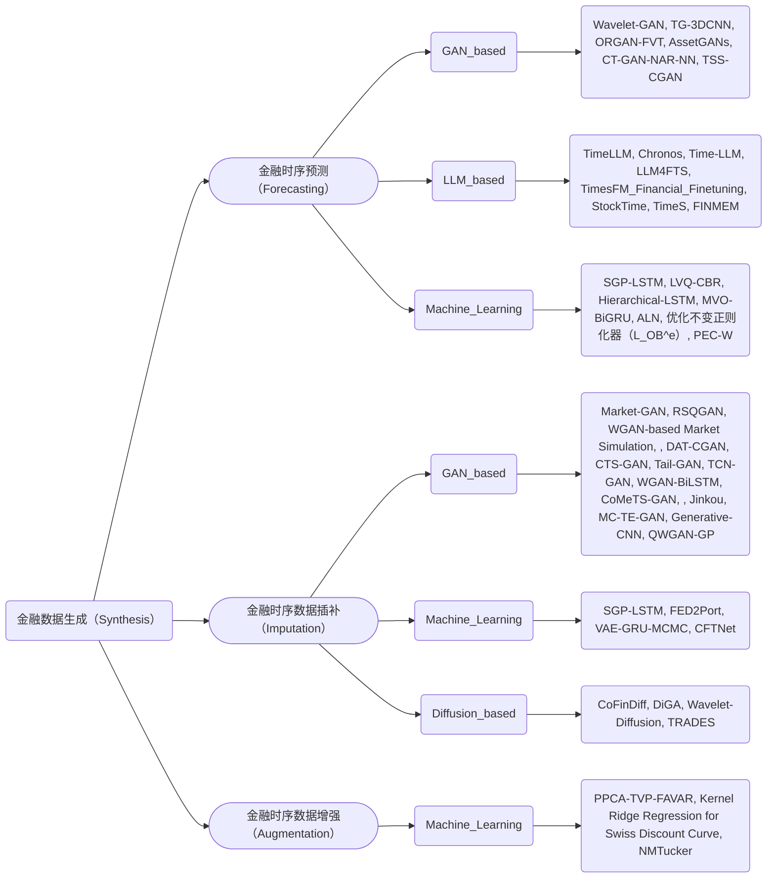

## 金融时间序列数据生成的最新先进技术综述

> This repository displays a paper collection of the survey of recent financial data-generation technologies.

### 写作大纲

| 章节 | 标题 | 主要内容 |
| --- | --- | --- |
| 1 | 引言 | |
| 2 | 时间序列数据预测 | 问题定义、方法分类、评价指标、主要挑战 |
| 3 | 时间序列数据补插 | 问题定义、方法分类、评价指标、主要挑战 |
| 4 | 时间序列数据增强 | 问题定义、方法分类、评价指标、主要挑战 |
| 5 | 数据集整理 | 为方便研究工作的开展，列表总结金融时序数据生成领域的数据集，维度包括开放性、下游任务、数据量等 |
| 6* | 未来方向* | 总结金融时序数据生成领域（非时序预测/合成/增强）未来的研究方向 |
| 7 | 总结 | |

### 基本思路

1. **确定任务**：金融时序预测（基于数据生成方法）、金融时序数据补插、金融时序数据增强
2. **确定技术路线**：
- 金融时序预测：基于机器学习、基于深度学习（基于GAN、DM）、基于大模型（Single Agent、Multi-Agent）、融合方法
- 金融时序数据补插：
- 金融时序数据增强：

### 方法分类

----
## 文献列表

### 金融时序预测

#### StockTime: A Time Series Specialized Large Language Model Architecture for Stock Price Prediction
- **Authors**: Shengkun Wang, Taoran Ji, Linhan Wang, Yanshen Sun, Shang-Ching Liu, Amit Kumar, Chang-Tien Lu
- **Year**: 2024
- **Abstract**: 为解决传统金融大语言模型（FinLLMs）在股票价格预测中忽视时序特征、依赖冗余文本信息且效率低下的问题，本文提出StockTime，一种专门针对股票价格时序数据的LLM架构，通过将股票价格分块为令牌、提取其相关性与统计趋势等文本信息，并与自回归编码器提取的时序特征在嵌入空间融合，利用冻结的LLM进行下一令牌预测，从而在不微调LLM的情况下实现更高精度、更低资源消耗的多周期股票价格预测。

#### Forecasting stock prices changes using long‑short term memory neural network with symbolic genetic programming
- **Authors**: Qi Li, Norshaliza Kamaruddin, Siti Sophiayati Yuhaniz, Hamdan Amer Ali Al-Jaif
- **Year**: 2023
- **Abstract**: 为解决中国股票市场跨截面收益预测中特征工程薄弱和传统深度学习模型精度不足的问题，本文提出一种结合符号遗传编程（SGP）与长短期记忆网络（LSTM）的混合模型，通过SGP自动生成并优化融合基本面与技术面指标的非线性特征，再输入LSTM进行时序模式学习，显著提升了预测准确率和风险调整收益，Rank IC和ICIR分别提升1128%和5360%（基本面）及20%和2752%（技术面），年化超额收益超越CSI 300达31.00%

#### A hybrid carbon price forecasting model combining time series clustering and data augmentation
- **Authors**: Yue Wang, Zhong Wang, Yuyan Luo
- **Year**: 2023
- **Abstract**: 为解决碳价格序列高波动、非平稳和数据量小导致的预测精度低与过拟合问题，本文提出一种融合时间序列聚类、数据增强与TVFEMD分解的混合预测模型Informer-DA-BOHB-TVFEMD-CL，通过TVFEMD分解获得高细节IMF分量，利用时间序列聚类保留高频分量并重构低频分量，采用VAE生成数据增强训练集，并结合BOHB优化的Informer模型进行预测，显著提升了多碳市场的预测精度与交易盈利能力。

#### Large Scale Financial Time Series Forecasting with Multi-faceted Model
- **Authors**: Defu Cao, Yixiang Zheng, Parisa Hassanzadeh, Simran Lamba, Xiaomo Liu, Yan Liu
- **Year**: 2023
- **Abstract**: 为解决金融时序预测中因分布偏移导致的模型泛化能力差的问题，本文提出一种基于松弛不变风险最小化的多面统一模型，通过引入优化驱动的正则化项放宽传统IRM的严格约束，在S&P 500多行业数据上联合训练线性/非线性模型，显著提升对已见和零样本行业的预测准确性，EBITDA预测误差平均降低27.87%。

#### A Novel Wavelet based Generative Model for Time Series Prediction
- **Authors**: Chaofan Dai, Xiaoguang Yuan, Zongkai Tian, Xinyue Hu, Zhen Luan, Youchen Wang
- **Year**: 2024
- **Abstract**: 为解决股票市场非线性、非平稳时间序列预测精度低的问题，本文提出一种基于小波变换的生成对抗网络（Wavelet-GAN），通过小波分解将原始价格序列分解为多尺度频率分量，分别用ARMA模型预测小波系数，再将预测系数输入Wasserstein GAN框架生成合成价格趋势，最终实现比GRU、LSTM和传统GAN更精准的预测效果（R²达0.99）。

#### Enhancing Recurrent Neural Networks For Stock Market Forecasts through PEC-W Framework
- **Authors**: Bus¸ra C¸ alıs¸kan
- **Year**: 2024
- **Abstract**: 为解决股票市场短期预测中LSTM和GRU模型存在的过拟合与训练时间长问题，本文提出一种基于PEC-W预处理框架的方法，通过滚动窗口均值聚合、均值减法归一化和离散小波变换（DWT）增强时序特征并降低数据维度，同时结合SHAP可解释性分析验证模型有效性，显著提升了预测精度并大幅缩短训练时间。

#### Adversarial Learning Networks for FinTech Applications Using Heterogeneous Data Sources
- **Authors**: Parus Khuwaja, Sunder Ali Khowaja, Kapal Dev
- **Year**: 2023
- **Abstract**: 为解决金融市场上由于数据异构性、缺失值和市场崩盘期间预测性能下降的问题，本文提出一种基于对抗学习网络（ALN）的股票价格预测框架，通过融合股票价格、推文和全球宏观指标构建异构知识库，采用改进的牛顿插值多项式（NDDP）进行缺失值插补，利用LSTM提取时序特征，并设计HDFM Q-learning（批评者）与对抗性Q-learning（参与者）网络进行对抗训练，显著提升了在市场波动和崩盘场景下的预测准确率，相比现有方法在准确率上提升5.58%以上。

#### Distributed Generative Adversarial Networks for Fuzzy Portfolio Optimization
- **Authors**: Xueying Yang, Chen Li, Zidong Han, Zhonghua Lu
- **Year**: 2023
- **Abstract**: 为解决金融时间序列多步预测精度低、训练效率差及模糊投资组合优化计算耗时的问题，本文提出基于WGAN-GP的分布式生成对抗网络AssetGANs，通过卷积神经网络生成器与判别器联合训练模拟未来多日资产收益，并结合模糊模拟与MPI并行化遗传算法优化模糊Mean-CVaR投资组合模型，实现了比LSTM更低的RMSE（0.4615 vs 0.6638）和8 GPU下573倍的训练加速，同时模糊组合优化并行效率达96.3%。

#### Large Language Models for Financial Time Series Forecasting
- **Authors**: Miguel Noguer i Alonso, Rodolfo Pereira Franklin
- **Year**: 2025
- **Abstract**: 为解决传统时间序列模型在金融数据中泛化能力差和依赖大量标注数据的问题，本文评估了包括Time-LLM在内的多种大语言模型（LLM）在股票价格预测中的表现，其基本思路是通过文本重编程（patch reprogramming）和提示引导（Prompt-as-Prefix）将连续时间序列转化为语言模型可处理的离散文本表示，无需微调基础LLM即可实现零样本或小样本预测，实验表明Time-LLM、PatchTST和KAN在稳定与波动市场中均能超越传统模型如NBEATS和NHITS。

#### Large Language Models for Financial Aid in Financial Time-series Forecasting
- **Authors**: Md Khairul Islam, Ayush Karmacharya, Timothy Sue, Judy Fox
- **Year**: 2024
- **Abstract**: 为解决金融援助领域因数据稀缺导致传统深度学习模型效果不佳的问题，本文提出利用预训练大语言模型（LLM）作为基础模型，在仅使用少量训练数据（少样本）或完全不微调（零样本）的情况下，对州级财政援助资金进行年度预测，实验表明TimeLLM和PatchTST在少样本场景下表现最优，而GPT4TS在零样本场景下表现相对较好，但整体零样本效果仍有限。

#### An Efcient GAN‑Based Multi‑classifcation Approach for Financial Time Series Volatility Trend Prediction
- **Authors**: Lei Liu, Zheng Pei, Peng Chen, Hang Luo, Zhisheng Gao, Kang Feng, Zhihao Gan
- **Year**: 2023
- **Abstract**: 为解决金融时间序列中短期、中性、长期波动趋势的多分类预测问题，本文提出了一种基于序回归生成对抗网络（ORGAN-FVT）的方法，通过ConvLSTM生成器学习时序数据分布，结合引入序回归惩罚机制的MLP判别器，优化预测结果对误判方向（如将短期误判为长期）的敏感性，显著提升了在MSFT、TSLA和PAICC三个股票数据集上的AUC和F1分数，最高提升达20.81%

#### A semi-heterogeneous ensemble forecasting method for stock returns based on sentiment analysis
- **Authors**: Xiao Zhang, Peide Liu, Jing Feng
- **Year**: 2023
- **Abstract**: 为解决股票收益预测中传统模型忽视投资者情绪与特征多样性的问题，本文提出一种基于情感分析的半异构集成预测方法，通过监督数据增强构建注意力-PCA情感指数，结合变量扰动生成多样化的基模型（MLR与BPNN），并采用加权集成策略融合异构与同构优势，显著提升了S&P 500收益预测的准确性与泛化能力。

#### Price Forecast of Treasury Bond Market Yield: Optimize Method Based on Deep Learning Model
- **Authors**: WEIYING PING, YUWEN HU, LIANGQING LUO
- **Year**: 2023
- **Abstract**: 为解决国债收益率预测中多变量时间序列高噪声、非线性和多重共线性导致的传统模型精度不足的问题，本文提出一种基于LASSO-SMLR-PCA降维与贝叶斯优化LSTM的深度学习模型框架，通过逐步筛选和降维处理输入变量，再利用贝叶斯优化调整LSTM超参数，实现了对国债收益率的高精度滚动预测，显著提升了模型拟合效果与实际应用稳定性。

#### Article
- **Authors**: Farhat Iqbal, Dimitrios Koutmos, Eman A. Ahmed, Lulwah M. Al-Essa
- **Year**: 2024
- **Abstract**: 为解决低频金融时间序列数据中过拟合和预测精度低的问题，本文提出了一种名为MVO-BiGRU的混合深度学习模型，该方法通过变分模态分解（VMD）将汇率序列分解为多个子序列，利用防过拟合模块（Prevention module）随机组合子序列进行数据增强，结合预测模块（Prediction module）使用全部子序列进行建模，并通过Optuna优化超参数，最终融合两模块输出通过全连接网络预测汇率，实现了显著优于基准模型的预测精度和泛化能力。

#### Financial Fine-tuning a Large Time Series Model
- **Authors**: Xinghong Fu, Masanori Hirano, Kentaro Imajo
- **Year**: 2024
- **Abstract**: 为解决金融价格数据的非平稳性和极端波动导致基础时间序列模型TimesFM预测性能差的问题，本文提出对TimesFM进行金融数据持续预训练，通过对价格数据进行对数变换稳定损失函数并优化掩码策略，使模型在多种金融市场中显著提升预测准确率，并在模拟交易中实现优于基准模型的收益、夏普比率和最大回撤表现。

#### Retrieval-augmented Large Language Models for Financial Time Series Forecasting
- **Authors**: Mengxi Xiao, Zhengyu Chen, Lingfei Qian, Zihao Jiang, Yueru He, Yijing Xu, Yuechen Jiang, Dong Li, Ruey-Ling Weng, Jimin Huang, Min Peng, Sophia Ananiadou, Jian-Yun Nie, Qianqian Xie
- **Year**: 2024
- **Abstract**: 为解决金融时序数据中传统检索方法难以捕捉复杂时序依赖与隐含市场信号的问题，本文提出FinSrag框架，通过引入基于LLM反馈训练的领域专用检索器FinSeer，从包含28个金融指标的增强数据集中检索最具预测价值的历史序列，并将其注入微调的StockLLM中进行股票涨跌预测，显著提升了预测准确率并超越了现有文本和距离基检索方法。

#### Nonlinear Regression with Hierarchical Recurrent Neural Networks Under Missing Data
- **Authors**: S. Onur Sahin, Suleyman S. Kozat
- **Year**: 2023
- **Abstract**: 为解决序列数据中存在缺失值导致传统神经网络性能下降的问题，本文提出了一种层次化LSTM架构，通过将输入空间根据历史输入的‘存在模式’划分为多个区域，并为每个模式分配独立的LSTM专家网络，仅利用实际存在的输入进行预测，避免数据插补带来的误差累积，从而在金融和真实世界数据集上显著提升了预测精度且计算复杂度与传统LSTM相当。

#### A Financial Time Series Denoiser Based on Diffusion Models
- **Authors**: Zhuohan Wang, Carmine Ventre
- **Year**: 2024
- **Abstract**: 为解决金融时间序列信噪比低导致预测不准和交易效率低的问题，本文提出一种基于条件扩散模型的去噪方法，通过前向加噪与反向去噪过程结合分类器无引导和总变差/傅里叶损失辅助优化，重构更平滑且趋势保留的时序数据，显著提升未来收益分类准确率与交易收益并降低交易频率。

#### Probabilistic simulation of electricity price scenarios using Conditional Generative Adversarial Networks
- **Authors**: Viktor Walter, Andreas Wagner
- **Year**: 2023
- **Abstract**: 为解决日前电力市场价格分布建模中传统统计模型依赖复杂假设和难以捕捉市场特异性规律的问题，本文提出一种基于条件生成对抗网络（TSS-CGAN）的方法，通过融合电价预测、可再生能源出力、负荷、小时信息等多变量时序特征，利用一维卷积网络提取空间特征、双向LSTM捕捉时序依赖，并通过生成器与判别器对抗训练生成24小时电价场景，实现了比DeepAR等基准模型降低50%连续排序概率得分（CRPS）的显著效果，能准确反映可再生能源波动对电价的非线性影响。

#### Article
- **Authors**: Farhat Iqbal, Dimitrios Koutmos, Eman A. Ahmed, Lulwah M. Al-Essa
- **Year**: 2024
- **Abstract**: 为解决低频金融时间序列数据中过拟合和预测精度低的问题，本文提出了一种名为MVO-BiGRU的混合深度学习模型，通过变分模态分解（VMD）将汇率序列分解为多个子序列，利用预防模块随机组合子序列进行数据增强以提升泛化能力，再结合预测模块使用全部子序列进行建模，并通过Optuna优化超参数，最终在EUR/SAR和EUR/CNY汇率预测中实现了显著优于基准模型的预测精度和稳定性。

#### LLMs for Time Series: an Application for Single Stocks and Statistical Arbitrage
- **Authors**: Sebastien Valeyre, Sofiane Aboura
- **Year**: 2024
- **Abstract**: 为解决金融时间序列预测中传统模型难以识别微弱市场无效性的问题，本文提出使用预训练和微调的LLM模型Chronos对美国个股残差收益进行日度预测，通过零样本和在线微调方式构建多空投资组合，实证表明Chronos能在不依赖金融数据预训练的情况下识别出可盈利的交易信号，实现高达4.21的夏普比率，虽仍低于专用模型但证明了LLM在噪声金融数据中提取Alpha的潜力。

#### Natural Language Processing and Deep Learning for Bankruptcy Prediction: An End-to-End Architecture
- **Authors**: GIANFRANCO LOMBARDO, ANDREA BERTOGALLI, SERGIO CONSOLI, DIEGO REFORGIATO RECUPERO
- **Year**: 2023
- **Abstract**: 为解决企业破产预测中传统方法无法有效利用财务报告文本信息且难以适应概念漂移的问题，本文提出一种端到端的Transformer与多头LSTM融合架构，通过文本摘要模块提取SEC年报中的关键语义信息并结合财务时序数据进行联合建模，实现了87.5%的预测准确率和0.84的违约召回率，显著优于单一数据源模型。

#### CAMEF: Causal-Augmented Multi-Modality Event-Driven Financial Forecasting by Integrating Time Series Patterns and Salient Macroeconomic Announcements
- **Authors**: Yang Zhang, Wenbo Yang, Jun Wang, Qiang Ma, Jie Xiong
- **Year**: 2025
- **Abstract**: 为解决现有金融预测方法忽视宏观事件与市场反应之间的因果关系及多模态信息融合不足的问题，本文提出CAMEF方法，通过整合高频率时间序列数据与宏观事件文本，利用LLM生成反事实事件增强因果学习，并设计多模态编码-融合-解码架构，显著提升对市场反应的预测准确性与鲁棒性。

#### A Novel Wavelet based Generative Model for Time Series Prediction
- **Authors**: Chaofan Dai, Xiaoguang Yuan, Zongkai Tian, Xinyue Hu, Zhen Luan, Youchen Wang
- **Year**: 2024
- **Abstract**: 为解决股票市场非线性、非平稳时间序列预测精度低的问题，本文提出一种基于小波变换的生成对抗网络（Wavelet-GAN），通过小波分解将原始股价序列分解为多尺度频域分量，对各分量分别建立ARMA模型预测其系数，再将预测系数输入Wasserstein GAN框架进行生成对抗训练以重建高精度股价序列，实验表明该方法在预测准确率上显著优于GRU、LSTM和传统GAN模型。

#### Text2TimeSeries: Enhancing Financial Forecasting through Time Series Prediction Updates with Event-Driven Insights from Large Language Models
- **Authors**: Litton Jose Kurisinkel, Pruthwik Mishra, Yue Zhang
- **Year**: 2023
- **Abstract**: 为解决金融时序预测中传统模型忽略事件驱动非数值因素导致预测不准确的问题，本文提出Text2TimeSeries方法，利用大语言模型（LLM）预测事件对股票价格的多步变化趋势（离散标签），并通过门控循环单元计算股票状态，生成价格放大/衰减值，动态更新时间序列模型的预测结果，从而在小盘、中盘和大盘股票上显著降低预测误差（RMSE和MAE）。

#### LLM4FTS: Enhancing Large Language Models for Financial Time Series Prediction
- **Authors**: Renjun Jia, Zian Liu, Peng Zhu, Dawei Cheng, Yuqi Liang
- **Year**: 2024
- **Abstract**: 为解决金融时间序列中低信噪比与多尺度模式难以建模的问题，本文提出LLM4FTS框架，通过基于DTW的K-means++聚类识别尺度不变模式、自适应分段策略保留模式完整性、动态小波卷积模块实现多尺度时频特征提取，结合两阶段预训练与微调，在四个真实金融市场数据集上实现了超越现有SOTA方法的股票收益预测精度与风险调整收益，并成功部署于实盘交易系统获得持续超额收益。

### 金融时序数据插补

#### Handling missing data in Burundian sovereign bond market
- **Authors**: Irene Irakoze, Rédempteur Ntawiratsa, David Niyukuri
- **Year**: 2024
- **Abstract**: 为解决布隆迪主权债券市场因数据缺失导致收益率曲线构建困难的问题，本文提出使用线性回归和前值插补方法对缺失的债券价格、收益率和票息率进行填补，通过模拟缺失数据并评估各方法的平均绝对误差及正态性检验，发现线性回归方法在误差分布接近正态分布和预测能力方面表现最优，显著提升了收益率曲线的准确性与市场透明度。

#### Missing value imputation and the effect of feature normalisation on financial distress prediction
- **Authors**: Kuen-Liang Sue, Chih-Fong Tsai, Hau-Min Tsau
- **Year**: 2024
- **Abstract**: 为解决财务困境预测中缺失值插补和特征归一化对模型性能的影响问题，本文比较了KNN、随机森林、MICE和深度神经网络等多种插补方法，并评估了最小-最大归一化对不同分类器（SVM、RF、DNN）预测效果的影响，发现随机森林插补效果最优，且归一化显著提升SVM和DNN性能但对RF无显著增益。

#### A Fast Non-Linear Coupled Tensor Completion Algorithm for Financial Data Integration and Imputation
- **Authors**: Dan Zhou, Ajim Uddin, Zuofeng Shang, Cheickna Sylla, Xinyuan Tao, Dantong Yu
- **Year**: 2023
- **Abstract**: 为解决金融数据中高稀疏张量的缺失值插补问题，本文提出了一种名为RegTensor的正则化非线性耦合张量完成算法，通过引入多层感知机（MLP）建模嵌入向量间的非线性交互，并结合正交正则化抑制过拟合与特征冗余，同时耦合辅助张量增强嵌入学习，实现在债券特征和分析师盈利预测等金融数据集上显著优于线性和现有非线性模型的插补精度（提升2%-52%）。

#### Обработка пропусков в рыночных данных на примере задачи оценки кривой доходностей облигаций
- **Authors**: M. S. Makushkin, V. A. Lapshin
- **Year**: 2023
- **Abstract**: 为解决新兴市场债券市场中收益曲线估计因市场数据缺失而导致的偏差问题，本文比较了删除缺失值与三种插补方法（最后观察值前推、卡尔曼滤波、EM算法）对模型估计质量的影响，发现对于敏感模型（如bootstrap）插补能显著提升估计精度，而对于低敏感模型（如Nelson-Siegel）效果微弱，且不同插补方法间效果相近，从而提出根据模型敏感性选择是否插补的实践建议。

#### A two-stage case-based reasoning driven classification paradigm for financial distress prediction with missing and imbalanced data
- **Authors**: Lean Yu, Mengxin Li, Xiaojun Liu
- **Year**: 2023
- **Abstract**: 为解决金融困境预测中缺失数据和样本不平衡带来的预测性能下降问题，本文提出一种两阶段基于案例推理（CBR）的分类范式，第一阶段采用混合加权CBR方法插补缺失值，第二阶段构建LVQ-CBR分类器通过聚类增强少数类样本学习，显著提升了缺失与不平衡数据下的整体预测准确率和少数类识别能力。

#### NMTucker: Non-linear Matryoshka Tucker Decomposition for Financial Time Series Imputation
- **Authors**: Uras Varolgunes, Dan Zhou, Dantong Yu, Ajim Uddin
- **Year**: 2023
- **Abstract**: 为解决金融时间序列中高稀疏性数据的缺失值插补问题，本文提出NMTucker方法，通过递归分解Tucker核心张量并引入多层非线性激活函数模拟复杂非线性交互，显著降低过拟合并提升插补精度，在多个真实金融数据集上比现有模型降低最高53.91%的RMSE。

#### A Fast Non-Linear Coupled Tensor Completion Algorithm for Financial Data Integration and Imputation
- **Authors**: Dan Zhou, Ajim Uddin, Zuofeng Shang, Cheickna Sylla, Xinyuan Tao, Dantong Yu
- **Year**: 2023
- **Abstract**: 为解决金融数据中高稀疏性张量的缺失值插补问题，本文提出了一种名为RegTensor的快速非线性耦合张量补全算法，通过引入多层感知机（MLP）建模嵌入向量间的非线性交互、正交正则化抑制嵌入冗余与过拟合，并联合多个相关张量进行协同因子分解，显著提升了插补精度，在债券特征和分析师盈利预测等数据集上比线性模型提升40%-74%，比现有非线性模型提升2%-52%。

#### Miguel C. Herculano\* and Punnoose Jacob
- **Authors**: Miguel C. Herculano, Punnoose Jacob
- **Year**: 2023
- **Abstract**: 为解决高频率金融数据中大量缺失值导致金融状况指数（FCI）构建不准确的问题，本文提出一种结合概率主成分分析（PPCA）与贝叶斯因子增强VAR模型的两步估计方法，通过在不完整数据面板上初始化因子并使用卡尔曼滤波与平滑技术动态估计时变参数，显著提升了FCI在样本内拟合和样本外预测中的准确性与稳定性，尤其在高频（周度）数据下优于传统方法。

### 金融时序数据增强

#### CFTNet: a robust credit card fraud detection model enhanced by counterfactual data augmentation
- **Authors**: Menglin Kong, Ruichen Li, Jia Wang, Xingquan Li, Shengzhong Jin, Wanying Xie, Muzhou Hou, Cong Cao
- **Year**: 2024
- **Abstract**: 为解决信用卡欺诈检测中因数据极度不平衡和模型依赖虚假相关性导致的鲁棒性差与召回率低问题，本文提出CFTNet模型，通过强化学习生成反事实样本（CFs）并构建三元组网络，利用风险表征与混淆表征的解耦学习增强因果建模能力，显著提升了检测准确率与模型鲁棒性。

#### RESEARCH ARTICLE
- **Authors**: Aya Salama Abdelhady, Nadia Dahmani, Lobna M. AbouEl-Magd, Ashraf Darwish, Aboul Ella Hassanien
- **Year**: 2024
- **Abstract**: 为解决全球绿色金融数据稀缺和非平稳性导致的预测精度不足问题，本文提出一种基于条件生成对抗网络（CT-GAN）数据增强与非线性自回归神经网络（NAR-NN）预测的混合模型，首先通过ADF检验确认数据非平稳性，继而使用CT-GAN生成高质量合成数据以扩充训练集，最后用NAR-NN进行时序预测，实现在欧洲、亚洲及其他地区分别达到98.8%、96.6%和99%的R²预测准确率，显著优于未增强的基线模型。

#### Article Enhancing Financial Time Series Prediction with Quantum-Enhanced Synthetic Data Generation: A Case Study on the S&P 500 Using a Quantum Wasserstein Generative Adversarial Network Approach with a Gradient Penalty
- **Authors**: Filippo Orlandi, Enrico Barbierato, Alice Gatti
- **Year**: 2024
- **Abstract**: 为解决金融时间序列中极端事件样本稀缺导致预测模型性能不足的问题，本文提出一种量子增强的Wasserstein生成对抗网络（QWGAN-GP）方法，通过量子生成器与经典判别器协同生成与S&P 500对数收益率统计特性高度一致的合成数据，并结合LSTM模型验证其在提升预测准确性（尤其是极端事件预测）方面的有效性，实验表明融合合成数据的模型显著优于仅使用真实数据的基准模型。

#### Market-GAN: Adding Control to Financial Market Data Generation with Semantic Context
- **Authors**: Haochong Xia, Shuo Sun, Xinrun Wang, Bo An
- **Year**: 2023
- **Abstract**: 为解决金融数据缺乏语义上下文控制、生成数据保真度低且难以用于下游任务的问题，本文提出Market-GAN，一种融合上下文建模、自编码器与对抗训练的生成模型，通过市场动态建模提取股票 ticker、历史状态和市场动态三类语义上下文，并采用两阶段训练（预训练+对抗训练）结合C-TimesBlock架构，实现高保真、强对齐、符合市场事实的金融时序数据生成，显著提升下游预测任务性能。

#### Article
- **Authors**: Francesco Bruni Prenestino, Enrico Barbierato, Alice Gatti
- **Year**: 2025
- **Abstract**: 为解决金融时序数据稀缺与隐私保护下合成数据保真度低的问题，本文提出一种融合变分自编码器（VAE）与马尔可夫链蒙特卡洛（MCMC）采样的混合架构，通过GRU捕获长期时序依赖，并利用MCMC在潜在空间中生成相关样本序列，显著提升了合成数据在统计特性、时序模式和缺失数据鲁棒性方面的保真度。

#### Can GANs Learn the Stylized Facts of Financial Time Series?
- **Authors**: Sohyeon Kwon, Yongjae Lee
- **Year**: 2024
- **Abstract**: 为解决传统金融时序模拟方法难以捕捉随机游走、均值回归、跳跃和时变波动率等stylized facts的问题，本文通过实验验证了多种GAN生成器架构（MLP、MLP-CNN、LSTM、GRU、TCN）在模拟五种随机过程（BM、GBM、OU、JD、HT）中的表现，发现GAN能较好学习简单随机过程的分布，但对复杂时序结构（如均值回归和多变量依赖）建模能力有限，且性能高度依赖生成器架构选择，表明需谨慎设计和验证GAN模型以有效增强金融时序数据。

#### Generation of synthetic financial time series by diffusion models
- **Authors**: Tomonori Takahashi, Takayuki Mizuno
- **Year**: 2024
- **Abstract**: 为解决现有生成模型难以同时复现金融时间序列多重统计特征（如厚尾、波动聚类、日内季节性和跨序列相关性）的问题，本文提出一种结合小波变换与去噪扩散概率模型（DDPM）的方法，通过将股票价格、买卖价差和交易量三类时间序列转换为RGB彩色图像，利用DDPM学习图像中的多尺度结构并生成合成图像，再经逆小波变换还原为时间序列，成功实现了对所有关键stylized facts的高精度复现。

#### Article Enhancing Portfolio Performance through Financial Time-Series Decomposition-Based Variational Encoder-Decoder Data Augmentation
- **Authors**: Bayartsetseg Kalina, Ju-Hong Lee, Kwang-Tek Na
- **Year**: 2024
- **Abstract**: 为解决金融时间序列数据不足和历史数据中不确定性缺失导致的投资组合模型性能不佳的问题，本文提出了一种基于金融时间序列分解的变分编码器-解码器（FED）数据增强方法，通过将时间序列分解为趋势、离散度和残差三个潜在组件并重建具有历史不确定性的合成数据，进而构建FED2Port强化学习投资组合模型，显著提升了投资组合的收益风险比和鲁棒性。

#### Generative Adversarial Networks: A Systematic Review of Characteristics, Applications, and Challenges in Financial Data Generation and Market Modeling: 2019-2024
- **Authors**: D. Wilson, A. Azmani
- **Year**: 2025
- **Abstract**: 为解决金融数据隐私受限、稀缺及传统模型难以捕捉复杂市场动态的问题，本文通过系统综述2019–2024年30篇文献，分析各类GAN架构（如CTGAN、WGAN、TGAN、TTGAN等）在生成高保真合成金融数据中的应用，发现其能有效增强数据隐私性并提升股票预测、风险评估、组合优化等任务性能，但仍面临模式坍塌、训练不稳定和缺乏统一评估标准等挑战。

#### Article
- **Authors**: César Vaca, Jesús-Ángel Román-Gallego, Verónica Barroso-García, Fernando Tejerina, Benjamín Sahelices
- **Year**: 2025
- **Abstract**: 为解决金融领域非结构化文本（如公司治理报告中的董事履历）数据稀缺导致深度学习模型性能受限的问题，本文提出了一种名为连接增强（Concatenation Augmentation, CA）的新数据增强方法，通过将原始文本样本串联并基于逻辑激活函数的逆变换对标签进行凸加性融合，生成语义连贯的新样本，显著提升了模型在低数据场景下的准确率（92.4%–99.7%）和鲁棒性。

#### Generative Adversarial Networks applied to synthetic financial scenarios generation
- **Authors**: Matteo Rizzato, Julien Wallart, Christophe Geissler, Nicolas Morizet, Noureddine Boumlaik
- **Year**: 2023
- **Abstract**: 为解决金融领域中多变量时序数据在宏观情景约束下难以生成符合现实统计特性合成场景的问题，本文提出Jinkou算法，基于双向GAN（BiGAN）和条件GAN（cGAN）的耦合架构，先通过BiGAN生成宏观状态变量变化，再以这些变化为条件驱动cGAN生成金融工具特征的时序变化，最终通过MCMC采样实现情景条件生成，成功复现了金融市场的经典统计特征并实现了对能源和金融组合的高保真情景模拟。

#### Bankruptcy Prediction: Data Augmentation, LLMs and the Need for Auditor's Opinion
- **Authors**: Andreas Sideras, Konstantinos Bougiatiotis, Elias Zavitsanos, Georgios Paliouras, George Vouros
- **Year**: 2024
- **Abstract**: 为解决企业破产预测中样本极度不平衡及单一数据源信息不足的问题，本文提出一种融合管理层讨论与分析（MD&A）和审计意见（AO）文本的多源数据增强方法，利用变分自编码器（VAE）生成合成破产样本，并采用晚期融合策略整合双源预测结果，显著提升了破产预测的F1分数和召回率，同时评估了大语言模型（LLM）在零样本预测和数据增强中的表现与局限性。

#### Improving Anti-money Laundering via Fourier-Based Contrastive Learning
- **Authors**: Meihan Tong, Shuai Wang, Xinyu Chen, Jinsong Bei
- **Year**: 2024
- **Abstract**: 为解决现有深度学习反洗钱模型对数据扰动鲁棒性不足的问题，本文提出一种基于傅里叶变换的对比学习模型（FCLM），通过将交易数据从时域映射到频域生成高差异性增强视图，并利用对比学习使模型对原始交易及其增强视图保持预测一致性，从而显著提升检测鲁棒性与泛化能力，在合成与真实数据集上均超越七种先进基线方法。

#### Tail-GAN:Learning to Simulate Tail Risk Scenarios∗
- **Authors**: Rama Cont, Mihai Cucuringu, Renyuan Xu, Chao Zhang
- **Year**: 2025
- **Abstract**: 为解决传统生成模型在金融场景模拟中无法准确捕捉尾部风险的问题，本文提出Tail-GAN方法，通过联合可 elicibility 性质设计基于VaR和ES的尾部敏感评分函数作为生成对抗网络的训练目标，使生成的多资产价格场景能精确保留基准交易策略的尾部风险特征，并在合成与真实市场数据上验证了其在尾部风险估计和泛化能力上的优越性。

#### Stock Price Prediction with Heavy‑Tailed Distribution Time‑Series Generation Based on WGAN‑BiLSTM
- **Authors**: Ming Kang
- **Year**: 2024
- **Abstract**: 为解决新上市公司股票数据稀缺导致预测精度低的问题，本文提出WGAN-BiLSTM模型，利用WGAN生成符合真实数据重尾分布的增强样本，并结合BiLSTM双向提取时序特征进行预测，显著提升了小样本场景下的预测准确性。

#### Controllable Financial Market Generation with Diffusion Guided Meta Agent
- **Authors**: Yu-Hao Huang, Chang Xu, Yang Liu, Weiqing Liu, Wu-Jun Li, Jiang Bian
- **Year**: 2023
- **Abstract**: 为解决金融市场上订单流生成缺乏可控性与高保真度的问题，本文提出Diffusion Guided meta Agent (DiGA)模型，通过条件扩散模型建模市场状态（如中价回报率和订单到达率）的时变分布，并结合具有金融经济先验的元代理按分布采样订单，实现了对市场场景（如收益、波动率）的精准控制与高保真订单流生成。

#### SimMix: Local similarity-aware data augmentation for time series
- **Authors**: Pin Liu, Yuxuan Guo, Pengpeng Chen, Zhijun Chen, Rui Wang, Yuzhu Wang, Bin Shi
- **Year**: 2023
- **Abstract**: 为解决时间序列分类任务中数据增强强度控制不当导致模型性能下降的问题，本文提出SimMix方法，通过动态时间规整（DTW）对同类样本进行局部相似性对齐，基于距离与长度复合指标动态选择最优对齐段，并采用无插值的点对点替换策略进行切片混合，从而精确控制增强强度，在10个真实数据集上显著超越现有方法，平均准确率提升3.5%以上。

#### Generative-CNN for Pattern Recognition in Finance
- **Authors**: Jeevesh Natarajan, Wayne Wang, Yaqiao Jiang, Zeqi Zhang, Huanhui Ye, Lingxi Kuang
- **Year**: 2024
- **Abstract**: 为解决金融领域中K线模式识别因标注图像数据稀缺导致的卷积神经网络（CNN）性能受限问题，本文提出Generative-CNN方法，通过使用深度卷积生成对抗网络（DCGAN）基于少量真实K线图像生成大量合成图像，并将合成图像与真实图像结合训练Inception V3 CNN模型，从而显著提升K线模式分类准确率至80%以上，有效缓解了数据稀缺瓶颈。

#### Decision-Aware Conditional GANs for Time Series Data
- **Authors**: He Sun, Zhun Deng, Hui Chen, David C. Parkes
- **Year**: 2023
- **Abstract**: 为解决金融时序数据稀缺导致决策相关量（如投资组合权重、协方差）估计不可靠的问题，本文提出决策感知条件生成对抗网络（DAT-CGAN），通过在Wasserstein GAN损失函数中引入多步决策相关量的多Wasserstein距离项，并结合重叠块采样和条件对齐机制，使生成数据不仅逼近原始时序数据，更精准模拟决策关键量，从而提升投资组合优化的仿真质量与训练稳定性。

#### Time Series Generation with GANs for Momentum Effect Simulation on Moscow Stock Exchange
- **Authors**: Maksim Kazadaev, Vitaliy Pozdnyakov, Ilya Makarov
- **Year**: 2023
- **Abstract**: 为解决金融时间序列数据稀缺导致的交易策略过拟合问题，本文提出基于时间卷积网络（TCN）的生成对抗网络（GAN）方法，通过生成具有真实统计特性的多维股票对数收益率序列来增强训练数据，从而支持动量效应策略的回测与超参数调优，实验表明该方法能有效模拟股票间相关性但未能充分捕捉动量效应的复杂依赖关系。

#### Regime-Specific Quant Generative Adversarial Network: A Conditional Generative Adversarial Network for Regime-Specific Deepfakes of Financial Time Series
- **Authors**: Andrew Huang, Matloob Khushi, Basem Suleiman
- **Year**: 2023
- **Abstract**: 为解决金融时间序列在市场危机等罕见 regimes 下数据稀缺和非平稳性导致的风险评估困难问题，本文提出了一种名为RSQGAN的条件生成对抗网络，通过结构断点算法（贪婪高斯分割）识别市场 regimes 并将其作为条件标签，利用时序卷积网络（TCN）生成符合特定 regimes 特征的合成资产回报数据，并引入Z-裁剪超参数控制合成数据保真度与多样性，实验证明其在危机 regimes 下的合成数据质量显著优于无条件GAN模型。

#### Graph-Based Inductive Learning for Credit Risk Prediction with Imbalance Mitigation
- **Authors**: Sogand Pourkhoshgoftar, Asadollah Shahbahrami, Nima Esmi
- **Year**: 2025
- **Abstract**: 为解决信用风险预测中极端类别不平衡和非线性借款人关系建模不足的问题，本文提出一种结合条件表格生成对抗网络（CTGAN）与图采样与聚合图神经网络（GraphSAGE）的混合方法，先通过CTGAN生成合成违约样本以平衡数据分布，再构建借款人相似性图并利用GraphSAGE进行归纳式关系学习，最终在GMSC和GC数据集上显著提升了准确率、F1分数和AUC指标，同时通过SHAP增强模型可解释性。

#### On Correlated Stock Market Time Series Generation
- **Authors**: Giuseppe Masi, Matteo Prata, Michele Conti, Novella Bartolini, Svitlana Vyetrenko
- **Year**: 2023
- **Abstract**: 为解决多股票市场中合成时序数据难以准确捕捉资产间相关性动态的问题，本文提出CoMeTS-GAN框架，基于条件Wasserstein生成对抗网络（C-WGAN），通过在判别器中引入交叉相关性评分项，联合优化价格与成交量序列的统计真实性与资产间相关性，实现了在保持金融时序经典统计特征（如尖峰厚尾、波动聚集）的同时，精准复现多资产间正负相关关系，并支持自回归生成任意长度序列，训练效率显著优于现有模型。

#### Macroeconomic Conditioned Synthetic Financial Markets
- **Authors**: Alexander Michael Rusnak, Stéphane Daul
- **Year**: 2024
- **Abstract**: 为解决金融领域因历史数据稀缺和极端事件稀少导致的深度学习模型训练困难问题，本文提出了一种名为MC-TE-GAN的宏观条件Transformer编码器生成对抗网络，通过将宏观经济学变量作为条件输入，结合Transformer编码器结构和谱归一化对抗训练，生成具有真实统计特性（如波动聚集、杠杆效应、多资产相关性）且能模拟市场崩盘或牛市等极端场景的多资产金融时序数据，显著优于基准模型CoMeTS-GAN，尤其在出样本场景下展现出更强的条件响应能力和场景复现能力。

#### Prediction of index futures movement using TimeGAN and 3D-CNN: Empirical evidence from Korea and the United States
- **Authors**: Woojung Kim, Jiyoung Jeon, Sanghoe Kim, Minwoo Jang, Heesoo Lee, Sanghyuk Yoo, Kyong Joo Oh
- **Year**: 2023
- **Abstract**: 为解决指数期货市场中时序数据稀缺与高波动性导致预测性能不佳的问题，本文提出一种结合TimeGAN数据增强与3D-CNN的混合模型，通过TimeGAN生成具有时间动态特性的合成数据并将其扩展为三维张量，再利用3D-CNN捕捉多市场、多特征、多时间步的时空关联，从而在韩国与美国期货市场实现风险调整后收益提升1.35倍、训练效率提升6390倍的显著效果。

#### Article Enhancing Portfolio Performance through Financial Time-Series Decomposition-Based Variational Encoder-Decoder Data Augmentation
- **Authors**: Bayartsetseg Kalina, Ju-Hong Lee, Kwang-Tek Na
- **Year**: 2024
- **Abstract**: 为解决金融时间序列数据不足和历史数据不确定性缺失导致的投资组合模型性能受限问题，本文提出了一种基于金融时间序列分解的变分编码器-解码器（FED）数据增强方法，通过将时序数据分解为趋势、离散度和残差三个潜在成分并分别建模，生成更具真实性和多样性的合成数据，进而构建FED2Port强化学习投资组合模型，使算法能在更全面的市场不确定性环境中学习，显著提升投资组合绩效。

#### CoFinDiff: Controllable Financial Diffusion Model for Time Series Generation
- **Authors**: Yuki Tanaka, Ryuji Hashimoto, Takehiro Takayanagi, Zhe Piao, Yuri Murayama, Kiyoshi Izumi
- **Year**: 2023
- **Abstract**: 为解决金融领域因真实数据稀缺导致的极端事件模拟不足与合成数据可控性差的问题，本文提出CoFinDiff，一种基于条件扩散模型的金融时间序列生成方法，通过将对数收益率序列转换为Haar小波图像，并将趋势与已实现波动率作为条件通过交叉注意力机制注入扩散模型，从而生成符合金融stylized facts（如肥尾、波动聚集）且精准满足指定趋势与波动率条件的多样化合成数据，显著提升了深度对冲任务的模型性能。

#### Data Augmentation Using BERT-Based Models for Aspect-Based Sentiment Analysis
- **Authors**: Bron Hollander, Flavius Frasincar, Finn van der Knaap
- **Year**: 2023
- **Abstract**: 为解决方面情感分析（ABSA）中训练数据稀缺导致模型性能受限的问题，本文提出在HAABSA++模型中引入多种BERT-based数据增强方法，通过掩码语言建模（MLM）生成语义一致的增强样本，并结合标签感知的BERTprepend和BERTexpand策略保留情感标签信息，显著提升了模型在SemEval 2015和2016数据集上的测试准确率，最高提升达1.85个百分点。

#### Desensitized Financial Data Generation Based on Generative Adversarial Network and Differential Privacy
- **Authors**: Fan Zhang, Luyao Wang, Xinhong Zhang
- **Year**: 2024
- **Abstract**: 为解决金融数据敏感性强、可用样本少导致深度学习模型训练困难的问题，本文提出NVF-DPGAN模型，通过在生成对抗网络（GAN）的判别器训练过程中引入高斯噪声实现差分隐私保护，并结合噪声可见性函数（NVF）自适应调整噪声强度以保留数据关键特征，从而生成与真实金融数据统计特性高度一致的合成数据，实现数据增强与隐私保护的双重目标。

#### Simulating Asset Prices using Conditional Time-Series GAN
- **Authors**: Riasat Ali Istiaque, Chi Seng Pun, Yuli Song
- **Year**: 2024
- **Abstract**: 为解决金融资产价格生成中传统模型无法有效模拟多变量时序依赖且缺乏条件控制的难题，本文提出条件时间序列生成对抗网络（CTS-GAN），通过五网络架构结合移动窗口机制，在给定历史条件序列下生成出样本多变量资产价格序列，并利用stylized facts验证其统计特性，成功实现了对真实市场动态的高保真模拟，应用于投资组合风险价值（VaR）估算，显著提升风险评估的准确性与鲁棒性。

#### TRADES: Generating Realistic Market Simulations with Diffusion Models
- **Authors**: Leonardo Berti, Bardh Prenkaj, Paola Velardi
- **Year**: 2025
- **Abstract**: 为解决金融市场上真实限价订单簿（LOB）数据稀缺且现有生成模型缺乏 realism、responsiveness 和 usefulness 的问题，本文提出 TRADES，一种基于 Transformer 的去噪扩散概率模型，通过条件化历史订单和 LOB 快照生成高保真、可响应的订单流时间序列，显著超越现有方法，在预测得分上提升 3.27–3.48 倍，并能复现金融市场的典型统计特征（stylized facts）。

#### Integrating Symbolic Genetic Programming With Lstm for Forecasting Cross-Sectional Price Returns: A Comparative Analysis of Chinese And Japanese Stock Market
- **Authors**: Li Qi, Norshaliza Kamaruddin, Xun Gong, Chen Peng
- **Year**: 2024
- **Abstract**: 为解决传统深度学习模型在跨市场股票收益排序预测中因特征数量有限和过拟合导致的精度不足问题，本文提出一种融合符号遗传编程（SGP）与长短期记忆网络（LSTM）的混合模型，通过SGP自动生成高质量金融因子并进行数据增强，再输入LSTM进行跨截面股票收益排序预测，在中国和日本市场分别实现Rank IC提升588.03%和194.27%，并获得显著超额收益。

### 其他

#### An LLM-Based Framework for Synthetic Data Generation
- **Authors**: Mandeep Goyal, Qusay H. Mahmoud
- **Year**: 2024
- **Abstract**: 为解决医疗、金融等敏感领域数据稀缺与隐私保护的难题，本文提出一种基于微调大语言模型（LLM）与差分隐私技术的合成数据生成框架，通过微调LLM学习真实数据分布，结合IBM diffprivlib施加差分隐私保护，实现对结构化与非结构化数据的高保真合成，显著提升数据质量与隐私安全性，且在机器学习任务中保持接近真实数据的模型性能。

#### TIME-LLM: TIME SERIES FORECASTING BY REPROGRAMMING LARGE LANGUAGE MODELS
- **Authors**: Ming Jin, Shiyu Wang, Lintao Ma, Zhixuan Chu, James Y. Zhang, Xiaoming Shi, Pin-Yu Chen, Yuxuan Liang, Yuanfang Li, Shirui Pan, Qingsong Wen
- **Year**: 2023
- **Abstract**: 为解决传统时间序列预测模型缺乏通用性、数据效率低和推理能力弱的问题，本文提出TIME-LLM框架，通过将时间序列数据重编程为文本原型并结合Prompt-as-Prefix提示机制，使冻结的大语言模型能够直接理解时序模式并生成预测，实现在长周期、短周期、少样本和零样本场景下超越现有专用模型的预测性能。

#### A Survey of Large Language Models for Financial Applications: Progress, Prospects and Challenges
- **Authors**: Yuqi Nie, Yaxuan Kong, Xiaowen Dong, John M. Mulvey, H. Vincent Poor, Qingsong Wen, Stefan Zohren
- **Year**: 2024
- **Abstract**: 为系统梳理大语言模型（LLM）在金融领域的应用进展、技术优势与挑战，本文综述了LLM在金融文本分析、情感分析、时间序列预测、金融推理和智能体建模等六大类任务中的研究现状，通过整合模型架构、数据集、基准测试与实践案例，揭示了LLM在提升金融决策效率与智能化水平方面的潜力，并指出数据、建模、伦理等关键挑战以指导未来研究。

#### LLM40FD: Unlocking the Potential of LLM for Anonymous Zero-Shot Fraud Detection
- **Authors**: Kaixiang Yang, Zhijie Zhong, Song Sun, Zhiwen Yu, C. L. Philip Chen, Tong Zhang
- **Year**: 2024
- **Abstract**: 为解决信用卡欺诈检测中标签稀缺、数据匿名化和跨系统泛化能力不足的问题，本文提出LLM40FD框架，通过行走嵌入将匿名交易特征统一转化为LLM可处理的序列，结合基于分布的一类函数（DOC）进行知识蒸馏，并利用隐式对比学习的双重数据增强策略生成正负样本以强化决策边界，无需微调LLM即可在零样本和全样本设置下实现SOTA性能。

#### Auto-Generating Earnings Report Analysis via an Augmented LLM
- **Authors**: Van-Duc Le
- **Year**: 2023
- **Abstract**: 为解决金融分析师人工撰写财报分析耗时耗力的问题，本文提出一种基于检索增强指令微调的增强型LLM方法，通过结合金融领域文档上下文与教师模型自动生成指令数据，微调Llama-2-7b模型，使其在财报分析任务中性能超越开源模型Llama-2-7b并接近GPT-3.5的商业水平。

#### TimeHF: Billion-Scale Time Series Models Guided by Human Feedback
- **Authors**: Yongzhi Qi, Hao Hu, Dazhou Lei, Jianshen Zhang, Zhengxin Shi, Yulin Huang, Zhengyu Chen, Xiaoming Lin, Zuo-Jun Max Shen
- **Year**: 2024
- **Abstract**: 为解决大规模时间序列模型在 scalability、泛化能力和零样本预测性能上的挑战，本文提出TimeHF框架，通过构建210B规模的高质量时间序列数据集、设计基于补丁卷积的60亿参数纯时间序列模型（PCLTM），并首次引入面向时间序列的强化学习人类反馈优化方法（TPO），利用专家构建的优劣预测对比对引导模型学习隐性专家知识，最终在京东供应链中实现预测精度提升33.21%。

#### Combining Financial Data and News Articles for Stock Price Movement Prediction Using Large Language Models
- **Authors**: Ali Elahi, Fatemeh Taghvaei
- **Year**: 2024
- **Abstract**: 为解决金融市场上股票价格走势预测中多源异构数据（结构化财务数据与非结构化新闻文本）融合建模的难题，本文提出一种基于大语言模型（LLM）的零样本至四样本提示方法，通过检索增强生成（RAG）技术提取与公司相关的新闻摘要，并将财务指标与新闻摘要拼接为长文本提示输入LLM进行二分类预测，实现了3个月和6个月预测窗口下加权F1分数分别达59.2%和59.1%的效果。

#### LLM-PS: Empowering Large Language Models for Time Series Forecasting with Temporal Patterns and Semantics
- **Authors**: Jialiang Tang, Shuo Chen, Chen Gong, Jing Zhang, Dacheng Tao
- **Year**: 2024
- **Abstract**: 为解决大型语言模型（LLM）在时间序列预测中忽视时序数据固有特性（如多尺度时间模式和语义稀疏性）导致性能不佳的问题，本文提出LLM-PS方法，通过多尺度卷积神经网络（MSCNN）提取短长期时间模式，并通过时间到文本模块（T2T）从时间序列片段中提取语义信息，再将二者融合输入LLM进行预测，在多种数据集上实现了最先进的预测精度，尤其在少样本和零样本场景下表现优异。

#### Lending an Ear: How LLMs Hear Your Banking Intentions
- **Authors**: Varad Srivastava
- **Year**: 2024
- **Abstract**: 为解决银行领域数据稀缺条件下客户意图识别的低性能与高成本问题，本文提出基于小样本学习和检索增强生成（RAG）的开源大语言模型（LLM）方法，通过在Banking77数据集上对比开源与闭源LLM的性能与成本，发现小规模开源模型Mistral-7B结合RAG和参数高效微调（PEFT）可超越大型闭源模型，实现94.58%的微F1分数且成本降低540倍。

#### MARS: A FINANCIAL MARKET SIMULATION ENGINE POWERED BY GENERATIVE FOUNDATION MODEL
- **Authors**: Junjie Li, Yang Liu, Weiqing Liu, Shikai Fang, Lewen Wang, Chang Xu, Jiang Bian
- **Year**: 2024
- **Abstract**: 为解决传统金融市场模拟器缺乏订单级细粒度、可控性与交互性的问题，本文提出基于生成基础模型LMM的MarS仿真引擎，通过订单序列与订单批次的双尺度建模，结合条件生成机制和模拟撮合引擎，实现高保真、可控制、可交互的市场行为仿真，显著提升预测、风险检测、市场影响分析和智能体训练等金融任务的性能与实用性。

#### Black-Scholes Meet Imitation Learning: Evidence From Deep Hedging in China
- **Authors**: Fuwei Jiang, Jie Kang, Ruzheng Tian, Qingdong Xu
- **Year**: 2025
- **Abstract**: 为解决中国股票指数期权市场中深度对冲算法因数据稀缺和尾部风险难以管理而导致的性能不足问题，本文提出了一种融合Black-Scholes-Merton模型示范与深度强化学习的模仿学习深度对冲（ILDH）算法，通过将BSM模型生成的对冲动作作为专家示范与智能体自身探索数据结合进行训练，并引入循环神经网络记忆历史信息，显著提升了对冲收益、降低了风险与交易成本。

#### Data Augmentation using Large Language Models: Data Perspectives, Learning Paradigms and Challenges
- **Authors**: Bosheng Ding, Chengwei Qin, Ruochen Zhao, Tianze Luo, Xinze Li, Guizhen Chen, Wenhan Xia, Junjie Hu, Anh Tuan Luu, Shafiq Joty
- **Year**: 2024
- **Abstract**: 为解决大规模语言模型（LLM）时代训练数据稀缺与标注成本高昂的问题，本文系统综述了基于LLM的数据增强方法，从数据生成、标注、重构和人机协同四个视角出发，结合生成式与判别式学习范式，利用LLM生成高质量合成数据以提升模型性能，实现了在低资源任务中接近或超越人工标注数据的效果，并揭示了数据污染、可控性、文化适配、多模态与隐私等关键挑战。

#### Pattern recognition with limited data: an AI model inspired by BCR-Net and SwitchNet
- **Authors**: Ali Sever
- **Year**: 2024
- **Abstract**: 为解决小样本数据下深度学习模型性能受限的问题，本文提出了一种受BCR-Net和SwitchNet启发的模式识别系统（PRS），通过将逆问题数学框架与神经网络结合，利用积分算子的低秩结构和小波分解实现数据驱动的参数选择与增强，在多个合成与真实生物图像数据集上显著提升了模式识别的准确率与鲁棒性。

#### DATA-CENTRIC FINANCIAL LARGE LANGUAGE MODELS
- **Authors**: Zhixuan Chu, Huaiyu Guo, Xinyuan Zhou, Yijia Wang, Fei Yu, Hong Chen, Wanqing Xu, Xin Lu, Qing Cui, Longfei Li, Jun Zhou, Sheng Li
- **Year**: 2023
- **Abstract**: 为解决金融领域中大型语言模型（LLM）难以有效整合多源复杂金融信息进行深度分析的问题，本文提出一种数据中心化的金融大语言模型（FLLM）结合抽象增强推理（AAR）的方法，通过多任务提示微调对金融文本进行预处理与语义理解，并利用AAR自动增强高质量训练数据，显著提升了金融分析与解读任务的性能，达到当前最优水平。

#### FINMEM: A PERFORMANCE-ENHANCED LLM TRADING AGENT WITH LAYERED MEMORY AND CHARACTER DESIGN
- **Authors**: Yangyang Vu, Haohang Li, Zhi Chen, Yuechen Jiang, Yang Li, Denghui Zhang, Rong Liu, Jordan W. Suchow, Khaldoun Khashanah
- **Year**: 2024
- **Abstract**: 为解决传统金融交易代理在处理多源异构金融数据时缺乏可解释性、记忆能力不足和无法自适应市场变化的问题，本文提出FINMEM，一种基于大语言模型（LLM）的自主交易代理框架，通过分层记忆模块模拟人类工作记忆与长期记忆结构，结合动态角色配置（如风险偏好自适应）和多层信息处理机制，实现对新闻、财报等时序金融数据的高效整合与优先级排序，显著提升交易收益与决策鲁棒性。

#### Variational autoencoder-based anomaly detection in time series data for inventory record inaccuracy
- **Authors**: Halil ARGUN, S. Emre ALPTEKİN
- **Year**: 2023
- **Abstract**: 为解决零售业库存记录不准确（IRI）问题，本文提出一种基于变分自编码器（VAE）的无监督异常检测方法，通过构建单变量和多变量时间序列模型，利用编码-解码结构学习库存数据的潜在分布，并通过重建误差识别异常点，实现了在不依赖人工标注的情况下有效检测高低库存异常，显著减少误报并支持动态阈值调整。

#### Enterprise violation risk deduction combining generative Al and event evolution graph
- **Authors**: Chao Zhong, Pengjun Li, Jinlong Wang, Xiaoyun Xiong, Zhihan Lv, Xiaochen Zhou, Qixin Zhao
- **Year**: 2023
- **Abstract**: 为解决上市公司违规事件因果逻辑缺失、可解释性低和训练数据不足的问题，本文提出一种融合生成式AI与事件演化图的违规风险推断框架，通过ChatGLM2生成违规文本摘要、基于UIE模型提取事件实体、设计CDDP-GAT模型提取因果关系、构建加权事件演化图，最终实现对违规风险路径与后果的精准识别与可视化，显著提升风险推断的准确性和可解释性。

#### Management Analysis Method of Multivariate Time Series Anomaly Detection in Financial Risk Assessment
- **Authors**: Yongshan Zhang, Weifang University of Science and Technology, China, Zhiyun Jiang, Weifang University of Science and Technology, China, Cong Peng, Guizhou University of Commerce, China, Xiumei Zhu, Weifang University of Science and Technology, China, Gang Wang, Imperial College London, UK
- **Year**: 2023
- **Abstract**: 为解决金融多变量时间序列异常检测中模型过拟合与泛化能力不足的问题，本文提出一种结合对比学习与生成对抗网络（GAN）的创新方法，通过几何分布掩码进行数据增强，利用Transformer自编码器学习正常模式分布，并在判别器中引入对比损失以增强对正常模式的判别能力，实验表明该方法在四个真实金融数据集上显著优于现有主流方法，有效提升了异常检测的准确性和鲁棒性。

#### A Comprehensive Survey of Time Series Forecasting: Architectural Diversity and Open Challenges
- **Authors**: Jongseon Kim, Hyungjoon Kim, HyunGi Kim, Dongjun Lee, Sungroh Yoon
- **Year**: 2024
- **Abstract**: 为解决时间序列预测领域中模型架构单一和开放性挑战（如通道依赖、分布偏移、因果性等）的问题，本文系统综述了从传统统计方法到深度学习架构（MLP、CNN、RNN、GNN、Transformer）以及新兴模型（扩散模型、Mamba、基础模型）的发展脉络，通过横向比较各类架构的优劣与演进趋势，揭示了架构多样化是当前研究的核心方向，并系统梳理了应对关键挑战的最新方法，为领域研究者提供了全面的理论框架与实践指南。

#### Large Language Models for Time Series: A Survey
- **Authors**: Xiyuan Zhang, Ranak Roy Chowdhury, Rajesh K. Gupta, Jingbo Shang
- **Year**: 2024
- **Abstract**: 为解决大型语言模型（LLM）在处理数值型时间序列数据时面临的模态鸿沟问题，本文系统综述了五类方法（直接提示、时间序列量化、对齐、视觉作为桥梁、工具集成），通过将时间序列转换为文本、离散令牌、对齐嵌入、视觉表示或调用外部工具，实现LLM在气候、医疗、金融等领域的时序分析任务，显著提升了零样本和少样本场景下的性能与泛化能力。

#### Anomaly Detection In Time Series Data Using Reinforcement Learning, Variational Autoencoder, and Active Learning
- **Authors**: Bahareh Golchin, Banafsheh Rekabdar
- **Year**: 2023
- **Abstract**: 为解决时间序列数据中异常检测依赖大量标注数据、难以识别新型异常的问题，本文提出一种结合深度强化学习（DRL）、变分自编码器（VAE）和主动学习的RLVAL方法，通过LSTM建模时序依赖，利用VAE生成异常评分作为内在奖励，结合标注数据的外在奖励与主动学习的边际采样策略，实现对未知异常类别的高效探索与检测，显著提升检测性能并减少对标注数据的依赖。

#### Hybrid boosted attention-based LightGBM framework for enhanced credit risk assessment in digital finance
- **Authors**: Chengwei Ying, Anlu Shi, Xiongyi Li
- **Year**: 2024
- **Abstract**: 为解决数字金融中信贷风险评估面临的高维数据、类别不平衡和模型可解释性差等问题，本文提出了一种混合增强注意力机制的LightGBM框架（HBA-LGBM），通过多阶段特征选择、注意力特征增强、混合提升机制和合成数据增强与代价敏感学习相结合的不平衡学习策略，显著提升了违约预测的准确性和模型稳定性，在LendingClub数据集上实现了RMSE=11.53、MAPE=4.44%和R²=0.998的优异性能。

#### A Survey of Large Language Models for Financial Applications: Progress, Prospects and Challenges
- **Authors**: Yuqi Nie, Yaxuan Kong, Xiaowen Dong, John M. Mulvey, H. Vincent Poor, Qingsong Wen, Stefan Zohren
- **Year**: 2024
- **Abstract**: 为系统梳理大语言模型（LLM）在金融领域的应用进展、技术优势与关键挑战，本文通过分类综述 linguistic tasks、sentiment analysis、financial time series、financial reasoning 和 agent-based modeling 等六大核心方向，整合了主流模型、数据集与基准，并深入分析了数据偏差、伦理风险与可解释性等现实障碍，为金融行业智能化转型提供了全面的理论与实践参考。

#### RMT-Net: Reject-Aware Multi-Task Network for Modeling Missing-Not-At-Random Data in Financial Credit Scoring
- **Authors**: Qiang Liu, Yingtao Luo, Shu Wu, Zhen Zhang, Xiangnan Yue, Hong Jin, Liang Wang
- **Year**: 2023
- **Abstract**: 为解决金融信用评分中因拒绝样本无标签导致的缺失不随机偏倚问题，本文提出RMT-Net，通过多任务学习框架联合建模拒绝/批准任务与违约/非违约任务，利用拒绝概率动态控制信息共享权重，使模型能有效利用拒绝样本信息提升对批准与拒绝样本的违约预测准确性，实验表明其相比传统方法平均提升47.9%，相比最优基线平均提升11.9%。

#### Advanced Progress in Optimized Generative Adversarial Network Applications Across Domains: A Comprehensive Survey
- **Authors**: Sudha Senthilkumar, P. Kumaresan, K. Brindha, Yu-Chen Hu
- **Year**: 2025
- **Abstract**: 为解决生成对抗网络（GAN）在电力需求预测、供应链库存管理、医学图像合成、农业数据增强和投资组合优化等跨领域应用中的稳定性、模式坍塌和数据稀缺等问题，本文通过系统性综述分析了多种优化GAN架构（如cGAN、WGAN、CycleGAN、StyleGAN等）及其与LSTM、CNN、DenseNet121、AlexNet等网络的结合方法，通过改进损失函数（如Wasserstein损失、二元交叉熵）、引入数据增强与混合优化算法，显著提升了生成数据的真实性与模型收敛性，实现了在各领域更准确的预测与更高效的决策支持。

#### Stripping the Swiss discount curve using kernel ridge regression
- **Authors**: Nicolas Camenzind, Damir Filipović
- **Year**: 2024
- **Abstract**: 为解决瑞士国债市场中无风险贴现曲线估计的鲁棒性与灵活性不足问题，本文提出基于核岭回归（KR）的方法，通过在再生核希尔伯特空间中最小化定价误差与曲线平滑性的加权和，实现数据驱动、可解释且优于传统方法（如Smith–Wilson、SST和SNB）的曲线拟合与外推效果。

#### Combining Financial Data and News Articles for Stock Price Movement Prediction Using Large Language Models
- **Authors**: Ali Elahi, Fatemeh Taghvaei
- **Year**: 2024
- **Abstract**: 为解决金融市场上股票价格走势预测中多源异构数据（结构化财务数据与非结构化新闻文本）融合分析的难题，本文提出一种基于大语言模型（LLM）的零样本至四样本提示方法，通过检索增强生成技术从新闻文章中提取相关片段并结合财务指标构建提示输入，利用GPT和LLaMA系列模型进行二分类预测，实现了3个月和6个月预测周期下加权F1分数分别达59.2%和59.1%的效果。

#### Regression estimation for continuous-time functional data processes with missing at random response
- **Authors**: Mohamed Chaouch, Naâmane Laïb
- **Year**: 2024
- **Abstract**: 为解决连续时间函数型数据中响应变量随机缺失（MAR）下的非参数回归估计问题，本文提出了一种基于核平滑的广义回归估计器，通过利用观测数据构建加权积分估计量，并结合连续时间遍历过程的渐近性质，实现了点态与一致几乎必然收敛率的理论保证，同时提供了置信区间构建方法，并成功应用于金融对数收益预测与家庭用电需求插补。

#### Foundation Models for Time Series Analysis: A Tutorial and Survey
- **Authors**: Yuxuan Liang, Haomin Wen, Yuqi Nie, Yushan Jiang, Ming Jin, Dongjin Song, Shirui Pan, Qingsong Wen
- **Year**: 2024
- **Abstract**: 为解决时间序列分析中模型泛化能力不足和任务适配效率低的问题，本文系统综述了时间序列基础模型（TSFMs）的最新进展，提出了一种以方法论为核心的分类体系，涵盖模型架构、预训练技术、适配方法和数据模态，阐明了TSFMs如何通过大规模预训练与灵活适配实现跨域通用时间序列理解与预测，显著提升了零样本和少样本场景下的性能。

#### VAE-INN: Variational Autoencoder with Integrated Neural Network Classifier for Imbalanced Credit Scoring, Utilizing Weighted Loss for Improved Accuracy
- **Authors**: Dalia ATIF
- **Year**: 2025
- **Abstract**: 为解决信贷评分中类别不平衡导致的Type II错误（漏判违约者）问题，本文提出VAE-INN方法，通过将带加权损失的神经网络分类器集成到变分自编码器（VAE）的潜在空间中，联合优化特征提取与分类，使潜在空间均衡表征多数与少数类，并利用类别权重和缩放因子α强化对违约样本的学习，显著降低误判率并提升金融风险识别能力。

#### Deep learning for time series forecasting: a survey
- **Authors**: Xiangjie Kong, Zhenghao Chen, Weiyao Liu, Kaili Ning, Lechao Zhang, Syauqie Muhammad Marier, Yichen Liu, Yuhao Chen, Feng Xia
- **Year**: 2025
- **Abstract**: 为解决深度学习时间序列预测模型缺乏系统性架构分类、特征提取方法综述和数据集汇总的问题，本文提出了一种动态分类框架，系统梳理了编码器-解码器、Transformer、生成对抗网络等五大模型架构范式，结合时间序列的趋势、季节性和残差成分分析特征提取方法，并整合多领域数据集，全面总结了当前挑战与未来研究方向，为DTSF领域提供了首个结构化、多维度的综述体系。

#### Data Augmentation Strategies for Improving Time Series Classification Accuracy
- **Authors**: Pongpanod Sankosik, Chotirat Ratanamahatana
- **Year**: 2024
- **Abstract**: 为解决时间序列分类中数据稀缺、类别不平衡和噪声干扰等问题，本文系统评估了多种数据增强技术（如wDBA、SMOTE、窗口扭曲等）对MiniRocket分类器在85个UCR数据集上的性能影响，发现增强效果高度依赖数据集特性，其中wDBA在44个数据集上显著提升准确率，但整体平均性能略低于基线，强调了数据增强需采用数据集特定策略。
