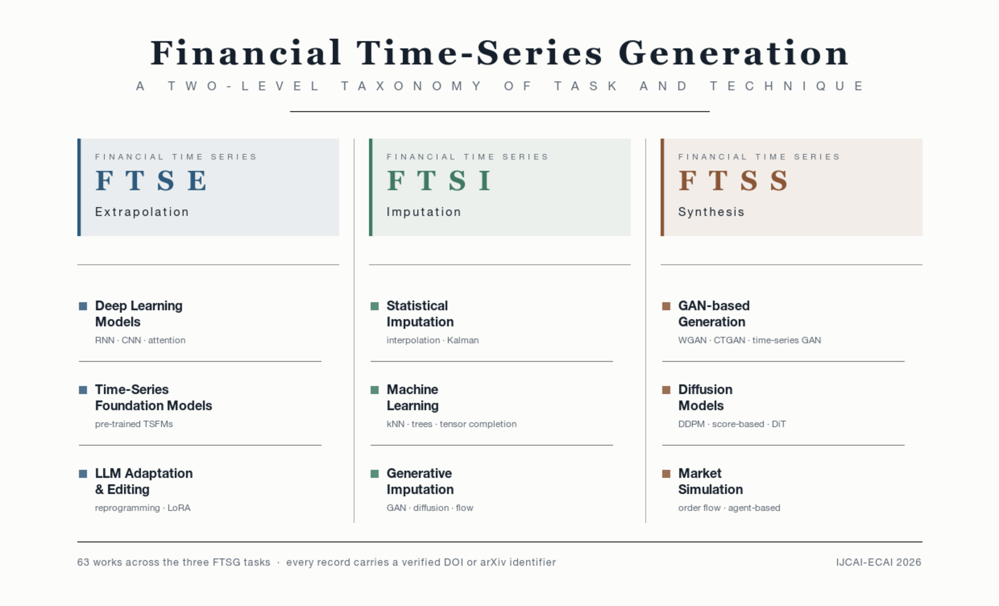

# Awesome Financial Time-Series Generation

> Curated paper collection accompanying the survey **"Recent Advanced Technologies in
> Financial Time-Series Generation: A Survey"** (IJCAI-ECAI 2026).

[](https://awesome.re)
[](LICENSE)
[](#contributing)
[](https://github.com/Lafitte1573/Awesome-FinTS-Generation/commits/main)

<p align="center">
  
</p>

Every entry carries a **verified** bibliographic record with a resolvable DOI or arXiv
identifier. Titles, author lists, venues and years were checked against Crossref, arXiv or the
publisher record.

Abstracts are reproduced where the publisher deposited one. A number of paywalled IEEE, ACM,
Elsevier and Springer proceedings papers deposit no abstract with their metadata record; for those
the link is given in place of a summary, rather than a paraphrase written from the title alone.

See [VERIFICATION.md](VERIFICATION.md) for how each record was checked.

---

## Contents

| Section | Entries |
|---|---|
| [A. Financial Time Series Extrapolation (FTSE)](#a-financial-time-series-extrapolation-ftse) | 33 |
| [B. Financial Time Series Imputation (FTSI)](#b-financial-time-series-imputation-ftsi) | 13 |
| [C. Financial Time Series Synthesis (FTSS)](#c-financial-time-series-synthesis-ftss) | 26 |
| [Literature Review total](#literature-review) | **72** |
| [General-purpose Comparators](#general-purpose-comparators) | 9 |
| [Related Surveys](#related-surveys) | 26 |
| [Adjacent & Non-Time-Series Work](#adjacent--non-time-series-work) | 8 |
| **Total entries** | **115** |

## Highlights

1. **A two-level taxonomy** — task type (extrapolation / imputation / synthesis) crossed with
   task-agnostic generation technique — reproduced from the survey's Figure 1 and used as the
   organising spine of the [Literature Review](#literature-review) below.
2. **72 primary works** spanning 2019-2026, each with a verified DOI, arXiv identifier or
   publisher link.
3. **26 related surveys**, each annotated with what it covers and how it differs from this
   survey's scope.
4. **A data-resource table** covering raw sources, databases and FTSG benchmark datasets.
5. **Open challenges** — causal and invariant representation learning, physics-informed generative
   modelling, multi-modal generation and online adaptation.

## Taxonomy


The task codes used throughout this repository match the survey and its Table 2:

| Code | Task | Short name |
|---|---|---|
| `FTSE` | Extrapolation | extend a series beyond the observed window |
| `FTSI` | Imputation | fill missing values inside the observed window |
| `FTSS` | Synthesis | generate new series, order flow or market scenarios |

## Benchmarks and Datasets

| **Dataset** | **Task** | **Data Sources** | **Split**<sup>1</sup> | **Total**<sup>2</sup> |
|---|---|---|---|---|
| FinTSB | FTSE / FTSI | Chinese A-share, NYSE, NASDAQ | 7:1:2 | 150M |
| GIFT-EVAL | FTSE / FTSI | FRED, Exchanges, Bitcoin, NYSE, NASDAQ, NN5 | 9:0:1 | 25M |
| TFB | FTSE / FTSI | FRED, Exchanges, NN5, NYSE, NASDAQ | 7:1:2 | 8,068 |
| M-Competitions<sup>3</sup> | FTSE / FTSI | Walmart Sales | 49:0:1 | 1,941 |
| FinTSBridge | FTSE / FTSI | S&P 500, NASDAQ, Dow Jones, FTSE, CSI 300 ETF, Bitcoin | 7:1:2 | 86,978 |
| FinMultiTime | FTSE / FTSI | S&P 500, HS 300 | - | 6M |
| TSGBench | FTSS | GOOGL, Exchanges | 9:0:1 | 13,213 |
| CTBench | FTSS | Cryptocurrencies on Binance Exchange | 9:0:1 | 530 |

<sup>1</sup> train : valid : test ratio.
<sup>2</sup> number of time series with a pre-defined temporal span.
<sup>3</sup> <https://forecasters.org/resources/time-series-data>

---

## Literature Review

This chapter follows the survey's **two-level taxonomy**: the first level is the generation *task*
(`FTSE` / `FTSI` / `FTSS`), the second is the generation *technique*. Both levels are taken from
Figure 1 of the paper, and the paper's own leaf names are reused verbatim.

Because the repository carries a broader corpus than the figure enumerates, a few leaves are this
repository's own subdivision; those are marked **(beyond Figure 1)**. A leaf marked
**(empty)** is one the paper populates but for which this repository holds no verified record yet.

### A. Financial Time Series Extrapolation (FTSE)

> Methods that extend a financial series beyond its observed window. Within this task the survey distinguishes deep-learning forecasters, generative predictors, and time-series foundation models adapted to finance.

#### A1  Deep Learning Models

##### A1.1  Hybrid LSTM and recurrent architectures

###### `PEC-W` — Enhancing Recurrent Neural Networks for Stock Market Forecasts through PEC-W Framework

- **Authors**: Busra Caliskan
- **Venue**: IEEE CiFer, 2025
- **Link**: <https://doi.org/10.1109/cifer64978.2025.10975740>
- **Task**: Stock price prediction
- **Abstract**: To address the overfitting and long training time problems of LSTM and GRU models in short-term stock market forecasting, this paper proposes a method based on the PEC-W preprocessing framework. It enhances time-series features and reduces data dimensionality through rolling window mean aggregation, mean-subtraction normalization, and discrete wavelet transform (DWT), and simultaneously combines SHAP interpretability analysis to verify model effectiveness, significantly improving forecasting accuracy and greatly shortening training time.

###### `SGP-LSTM` — Forecasting stock prices changes using long-short term memory neural network with symbolic genetic programming

- **Authors**: Qi Li, Norshaliza Kamaruddin, Siti Sophiayati Yuhaniz, Hamdan Amer Ali Al-Jaif
- **Venue**: Scientific Reports, 2024
- **Link**: <https://doi.org/10.1038/s41598-023-50783-0>
- **Task**: Cross-sectional return prediction
- **Abstract**: To address weak feature engineering and insufficient accuracy of traditional deep learning models in cross-sectional return forecasting in the Chinese stock market, this paper proposes a hybrid model combining symbolic genetic programming (SGP) with long short-term memory networks (LSTM). SGP automatically generates and optimizes nonlinear features that fuse fundamental and technical indicators, which are then fed into LSTM for time-series pattern learning, significantly improving forecasting accuracy and risk-adjusted returns. Rank IC and ICIR are improved by 1128% and 5360% respectively (fundamental) and by 20% and 2752% (technical), and annualized excess returns surpass CSI 300 by 31.00%.

###### `SGP-LSTM-CX` — Integrating Symbolic Genetic Programming With LSTM for Forecasting Cross-Sectional Price Returns: A Comparative Analysis of Chinese and Japanese Stock Markets

- **Authors**: Qi Li, Norshaliza Kamaruddin, Xun Gong, Peng Chen
- **Venue**: Advances in Artificial Intelligence and Machine Learning / Applied Mathematics, 2024
- **Link**: <https://doi.org/10.54364/aaiml.2024.44173>
- **Task**: Cross-market return ranking
- **Abstract**: To address the insufficient accuracy of traditional deep learning models in cross-market stock return ranking prediction caused by a limited number of features and overfitting, this paper proposes a hybrid model fusing symbolic genetic programming (SGP) with long short-term memory networks (LSTM). SGP automatically generates high-quality financial factors and performs data augmentation, which are then fed into LSTM for cross-sectional stock return ranking prediction, achieving Rank IC improvements of 588.03% and 194.27% in the Chinese and Japanese markets respectively, and obtaining significant excess returns.

###### `Hierarchical-LSTM` — Nonlinear Regression With Hierarchical Recurrent Neural Networks Under Missing Data

- **Authors**: S. Onur Sahin, Suleyman S. Kozat
- **Venue**: IEEE Transactions on Artificial Intelligence, 2024
- **Link**: <https://doi.org/10.1109/tai.2024.3404414>
- **Task**: Stock price prediction
- **Abstract**: To address the decline in performance of traditional neural networks caused by missing values in sequence data, this paper proposes a hierarchical LSTM architecture. It partitions the input space into multiple regions according to the presence pattern of historical inputs and assigns an independent LSTM expert network to each pattern, making predictions using only the inputs that actually exist and avoiding the error accumulation brought by data imputation, thereby significantly improving forecasting accuracy on financial and real-world datasets while keeping computational complexity comparable to that of a traditional LSTM.

###### `MVO-BiGRU` — A Novel Hybrid Deep Learning Method for Accurate Exchange Rate Prediction

- **Authors**: Farhat Iqbal, Dimitrios Koutmos, Eman A. Ahmed, Lulwah M. Al-Essa
- **Venue**: Risks (MDPI), 2024
- **Link**: <https://doi.org/10.3390/risks12090139>
- **Task**: Foreign exchange rate prediction
- **Abstract**: To address overfitting and low forecasting accuracy in low-frequency financial time series data, this paper proposes a hybrid deep learning model named MVO-BiGRU. The method uses variational mode decomposition (VMD) to decompose the exchange rate series into multiple subseries, employs a Prevention module that randomly combines subseries for data augmentation, and combines a Prediction module that models all subseries, while optimizing hyperparameters with Optuna. It finally fuses the outputs of the two modules to predict exchange rates through a fully connected network, achieving forecasting accuracy and generalization significantly better than baseline models.

###### `BiLSTM-ARIMA` — Hybrid BiLSTM-ARIMA Architecture with Whale-Driven Optimization for Financial Time Series Forecasting

- **Authors**: Panke Qin, Bo Ye, Ya Li, Zhongqi Cai, Zhenlun Gao, Haoran Qi, Yongjie Ding
- **Venue**: Algorithms (MDPI), 2025
- **Link**: <https://doi.org/10.3390/a18080517>
- **Task**: Hybrid forecasting baseline
- **Abstract**: A hybrid BiLSTM-ARIMA architecture whose hyperparameters are tuned by a whale optimisation algorithm.

###### `CEEMDAN-Informer-LSTM` — Enhancing Financial Time Series Forecasting with Hybrid Deep Learning: CEEMDAN-Informer-LSTM Model

- **Authors**: Jiang-Cheng Li, Li-Ping Sun, Xiao Wu, Chen Tao
- **Venue**: Applied Soft Computing, 2025
- **Link**: <https://doi.org/10.1016/j.asoc.2025.113241>
- **Task**: Hybrid forecasting baseline
- **Abstract**: Decomposes financial series with CEEMDAN, then models the components with an Informer-LSTM stack.

##### A1.2  Ensemble, multi-source and feature-engineered forecasters  *(beyond Figure 1)*

###### `SemiHetero-Ensemble` — A semi-heterogeneous ensemble forecasting method for stock returns based on sentiment analysis

- **Authors**: Xiao Zhang, Peide Liu, Jing Feng
- **Venue**: Information Sciences, 2026
- **Link**: <https://doi.org/10.1016/j.ins.2025.122655>
- **Task**: Stock return prediction
- **Abstract**: To address the problem that traditional models ignore investor sentiment and feature diversity in stock return forecasting, this paper proposes a semi-heterogeneous ensemble forecasting method based on sentiment analysis. It builds an attention-PCA sentiment index through supervised data augmentation, generates diverse base models (MLR and BPNN) by combining them with variable perturbation, and adopts a weighted ensemble strategy to fuse heterogeneous and homogeneous strengths, significantly improving the accuracy and generalization ability of S&P 500 return forecasting.

###### `ALN` — Adversarial Learning Networks for FinTech Applications Using Heterogeneous Data Sources

- **Authors**: Parus Khuwaja, Sunder Ali Khowaja, Kapal Dev
- **Venue**: IEEE Internet of Things Journal, 2023
- **Link**: <https://doi.org/10.1109/jiot.2021.3100742>
- **Task**: Stock price prediction
- **Abstract**: To address the decline in forecasting performance on financial markets caused by data heterogeneity, missing values, and market crashes, this paper proposes a stock price forecasting framework based on an adversarial learning network (ALN). It builds a heterogeneous knowledge base by fusing stock prices, tweets, and global macroeconomic indicators, adopts an improved Newton interpolation polynomial (NDDP) for missing value imputation, uses LSTM to extract time-series features, and designs HDFM Q-learning (critic) and adversarial Q-learning (actor) networks for adversarial training, significantly improving forecasting accuracy under market volatility and crash scenarios, with accuracy improved by more than 5.58% over existing methods.

###### `LASSO-SMLR-PCA-LSTM` — Price Forecast of Treasury Bond Market Yield: Optimize Method Based on Deep Learning Model

- **Authors**: Weiying Ping, Yuwen Hu, Liangqing Luo
- **Venue**: IEEE Access, 2024
- **Link**: <https://doi.org/10.1109/access.2024.3519438>
- **Task**: Treasury yield forecasting
- **Abstract**: To address the insufficient accuracy of traditional models caused by the high noise, nonlinearity, and multicollinearity of multivariate time series in Treasury bond yield forecasting, this paper proposes a deep learning model framework combining LASSO-SMLR-PCA dimensionality reduction with a Bayesian-optimized LSTM. It screens and reduces the dimensionality of the input variables step by step, and then uses Bayesian optimization to adjust LSTM hyperparameters, achieving high-accuracy rolling forecasts of Treasury bond yields and significantly improving model fitting performance and stability in practical application.

###### `IRM-MultiFaceted` — Large Scale Financial Time Series Forecasting with Multi-faceted Model

- **Authors**: Defu Cao, Yixiang Zheng, Parisa Hassanzadeh, Simran Lamba, Xiaomo Liu, Yan Liu
- **Venue**: ACM International Conference on AI in Finance (ICAIF), 2023
- **Link**: <https://doi.org/10.1145/3604237.3626868>
- **Task**: Distribution-shift baseline
- **Abstract**: Relaxes the strict invariance constraint of invariant risk minimisation with an optimisation-driven regulariser and trains linear and non-linear models jointly across S\&P 500 industries, improving both in-domain and zero-shot industry forecasting.

##### A1.3  Other deep-learning forecasters  *(beyond Figure 1)*

###### `ORGAN-FVT` — An Efficient GAN-Based Multi-Classification Approach for Financial Time Series Volatility Trend Prediction

- **Authors**: Lei Liu, Zheng Pei, Peng Chen, Hang Luo, Zhisheng Gao, Kang Feng, Zhihao Gan
- **Venue**: International Journal of Computational Intelligence Systems, 2023
- **Link**: <https://doi.org/10.1007/s44196-023-00212-x>
- **Task**: Volatility trend classification
- **Abstract**: To address the multi-class prediction of short-term, neutral, and long-term volatility trends in financial time series, this paper proposes a method based on an ordinal regression generative adversarial network (ORGAN-FVT). A ConvLSTM generator learns the distribution of time series data and is combined with an MLP discriminator that introduces an ordinal regression penalty, optimizing the sensitivity of the predictions to the direction of misclassification (e.g., misclassifying short-term as long-term). It significantly improves AUC and F1 scores on the MSFT, TSLA, and PAICC stock datasets, with improvements of up to 20.81%.

#### A2  Generative Learning Models

##### A2.1  GAN-based models

###### `Wavelet-GAN` — A Novel Wavelet Based Generative Model for Time Series Prediction

- **Authors**: Chaofan Dai, Xiaoguang Yuan, Zongkai Tian, Xinyue Hu, Zhen Luan, Youchen Wang
- **Venue**: IEEE BigDIA, 2024
- **Link**: <https://doi.org/10.1109/bigdia63733.2024.10808510>
- **Task**: Stock price prediction
- **Abstract**: To address the low forecasting accuracy for nonlinear and non-stationary time series in stock markets, this paper proposes a wavelet-transform-based generative adversarial network (Wavelet-GAN). It decomposes the original stock price series into multi-scale frequency-domain components through wavelet decomposition, builds ARMA models for each component to forecast its coefficients, and then feeds the predicted coefficients into a Wasserstein GAN framework for generative adversarial training to reconstruct high-accuracy stock price series. Experiments show that this method is significantly more accurate in forecasting than GRU, LSTM, and conventional GAN models.

###### `N-BEATS-GAN` — N-BEATS-GAN: A risk-aware financial time series forecasting with generative adversarial networks

- **Authors**: Manna Dai, Mao Yu Seow, Ricardo Shirota Filho, Alex Sclip, Kavilash Chawla, Rick Siow Mong Goh, Joyjit Chattoraj
- **Venue**: Applied Soft Computing, 2026
- **Link**: <https://doi.org/10.1016/j.asoc.2025.114235>
- **Task**: Risk-aware forecasting and augmentation

###### `AssetGANs` — Distributed Generative Adversarial Networks for Fuzzy Portfolio Optimization

- **Authors**: Xueying Yang, Chen Li, Zidong Han, Zhonghua Lu
- **Venue**: Lecture Notes in Computer Science, 2024
- **Link**: <https://doi.org/10.1007/978-981-97-0859-8_14>
- **Task**: Multi-step return simulation and fuzzy portfolio optimization
- **Abstract**: To address the low accuracy and poor training efficiency of multi-step financial time series forecasting and the computational time cost of fuzzy portfolio optimization, this paper proposes AssetGANs, a distributed generative adversarial network based on WGAN-GP. It jointly trains a convolutional neural network generator and discriminator to simulate future multi-day asset returns, and combines fuzzy simulation with an MPI-parallelized genetic algorithm to optimize a fuzzy Mean-CVaR portfolio model, achieving a lower RMSE than LSTM (0.4615 vs 0.6638) and a 573x training speedup on 8 GPU, while the parallel efficiency of fuzzy portfolio optimization reaches 96.3%.

##### A2.2  Diffusion models

###### `TimeGrad` — Autoregressive Denoising Diffusion Models for Multivariate Probabilistic Time Series Forecasting

- **Authors**: Kashif Rasul, Calvin Seward, Ingmar Schuster, Roland Vollgraf
- **Venue**: ICML, 2021
- **Link**: <https://arxiv.org/abs/2101.12072>
- **Task**: Diffusion forecasting baseline
- **Abstract**: An autoregressive model for multivariate probabilistic forecasting that samples the data distribution at each time step by estimating its gradient. Gradients are learned by optimising a variational bound on the data likelihood, and at inference white noise is converted into a sample of the target distribution through a Markov chain of Langevin updates. Evaluated on datasets with thousands of correlated dimensions.

###### `TimeDiT` — TimeDiT: General-purpose Diffusion Transformers for Time Series Foundation Model

- **Authors**: Defu Cao, Wen Ye, Yizhou Zhang, Yan Liu
- **Venue**: ICML Workshop on Foundation Models in the Wild, 2024
- **Link**: <https://arxiv.org/abs/2409.02322>
- **Task**: Diffusion foundation model
- **Abstract**: Replaces the temporal auto-regressive decoding used by most time-series foundation models with a denoising diffusion process, while keeping a transformer to capture temporal dependencies. A unified masking mechanism harmonises training and inference across tasks, and a finetuning-free model-editing strategy injects external knowledge during sampling without updating any weights. Evaluated on forecasting, imputation, anomaly detection and data generation.

#### A3  Time-series Foundation Models

##### A3.1  Fine-tuned LLM / foundation model

###### `Chronos` — Chronos: Learning the Language of Time Series

- **Authors**: Abdul Fatir Ansari, Lorenzo Stella, Caner Turkmen, Xiyuan Zhang, Pedro Mercado, Huibin Shen, Oleksandr Shchur, Syama Sundar Rangapuram, et al.
- **Venue**: Transactions on Machine Learning Research, 2024
- **Link**: <https://arxiv.org/abs/2403.07815>
- **Task**: Zero-shot forecasting foundation model
- **Abstract**: Tokenizes real-valued time series by scaling and quantization into a fixed vocabulary and trains T5-family transformers (20M-710M parameters) with cross-entropy, augmented by a Gaussian-process synthetic dataset. Benchmarked on 42 datasets, the models beat classical statistical baselines in-domain and are competitive zero-shot out-of-domain.

###### `OneFitsAll` — One Fits All: Power General Time Series Analysis by Pretrained LM

- **Authors**: Tian Zhou, Peisong Niu, Xue Wang, Liang Sun, Rong Jin
- **Venue**: NeurIPS, 2023
- **Link**: <https://doi.org/10.52202/075280-1877>
- **Task**: Unified forecasting framework
- **Abstract**: Formulates time-series analysis as a language-modelling problem: a single pretrained T5 backbone handles forecasting, imputation and classification without task-specific heads, by expressing each as text generation. A lightweight task-specific normalisation and patching layer adapts the numerical input to the frozen language model, so one model serves every downstream task.

###### `Financial TimesFM` — Financial Fine-Tuning a Large Time Series Model

- **Authors**: Xinghong Fu, Masanori Hirano, Kentaro Imajo
- **Venue**: IEEE CiFer, 2025
- **Link**: <https://doi.org/10.1109/cifer64978.2025.10975735>
- **Task**: Stock price prediction
- **Abstract**: To address the poor forecasting performance of the base time series model TimesFM caused by the non-stationarity and extreme volatility of financial price data, this paper proposes continued pre-training of TimesFM on financial data. By applying a log transformation to the price data to stabilize the loss function and optimizing the masking strategy, the model significantly improves forecasting accuracy across multiple financial markets, and achieves returns, Sharpe ratio, and maximum drawdown performance superior to baseline models in simulated trading.

###### `Chronos-Arbitrage` — LLMs for Time Series: an Application for Single Stocks and Statistical Arbitrage

- **Authors**: Sebastien Valeyre, Sofiane Aboura
- **Venue**: arXiv preprint, 2024
- **Link**: <https://arxiv.org/abs/2412.09394>
- **Task**: Statistical arbitrage
- **Abstract**: To address the difficulty of traditional models in identifying weak market inefficiencies in financial time series forecasting, this paper proposes using the pretrained and fine-tuned LLM model Chronos to make daily forecasts of residual returns for individual US stocks, and builds long-short portfolios through zero-shot and online fine-tuning. Empirical results show that Chronos can identify profitable trading signals without relying on pre-training on financial data and achieves a Sharpe ratio of up to 4.21. Although still lower than dedicated models, this demonstrates the potential of LLMs to extract Alpha from noisy financial data.

##### A3.2  Edited / adapted LLM

###### `StockTime` — StockTime: A Time Series Specialized Large Language Model Architecture for Stock Price Prediction

- **Authors**: Shengkun Wang, Taoran Ji, Linhan Wang, Yanshen Sun, Shang-Ching Liu, Amit Kumar, Chang-Tien Lu
- **Venue**: arXiv preprint, 2024
- **Link**: <https://arxiv.org/abs/2409.08281>
- **Task**: Stock price prediction
- **Abstract**: To address the problems that traditional financial large language models (FinLLMs) ignore time-series features, rely on redundant textual information, and are inefficient in stock price prediction, this paper proposes StockTime, an LLM architecture specifically designed for stock price time-series data. It chunks stock prices into tokens, extracts textual information such as their correlations and statistical trends, fuses them in the embedding space with time-series features extracted by an autoregressive encoder, and uses a frozen LLM for next-token prediction, thereby achieving higher-accuracy, lower-resource multi-period stock price prediction without fine-tuning the LLM.

###### `GPT4FTS` — Beyond Fixed Patches: Enhancing GPTs for Financial Prediction with Adaptive Segmentation and Learnable Wavelets

- **Authors**: Renjun Jia, Zian Liu, Peng Zhu, Dawei Cheng, Yuqi Liang
- **Venue**: arXiv preprint, 2025
- **Link**: <https://arxiv.org/abs/2505.02880>
- **Task**: Stock return prediction
- **Abstract**: Replaces fixed-length patch tokenization with pattern-aware segmentation: K-means++ clustering on DTW distance identifies scale-invariant motifs, an adaptive patcher then cuts the sequence along those boundaries, and a learnable wavelet module emulates a discrete wavelet transform with trainable filters. Evaluated on four real financial markets.

###### `LLM-PS` — Empowering Large Language Models for Time Series Forecasting with Patterns and Semantics

- **Authors**: Jialiang Tang, Shuo Chen, Chen Gong, Jing Zhang, Dacheng Tao
- **Venue**: IEEE ICDM, 2025
- **Link**: <https://doi.org/10.1109/icdm65498.2025.00081>
- **Task**: LLM forecasting
- **Abstract**: Feeds an LLM two complementary views of the same series: recurrent patterns extracted by a dedicated pattern learner, and the raw semantics of the values themselves, letting the two routes interact so that the model exploits structure the numeric view alone cannot express.

###### `Time-LLM` — Time-LLM: Time Series Forecasting by Reprogramming Large Language Models

- **Authors**: Ming Jin, Shiyu Wang, Lintao Ma, Zhixuan Chu, James Y. Zhang, Xiaoming Shi, Pin-Yu Chen, Yuxuan Liang, Yuan-Fang Li, Shirui Pan, Qingsong Wen
- **Venue**: ICLR, 2024
- **Link**: <https://arxiv.org/abs/2310.01728>
- **Task**: Zero-shot forecasting
- **Abstract**: Repurposes a frozen language model for forecasting without touching its weights: the input series is first reprogrammed into text prototypes so the two modalities can be aligned, and a Prompt-as-Prefix mechanism enriches the context to steer how the reprogrammed patches are transformed. The resulting patches are projected back to produce forecasts, with strong few-shot and zero-shot results.

###### `CALF` — CALF: Aligning LLMs for Time Series Forecasting via Cross-modal Fine-Tuning

- **Authors**: Peiyuan Liu, Hang Guo, Tao Dai, Naiqi Li, Jigang Bao, Xudong Ren, Yong Jiang, Shu-Tao Xia
- **Venue**: AAAI Conference on Artificial Intelligence, 2025
- **Link**: <https://doi.org/10.1609/aaai.v39i18.34082>
- **Task**: LLM forecasting
- **Abstract**: A context-aware patch embedding replaces the linear input projection of an LLM so that time-series semantics are injected at every layer rather than only at the input, with a parameter-efficient fine-tuning scheme applied jointly to the embedding and the LLM backbone.

###### `FinSrag` — Retrieval-augmented Large Language Models for Financial Time Series Forecasting

- **Authors**: Mengxi Xiao, Zihao Jiang, Lingfei Qian, Zhengyu Chen, Yueru He, Yijing Xu, Yuecheng Jiang, Dong Li, Ruey-Ling Weng, Min Peng, Jimin Huang, et al.
- **Venue**: arXiv preprint, 2025
- **Link**: <https://arxiv.org/abs/2502.05878>
- **Task**: Stock movement prediction
- **Abstract**: Introduces FinSrag, the first RAG framework for financial time-series forecasting, built on FinSeer, a domain-specific retriever trained with LLM-guided relevance feedback rather than embedding or DTW similarity. The retrieval corpus is expanded from price series to segments of 28 expert-selected financial indicators, which are injected into a 1B-parameter StockLLM for up/down prediction.

###### `FinMem` — FinMem: A Performance-Enhanced LLM Trading Agent with Layered Memory and Character Design

- **Authors**: Yangyang Yu, Haohang Li, Zhi Chen, Yuechen Jiang, Yang Li, Denghui Zhang, Rong Liu, Jordan W. Suchow, Khaldoun Khashanah
- **Venue**: AAAI Symposium Series on AI, Finance, and Econometrics, 2024
- **Link**: <https://doi.org/10.1609/aaaiss.v3i1.31290>
- **Task**: Quantitative trading
- **Abstract**: To address the lack of interpretability, insufficient memory capability, and inability to adapt to market changes when traditional financial trading agents process multi-source heterogeneous financial data, this paper proposes FINMEM, an autonomous trading agent framework based on a large language model (LLM). Through a layered memory module that simulates the structure of human working memory and long-term memory, combined with dynamic role configuration (e.g., adaptive risk preference) and a multi-layer information processing mechanism, it efficiently integrates and prioritizes time-series financial data such as news and financial reports, significantly improving trading returns and decision robustness.

###### `LLM-Financial-Aid` — Large Language Models for Financial Aid in Financial Time-series Forecasting

- **Authors**: Md Khairul Islam, Ayush Karmacharya, Timothy Sue, Judy Fox
- **Venue**: IEEE BigData, 2024
- **Link**: <https://doi.org/10.1109/bigdata62323.2024.10824953>
- **Task**: Financial aid forecasting
- **Abstract**: To address the poor performance of traditional deep learning models in the financial aid domain caused by data scarcity, this paper proposes using pretrained large language models (LLMs) as foundation models to make annual forecasts of state-level financial aid funding using only a small amount of training data (few-shot) or without any fine-tuning at all (zero-shot). Experiments show that TimeLLM and PatchTST perform best in the few-shot setting, while GPT4TS performs relatively well in the zero-shot setting, but the overall zero-shot performance remains limited.

###### `LLM-TS-Benchmark` — Pretrained Time-Series Foundation Models for Financial Return Forecasting

- **Authors**: Miquel Noguer I Alonso, Rodolfo Pereira Franklin
- **Venue**: arXiv preprint, 2026
- **Link**: <https://arxiv.org/abs/2606.27100>
- **Task**: Return forecasting benchmark
- **Abstract**: Benchmarks pretrained time-series foundation models (TimeGPT, TimesFM-2.5, Moirai-2.0, Chronos, Chronos-2) against from-scratch neural baselines on five liquid US equities under an equalized context budget and a rolling-origin protocol. Pretrained models win 8 of 10 task-level comparisons, but a one-sided Diebold-Mariano test rejects the random-walk null in only two cases, so the ranking gains carry little economic significance.

###### `TimeS` — Text2TimeSeries: Enhancing Financial Forecasting through Time Series Prediction Updates with Event-Driven Insights from Large Language Models

- **Authors**: Litton Jose Kurisinkel, Pruthwik Mishra, Yue Zhang
- **Venue**: arXiv preprint, 2024
- **Link**: <https://arxiv.org/abs/2407.03689>
- **Task**: Event-driven stock forecasting
- **Abstract**: A collaborative framework in which a time-series backbone (PatchTST+W or D-Linear+W) produces baseline forecasts while an LLM reads a news event and predicts a real-valued multi-step price-change signal. A gated recurrent unit then applies that event impact as an amplification factor that updates the time-series prediction.

##### A3.3  Emerging foundation models

###### `TimeHF` — TimeHF: Billion-Scale Time Series Models Guided by Human Feedback

- **Authors**: Yongzhi Qi, Hao Hu, Dazhou Lei, Jianshen Zhang, Zhengxin Shi, Yulin Huang, Zhengyu Chen, Xiaoming Lin, Zuo-Jun Max Shen
- **Venue**: arXiv preprint, 2025
- **Link**: <https://arxiv.org/abs/2501.15942>
- **Task**: RLHF for time series
- **Abstract**: A pipeline for building 6-billion-parameter large time series models, using patch-convolutional embeddings for long series and a human-feedback mechanism called time-series policy optimization. Deployed in JD.com's supply chain for automated replenishment of over 20,000 products, reporting a 33.21% accuracy improvement over existing methods.

###### `FinCast` — FinCast: A Foundation Model for Financial Time-Series Forecasting

- **Authors**: Zhuohang Zhu, Haodong Chen, Qiang Qu, Vera Chung
- **Venue**: ACM CIKM, 2025
- **Link**: <https://doi.org/10.1145/3746252.3761261>
- **Task**: Financial foundation model
- **Abstract**: A domain-specific time-series foundation model for financial forecasting, pre-trained on market data and evaluated across horizons and assets. Included here because the survey cites it as the emerging-financial-foundation-model counterpart to the FTSG methods.

### B. Financial Time Series Imputation (FTSI)

> Methods that reconstruct missing values inside the observed window. Split into classical machine-learning completion (factorization, interpolation) and generative completion.

#### B1  Machine Learning Models

##### B1.1  Factorization methods

###### `FCI` — Financial Condition Indices in an Incomplete Data Environment

- **Authors**: Miguel C. Herculano, Punnoose Jacob
- **Venue**: Studies in Nonlinear Dynamics & Econometrics, 2025
- **Link**: <https://doi.org/10.1515/snde-2022-0115>
- **Task**: Index construction under missing data
- **Abstract**: We construct a Financial Conditions Index (FCI) for the United States using a dataset that features many missing observations. The novel combination of probabilistic principal component techniques and a Bayesian factor-augmented VAR model resolves the challenges posed by data points being unavailable within a high-frequency dataset. Even with up to 62 % of the data missing, the new approach yields a less noisy FCI that tracks the movement of 22 underlying financial variables more accurately both in-sample and out-of-sample.

###### `RegTensor` — A Fast Non-Linear Coupled Tensor Completion Algorithm for Financial Data Integration and Imputation

- **Authors**: Dan Zhou, Ajim Uddin, Zuofeng Shang, Cheickna Sylla, Xinyuan Tao, Dantong Yu
- **Venue**: ACM International Conference on AI in Finance (ICAIF), 2023
- **Link**: <https://doi.org/10.1145/3604237.3626899>
- **Task**: Financial data imputation
- **Abstract**: To address the missing value imputation of highly sparse tensors in financial data, this paper proposes a regularized nonlinear coupled tensor completion algorithm named RegTensor. It introduces a multilayer perceptron (MLP) to model nonlinear interactions between embedding vectors and combines orthogonal regularization to suppress overfitting and feature redundancy, while coupling an auxiliary tensor to strengthen embedding learning, achieving imputation accuracy significantly better than linear and existing nonlinear models on financial datasets such as bond features and analyst earnings forecasts (improvements of 2%-52%).

###### `NMTucker` — NMTucker: Non-linear Matryoshka Tucker Decomposition for Financial Time Series Imputation

- **Authors**: Uras Varolgunes, Dan Zhou, Dantong Yu, Ajim Uddin
- **Venue**: ACM International Conference on AI in Finance (ICAIF), 2023
- **Link**: <https://doi.org/10.1145/3604237.3626909>
- **Task**: Financial time series imputation
- **Abstract**: To address the missing value imputation of highly sparse data in financial time series, this paper proposes the NMTucker method, which recursively decomposes the Tucker core tensor and introduces multi-layer nonlinear activation functions to simulate complex nonlinear interactions, substantially reducing overfitting and improving imputation accuracy, and lowering RMSE by up to 53.91% compared with existing models on multiple real financial datasets.

##### B1.2  Polynomial interpolation

*No verified entry in this repository yet. The survey's Figure 1 lists NDDP under this leaf.*

#### B2  Generative Learning Models

##### B2.1  GAN-based models

###### `AttnWGAIN` — AttnWGAIN: Attention-Based Wasserstein Generative Adversarial Imputation Network for IoT Multivariate Time Series with Missing Values

- **Authors**: Zhaoqin Wang, Qian Ma, Defu Cui, Shikai Guo, Hui Li, Qiao Ning
- **Venue**: IEEE Transactions on Consumer Electronics, 2025
- **Link**: <https://doi.org/10.1109/tce.2025.3600559>
- **Task**: Multivariate time series imputation

###### `ImputeGAN` — ImputeGAN: Generative Adversarial Network for Multivariate Time Series Imputation

- **Authors**: Rui Qin, Yong Wang
- **Venue**: Entropy (MDPI), 2023
- **Link**: <https://doi.org/10.3390/e25010137>
- **Task**: Multivariate time series imputation
- **Abstract**: Since missing values in multivariate time series data are inevitable, many researchers have come up with methods to deal with the missing data. These include case deletion methods, statistics-based imputation methods, and machine learning-based imputation methods. However, these methods cannot handle temporal information, or the complementation results are unstable. We propose a model based on generative adversarial networks (GANs) and an iterative strategy based on the gradient of the complementary results to solve these problems. This ensures the generalizability of the model and the reasonableness of the complementation results. We conducted experiments on three large-scale datasets and compare them with traditional complementation methods. The experimental results show that imputeGAN outperforms traditional complementation methods in terms of accuracy of complementation.

###### `CWGAIN-GP` — A time series continuous missing values imputation method based on generative adversarial networks

- **Authors**: Yunsheng Wang, Xinghan Xu, Lei Hu, Jianchao Fan, Min Han
- **Venue**: Knowledge-Based Systems, 2024
- **Link**: <https://doi.org/10.1016/j.knosys.2023.111215>
- **Task**: Continuous missing-value imputation
- **Abstract**: A conditional Wasserstein GAN for imputing blocks of continuously missing values in multivariate time series, paired with a Gaussian-process module that models the local structure of the gaps so the generator can produce coherent fills rather than point estimates.

##### B2.2  Score-based diffusion models

###### `CSDI` — CSDI: Conditional Score-based Diffusion Models for Probabilistic Time Series Imputation

- **Authors**: Yusuke Tashiro, Jiaming Song, Yang Song, Stefano Ermon
- **Venue**: NeurIPS, 2021
- **Link**: <https://arxiv.org/abs/2107.03502>
- **Code**: <https://github.com/ermongroup/CSDI>
- **Task**: Probabilistic time series imputation
- **Abstract**: A score-based diffusion model conditioned on the observed values of a time series, using cross-attention so the imputation exploits correlations among observed features. Reports a 40-65% improvement over prior probabilistic imputers and a 5-20% error reduction over deterministic methods on healthcare and environmental data.

###### `SaSDim` — SaSDim: Self-Adaptive Noise Scaling Diffusion Model for Spatial Time Series Imputation

- **Authors**: Shunyang Zhang, Senzhang Wang, Xianzhen Tan, Renzhi Wang, Ruochen Liu, Jian Zhang, Jianxin Wang
- **Venue**: IJCAI, 2024
- **Link**: <https://doi.org/10.24963/ijcai.2024/283>
- **Task**: Spatial time series imputation
- **Abstract**: Spatial time series imputation is of great importance to various real-world applications. As the state-of-the-art generative models, diffusion models (e.g. CSDI) have outperformed statistical and autoregressive based models in time series imputation. However, diffusion models may introduce unstable noise owing to the inherent uncertainty in sampling, leading to the generated noise deviating from the intended Gaussian distribution. Consequently, the imputed data may deviate from the real data. To this end, we propose a Self-adaptive noise Scaling Diffusion Model named SaSDim for spatial time series imputation. Specifically, we introduce a novel Probabilistic High-Order SDE Solver Module to scale the noise following the standard Gaussian distribution. The noise scaling operation helps the noise prediction module of the diffusion model to more accurately estimate the variance of noise. To effectively learn the spatial and temporal features, a Spatial guided Global Convolution Module (SgGConv) for multi-periodic temporal dependencies learning with the Fast Fourier Transformation and dynamic spatial dependencies learning with dynamic graph convolution is also proposed. Extensive experiments conducted on three real-world spatial time series datasets verify the effectiveness of SaSDim.

###### `MTSCI` — MTSCI: A Conditional Diffusion Model for Multivariate Time Series Consistent Imputation

- **Authors**: Jianping Zhou, Junhao Li, Guanjie Zheng, Xinbing Wang, Chenghu Zhou
- **Venue**: ACM CIKM, 2024
- **Link**: <https://doi.org/10.1145/3627673.3679532>
- **Task**: Consistent multivariate imputation

###### `LSCD` — LSCD: Lomb-Scargle Conditioned Diffusion for Time series Imputation

- **Authors**: Elizabeth Fons, Alejandro Sztrajman, Yousef El-Laham, Luciana Ferrer, Svitlana Vyetrenko, Manuela Veloso
- **Venue**: ICML (PMLR v267), 2025
- **Link**: <https://arxiv.org/abs/2506.17039>
- **Task**: Irregular-sampling time series imputation
- **Abstract**: Introduces a differentiable Lomb-Scargle layer that estimates the power spectrum of irregularly sampled data without the interpolation or zero-filling that FFT pipelines require, then conditions a score-based diffusion model on that spectrum. A consistency loss aligns the imputed time-domain signal with its spectral representation, improving both imputation error and frequency recovery.

###### `SPDM` — SPDM: Spatiotemporal-Periodic Diffusion Model for Multivariate Time Series Imputation

- **Authors**: Qia Zhang, Renfang Wang, Hong Qiu, Xiufeng Liu, Xu Cheng
- **Venue**: IEEE CSCWD, 2025
- **Link**: <https://doi.org/10.1109/cscwd64889.2025.11033512>
- **Task**: Multivariate time series imputation

###### `Score-CDM` — Score-CDM: Score-Weighted Convolutional Diffusion Model for Multivariate Time Series Imputation

- **Authors**: Shunyang Zhang, Senzhang Wang, Hao Miao, Hao Chen, Changjun Fan, Jian Zhang
- **Venue**: IJCAI, 2024
- **Link**: <https://doi.org/10.24963/ijcai.2024/282>
- **Task**: Multivariate time series imputation
- **Abstract**: Multivariant time series (MTS) data are usually incomplete in real scenarios, and imputing the incomplete MTS is practically important to facilitate various time series mining tasks. Recently, diffusion model-based MTS imputation methods have achieved promising results by utilizing CNN or attention mechanisms for temporal features learning. However, it is hard to adaptively trade off the diverse effects of local and global temporal features by simply combining CNN and attention. To address this issue, we propose a Score-weighted Convolutional Diffusion Model (Score-CDM for short), whose backbone consists of a Score-weighted Convolution Module (SCM) and an Adaptive Reception Module (ARM). SCM adopts a score map to capture the global temporal features in the time domain, while ARM uses a Spectral2Time Window Block (S2TWB) to convolve the local time series data in the spectral domain. Benefiting from the time convolution properties of Fast Fourier Transformation, ARM can adaptively change the receptive field of the score map, and thus effectively balance the local and global temporal features. We conduct extensive evaluations on three real MTS datasets of different domains, and the result verifies the effectiveness of the proposed Score-CDM.

###### `LSSDM` — Latent Space Score-based Diffusion Model for Probabilistic Multivariate Time Series Imputation

- **Authors**: Guojun Liang, Najmeh Abiri, Atiye Sadat Hashemi, Jens Lundstrom, Stefan Byttner, Prayag Tiwari
- **Venue**: IEEE ICASSP, 2025
- **Link**: <https://doi.org/10.1109/icassp49660.2025.10888912>
- **Task**: Probabilistic multivariate imputation

### C. Financial Time Series Synthesis (FTSS)

> Methods that generate new financial series, order flow or whole market scenarios. Split by the granularity of what is generated: individual series (micro-level) versus a whole market environment (macro-level).

#### C1  Micro-level Synthesis

##### C1.1  GAN-based models

###### `WGAN-HF-Aug` — Data Augmentation of High Frequency Financial Data Using Generative Adversarial Network

- **Authors**: Yusuke Naritomi, Takanori Adachi
- **Venue**: IEEE/WIC/ACM WI-IAT, 2020
- **Link**: <https://doi.org/10.1109/wiiat50758.2020.00097>
- **Task**: High-frequency data augmentation
- **Abstract**: To address the insufficiency of training data for prediction models caused by the non-stationarity of high-frequency financial data, this paper proposes a synthetic data augmentation method based on Wasserstein GAN. It uses a generator combining LSTM and 1D-CNN to simulate real order event sequences, and uses the discriminator to optimize the distributional similarity of the generated data, ultimately generating execution price data in an artificial market simulation, so that the accuracy of stock price rise/fall prediction is significantly higher than that of baseline models without data augmentation.

###### `QWGAN-GP` — Enhancing Financial Time Series Prediction with Quantum-Enhanced Synthetic Data Generation: A Case Study on the S&P 500 Using a Quantum Wasserstein Generative Adversarial Network Approach with a Gradient Penalty

- **Authors**: Filippo Orlandi, Enrico Barbierato, Alice Gatti
- **Venue**: Electronics (MDPI), 2024
- **Link**: <https://doi.org/10.3390/electronics13112158>
- **Task**: Quantum-enhanced data augmentation
- **Abstract**: To address the insufficient performance of prediction models caused by the scarcity of extreme event samples in financial time series, this paper proposes a quantum-enhanced Wasserstein generative adversarial network (QWGAN-GP) method. A quantum generator and a classical discriminator jointly generate synthetic data that is highly consistent with the statistical properties of S&P 500 log returns, and an LSTM model is used to verify its effectiveness in improving prediction accuracy (especially extreme event prediction). Experiments show that the model incorporating synthetic data significantly outperforms the baseline model using only real data.

###### `QuantGAN` — Quant GANs: deep generation of financial time series

- **Authors**: Magnus Wiese, Robert Knobloch, Ralf Korn, Peter Kretschmer
- **Venue**: Quantitative Finance, 2020
- **Link**: <https://doi.org/10.1080/14697688.2020.1730426>
- **Task**: Financial time series generation
- **Abstract**: Modeling financial time series by stochastic processes is a challenging task and a central area of research in financial mathematics. As an alternative, we introduce Quant GANs, a data-driven model which is inspired by the recent success of generative adversarial networks (GANs). Quant GANs consist of a generator and discriminator function, which utilize temporal convolutional networks (TCNs) and thereby achieve to capture long-range dependencies such as the presence of volatility clusters. The generator function is explicitly constructed such that the induced stochastic process allows a transition to its risk-neutral distribution. Our numerical results highlight that distributional properties for small and large lags are in an excellent agreement and dependence properties such as volatility clusters, leverage effects, and serial autocorrelations can be generated by the generator function of Quant GANs, demonstrably in high fidelity.

###### `RSQGAN` — Regime-Specific Quant Generative Adversarial Network: A Conditional Generative Adversarial Network for Regime-Specific Deepfakes of Financial Time Series

- **Authors**: Andrew Huang, Matloob Khushi, Basem Suleiman
- **Venue**: Applied Sciences (MDPI), 2023
- **Link**: <https://doi.org/10.3390/app131910639>
- **Task**: Regime-conditional synthesis
- **Abstract**: To address the difficulty of risk assessment for financial time series caused by data scarcity and non-stationarity under rare regimes such as market crises, this paper proposes a conditional generative adversarial network named RSQGAN. It identifies market regimes through a structural break algorithm (greedy Gaussian segmentation) and uses them as conditional labels, generates synthetic asset return data matching the characteristics of specific regimes with a temporal convolutional network (TCN), and introduces a Z-clipping hyperparameter to control the fidelity and diversity of the synthetic data. Experiments show that its synthetic data quality under crisis regimes is significantly better than that of unconditional GAN models.

###### `Tail-GAN` — Tail-GAN: Learning to Simulate Tail Risk Scenarios

- **Authors**: Rama Cont, Mihai Cucuringu, Renyuan Xu, Chao Zhang
- **Venue**: Management Science, 2026
- **Link**: <https://doi.org/10.1287/mnsc.2023.00936>
- **Task**: Tail risk scenario simulation
- **Abstract**: The estimation of loss distributions for dynamic portfolios requires the simulation of scenarios representing realistic joint dynamics of their components. We propose a novel data-driven approach for simulating realistic, high-dimensional multiasset scenarios, focusing on accurately representing tail risk for a class of static and dynamic trading strategies. We exploit the joint elicitability property of Value-at-Risk and Expected Shortfall to design a Generative Adversarial Network that learns to simulate price scenarios preserving these tail risk features. We demonstrate the performance of our algorithm on synthetic and market data sets through detailed numerical experiments. In contrast to previously proposed data-driven scenario generators, our proposed method correctly captures tail risk for a broad class of trading strategies and demonstrates strong generalization capabilities. In addition, combining our method with principal component analysis of the input data enhances its scalability to large-dimensional multiasset time series, setting our framework apart from the univariate settings commonly considered in the literature. This paper was accepted by Kay Giesecke, finance. Supplemental Material: The online appendix and data files are available at https://doi.org/10.1287/mnsc.2023.00936 .

###### `PhysicaA-GAN` — Generative Adversarial Networks applied to synthetic financial scenarios generation

- **Authors**: Matteo Rizzato, Julien Wallart, Christophe Geissler, Nicolas Morizet, Noureddine Boumlaik
- **Venue**: Physica A: Statistical Mechanics and its Applications, 2023
- **Link**: <https://doi.org/10.1016/j.physa.2023.128899>
- **Task**: Synthetic financial scenarios

###### `NVF-DPGAN` — Desensitized Financial Data Generation Based on Generative Adversarial Network and Differential Privacy

- **Authors**: Fan Zhang, Luyao Wang, Xinhong Zhang
- **Venue**: Big Data Mining and Analytics, 2025
- **Link**: <https://doi.org/10.26599/bdma.2024.9020047>
- **Task**: Privacy-preserving data generation
- **Abstract**: To address the difficulty of training deep learning models caused by the high sensitivity of financial data and the small number of usable samples, this paper proposes the NVF-DPGAN model. It achieves differential privacy protection by introducing Gaussian noise during the discriminator training of the generative adversarial network (GAN), and combines a noise visibility function (NVF) to adaptively adjust the noise strength in order to preserve the key features of the data, thereby generating synthetic data highly consistent with the statistical properties of real financial data, achieving the dual goals of data augmentation and privacy preservation.

###### `Edge-GAN` — Generating Synthetic Time-Series Data on Edge Devices Using Generative Adversarial Networks

- **Authors**: Md Faishal Yousuf, Md Shaad Mahmud
- **Venue**: IEEE ICNC, 2024
- **Link**: <https://doi.org/10.1109/icnc59896.2024.10556140>
- **Task**: On-device synthetic data generation
- **Abstract**: To address the generation of financial time-series data on edge devices under privacy preservation and data scarcity, this paper proposes a synthetic time series generation method based on LSTM-GAN. By deploying a generator that has been pruned and quantization-optimized on the edge device iBUG, it achieves low-resource real-time generation while preserving the statistical properties of real data. Experiments show that the synthetic data is highly similar to the real data in PCA and t-SNE analyses, and that the parameter trends closely match.

##### C1.2  Diffusion models

###### `GBMDiff` — A diffusion-based generative model for financial time series via geometric Brownian motion

- **Authors**: Gihun Kim, Sunyong Choi, Yeoneung Kim
- **Venue**: arXiv preprint, 2025
- **Link**: <https://arxiv.org/abs/2507.19003>
- **Task**: Diffusion-based financial synthesis
- **Abstract**: We propose a novel diffusion-based generative framework for financial time series that incorporates geometric Brownian motion (GBM), the foundation of the Black--Scholes theory, into the forward noising process. Unlike standard score-based models that treat price trajectories as generic numerical sequences, our method injects noise proportionally to asset prices at each time step, reflecting the heteroskedasticity observed in financial time series. By accurately balancing the drift and diffusion terms, we show that the resulting log-price process reduces to a variance-exploding stochastic differential equation, aligning with the formulation in score-based generative models. The reverse-time generative process is trained via denoising score matching using a Transformer-based architecture adapted from the Conditional Score-based Diffusion Imputation (CSDI) framework. Empirical evaluations on historical stock data demonstrate that our model reproduces key stylized facts heavy-tailed return distributions, volatility clustering, and the leverage effect more realistically than conventional diffusion models.

###### `DM-Denoiser` — A Financial Time Series Denoiser Based on Diffusion Models

- **Authors**: Zhuohan Wang, Carmine Ventre
- **Venue**: ACM International Conference on AI in Finance (ICAIF), 2024
- **Link**: <https://doi.org/10.1145/3677052.3698649>
- **Task**: Diffusion denoising for financial series

###### `CoFinDiff` — CoFinDiff: Controllable Financial Diffusion Model for Time Series Generation

- **Authors**: Yuki Tanaka, Ryuji Hashimoto, Takehiro Takayanagi, Zhe Piao, Yuri Murayama, Kiyoshi Izumi
- **Venue**: IJCAI, 2025
- **Link**: <https://doi.org/10.24963/ijcai.2025/1040>
- **Task**: Controllable financial synthesis
- **Abstract**: To address the insufficient simulation of extreme events and the poor controllability of synthetic data in the financial domain caused by the scarcity of real data, this paper proposes CoFinDiff, a financial time series generation method based on a conditional diffusion model. It converts log return series into Haar wavelet images and injects trend and realized volatility as conditions into the diffusion model through a cross-attention mechanism, thereby generating diverse synthetic data that conforms to financial stylized facts (such as heavy tails and volatility clustering) and precisely satisfies the specified trend and volatility conditions, significantly improving model performance for the deep hedging task.

###### `T2S` — T2S: High-resolution Time Series Generation with Text-to-Series Diffusion Models

- **Authors**: Yunfeng Ge, Jiawei Li, Yiji Zhao, Haomin Wen, Zhao Li, Meikang Qiu, Hongyan Li, Ming Jin
- **Venue**: IJCAI, 2025
- **Link**: <https://doi.org/10.24963/ijcai.2025/580>
- **Task**: Text-conditioned generation
- **Abstract**: Text-to-Time Series generation holds significant potential to address challenges such as data sparsity, imbalance, and limited availability of multimodal time series data across domains. While diffusion models have achieved remarkable success in Text-to-X (e.g., vision and audio data) generation, their use in time series generation remains limit. Existing approaches face two critical limitations: (1) reliance on domain-specific captions that generalize poorly, and (2) inability to generate time series of arbitrary length, limiting real-world use. In this work, we first introduce a new multimodal dataset containing over 600,000 high-resolution text-time series pairs. Second, we propose Text-to-Series (T2S), a diffusion-based framework that bridges the gap between natural language and time series in a domain-agnostic manner. It employs a length-adaptive VAE to encode time series of varying lengths into consistent latent embeddings. On top of that, T2S effectively aligns textual representations with latent embeddings by utilizing Flow Matching and employing DiT as the denoiser. We train T2S in an interleaved paradigm across multiple lengths, allowing it to generate sequences of arbitrary lengths. Extensive evaluations demonstrate that T2S achieves state-of-the-art performance across 13 datasets spanning 12 domains.

##### C1.3  Combined / VAE-based models

###### `VAE-GRU-MCMC` — Robust Synthetic Data Generation for Sequential Financial Models Using Hybrid VAE-GRU-MCMC

- **Authors**: Francesco Bruni Prenestino, Enrico Barbierato, Alice Gatti
- **Venue**: Future Internet (MDPI), 2025
- **Link**: <https://doi.org/10.3390/fi17020095>
- **Task**: Synthetic financial series generation
- **Abstract**: To address the scarcity of financial time series data and the low fidelity of synthetic data under privacy preservation, this paper proposes a hybrid architecture fusing a variational autoencoder (VAE) with Markov chain Monte Carlo (MCMC) sampling. It captures long-term temporal dependencies through GRU and uses MCMC to generate correlated sample sequences in the latent space, significantly improving the fidelity of the synthetic data in terms of statistical properties, temporal patterns, and robustness to missing data.

###### `FED2Port` — Enhancing Portfolio Performance through Financial Time-Series Decomposition-Based Variational Encoder-Decoder Data Augmentation

- **Authors**: Kalina Bayartsetseg, Ju-Hong Lee, Kwang-Tek Na
- **Venue**: Symmetry (MDPI), 2024
- **Link**: <https://doi.org/10.3390/sym16030283>
- **Task**: Portfolio diversification
- **Abstract**: To address the poor performance of portfolio models caused by insufficient financial time series data and missing uncertainty in historical data, this paper proposes a variational encoder-decoder (FED) data augmentation method based on financial time series decomposition. It decomposes the time series into three latent components, trend, dispersion, and residual, and reconstructs synthetic data carrying historical uncertainty, and then builds the FED2Port reinforcement learning portfolio model, significantly improving the return-risk ratio and robustness of the portfolio.

###### `Dogariu-Synth` — Generation of Realistic Synthetic Financial Time-series

- **Authors**: Mihai Dogariu, Liviu-Daniel Stefan, Bogdan Andrei Boteanu, Claudiu Lamba, Bomi Kim, Bogdan Ionescu
- **Venue**: ACM Transactions on Multimedia Computing, Communications, and Applications, 2022
- **Link**: <https://doi.org/10.1145/3501305>
- **Task**: Synthetic financial series generation
- **Abstract**: To address the scarcity of financial time series data and the difficulty of acquiring it quickly, this paper proposes a synthetic financial time series generation framework based on multiple generative models (such as GANs, VAEs, and GMMNs). By introducing a cross-stock correlation capture mechanism, a fixed-to-variable-length sequence conversion strategy, and a log-return-based preprocessing method, it generates synthetic data with realistic market statistical properties (such as heavy-tailed distributions and volatility clustering), and validates its effectiveness through quantitative metrics and a stock trend prediction task, significantly improving the accuracy of prediction models.

###### `WGAN-BiLSTM` — Stock Price Prediction with Heavy-Tailed Distribution Time-Series Generation Based on WGAN-BiLSTM

- **Authors**: Ming Kang
- **Venue**: Computational Economics, 2024
- **Link**: <https://doi.org/10.1007/s10614-024-10639-9>
- **Task**: Stock price prediction
- **Abstract**: To address the low prediction accuracy caused by scarce stock data for newly listed companies, this paper proposes the WGAN-BiLSTM model, which uses WGAN to generate augmented samples conforming to the heavy-tailed distribution of real data, and combines BiLSTM to bidirectionally extract time-series features for prediction, significantly improving prediction accuracy in small-sample scenarios.

##### C1.4  Stylized-fact evaluation of synthetic series  *(beyond Figure 1)*

###### `style-facts` — Can GANs Learn the Stylized Facts of Financial Time Series?

- **Authors**: Sohyeon Kwon, Yongjae Lee
- **Venue**: ACM International Conference on AI in Finance (ICAIF), 2024
- **Link**: <https://doi.org/10.1145/3677052.3698661>
- **Task**: Stylized-fact evaluation

###### `stylized-facts` — International Financial Markets Through 150 Years: Evaluating Stylized Facts

- **Authors**: Sara A. Safari, Maximilian Janisch, Thomas Hericy
- **Venue**: arXiv preprint, 2025
- **Link**: <https://arxiv.org/abs/2504.08611>
- **Task**: Stylized-fact evaluation
- **Abstract**: In the theory of financial markets, a stylized fact is a qualitative summary of a pattern in financial market data that is observed across multiple assets, asset classes and time horizons. In this article, we test a set of eleven stylized facts for financial market data. Our main contribution is to consider a broad range of geographical regions across Asia, continental Europe, and the US over a time period of 150 years, as well as two of the most traded cryptocurrencies, thus providing insights into the robustness and generalizability of commonly known stylized facts.

#### C2  Macro-level Simulation

##### C2.1  Conditional GANs

###### `CoMeTS-GAN` — On Correlated Stock Market Time Series Generation

- **Authors**: Giuseppe Masi, Matteo Prata, Michele Conti, Novella Bartolini, Svitlana Vyetrenko
- **Venue**: ACM International Conference on AI in Finance (ICAIF), 2023
- **Link**: <https://doi.org/10.1145/3604237.3626895>
- **Task**: Correlated multi-series generation

###### `CTS-GAN` — Simulating Asset Prices using Conditional Time-Series GAN

- **Authors**: Riasat Ali Istiaque, Chi Seng Pun, Yuli Song
- **Venue**: ACM International Conference on AI in Finance (ICAIF), 2024
- **Link**: <https://doi.org/10.1145/3677052.3698638>
- **Task**: Conditional asset price simulation

###### `Market-GAN` — Market-GAN: Adding Control to Financial Market Data Generation with Semantic Context

- **Authors**: Haochong Xia, Shuo Sun, Xinrun Wang, Bo An
- **Venue**: AAAI Conference on Artificial Intelligence, 2024
- **Link**: <https://doi.org/10.1609/aaai.v38i14.29531>
- **Task**: Semantically controlled market generation
- **Abstract**: Financial simulators play an important role in enhancing forecasting accuracy, managing risks, and fostering strategic financial decision-making. Despite the development of financial market simulation methodologies, existing frameworks often struggle with adapting to specialized simulation context. We pinpoint the challenges as i) current financial datasets do not contain context labels; ii) current techniques are not designed to generate financial data with context as control, which demands greater precision compared to other modalities; iii) the inherent difficulties in generating context-aligned, high-fidelity data given the non-stationary, noisy nature of financial data. To address these challenges, our contributions are: i) we proposed the Contextual Market Dataset with market dynamics, stock ticker, and history state as context, leveraging a market dynamics modeling method that combines linear regression and clustering to extract market dynamics; ii) we present Market-GAN, a novel architecture incorporating a Generative Adversarial Networks (GAN) for the controllable generation with context, an autoencoder for learning low-dimension features, and supervisors for knowledge transfer; iii) we introduce a two-stage training scheme to ensure that Market-GAN captures the intrinsic market distribution with multiple objectives. In the pertaining stage, with the use of the autoencoder and supervisors, we prepare the generator with a better initialization for the adversarial training stage. We propose a set of holistic evaluation metrics that consider alignment, fidelity, data usability on downstream tasks, and market facts. We evaluate Market-GAN with the Dow Jones Industrial Average data from 2000 to 2023 and showcase superior performance in comparison to 4 state-of-the-art time-series generative models.

###### `MC-TE-GAN` — Macroeconomic Conditioned Synthetic Financial Markets

- **Authors**: Alexander Michael Rusnak, Stephane Daul
- **Venue**: ACM International Conference on AI in Finance (ICAIF), 2024
- **Link**: <https://doi.org/10.1145/3677052.3698606>
- **Task**: Macro-conditioned market synthesis

###### `GAN-MoEx` — Time Series Generation with GANs for Momentum Effect Simulation on Moscow Stock Exchange

- **Authors**: Maksim Kazadaev, Vitaliy Pozdnyakov, Ilya Makarov
- **Venue**: IEEE CiFer, 2024
- **Link**: <https://doi.org/10.1109/cifer62890.2024.10772763>
- **Task**: Momentum effect simulation
- **Abstract**: To address the overfitting of trading strategies caused by scarce financial time series data, this paper proposes a generative adversarial network (GAN) method based on a temporal convolutional network (TCN). It augments the training data by generating multi-dimensional stock log return series with realistic statistical properties, thereby supporting the backtesting and hyperparameter tuning of momentum effect strategies. Experiments show that this method can effectively simulate inter-stock correlations but fails to fully capture the complex dependencies of the momentum effect.

##### C2.2  Conditional diffusion models

###### `TRADES` — TRADES: Generating Realistic Market Simulations with Diffusion Models

- **Authors**: Leonardo Berti, Bardh Prenkaj, Paola Velardi
- **Venue**: Frontiers in Artificial Intelligence and Applications (IOS Press), 2025
- **Link**: <https://doi.org/10.3233/faia251249>
- **Task**: Limit order book simulation
- **Abstract**: To address the scarcity of real limit order book (LOB) data on financial markets and the lack of realism, responsiveness, and usefulness in existing generative models, this paper proposes TRADES, a Transformer-based denoising diffusion probabilistic model. It generates high-fidelity, responsive order flow time series by conditioning on historical orders and LOB snapshots, significantly surpassing existing methods with a 3.27–3.48x improvement in prediction scores, and it can reproduce the typical statistical features of financial markets (stylized facts).

###### `DiGA` — Controllable Financial Market Generation with Diffusion Guided Meta Agent

- **Authors**: Yu-Hao Huang, Chang Xu, Yang Liu, Weiqing Liu, Wu-Jun Li, Jiang Bian
- **Venue**: AAAI Conference on Artificial Intelligence, 2026
- **Link**: <https://doi.org/10.1609/aaai.v40i1.37009>
- **Task**: Order-flow generation
- **Abstract**: To address the lack of controllability and high fidelity in order flow generation on financial markets, this paper proposes the Diffusion Guided meta Agent (DiGA) model. It models the time-varying distribution of market states (such as mid-price return and order arrival rate) through a conditional diffusion model, and combines a meta-agent with financial and economic priors to sample orders according to that distribution, realizing precise control over market scenarios (such as returns and volatility) and high-fidelity order flow generation.

##### C2.3  Large market models

###### `MarS` — MarS: a Financial Market Simulation Engine Powered by Generative Foundation Model

- **Authors**: Junjie Li, Yang Liu, Weiqing Liu, Shikai Fang, Lewen Wang, Chang Xu, Jiang Bian
- **Venue**: ICLR, 2025
- **Link**: <https://arxiv.org/abs/2409.07486>
- **Code**: <https://github.com/microsoft/MarS>
- **Task**: Market simulation
- **Abstract**: A market simulation engine powered by a Large Market Model (LMM), an order-level generative foundation model trained on historical order flow. Orders are generated conditionally on scenario descriptions, user-submitted orders and recent history, then matched in a simulated exchange to produce market trajectories. Validated against 11 stylized facts and used for forecasting, risk detection, market-impact analysis and agent training.


---

## General-purpose Comparators

The survey's Figure 1 does not enumerate these, but they are the forecasters most FTSG papers
report against. They are listed here by arXiv identifier so the Literature Review stays strictly
about generation.

#### `N-BEATS` — N-BEATS: Neural basis expansion analysis for interpretable time series forecasting

- **Authors**: Boris N. Oreshkin, Dmitri Carpov, Nicolas Chapados, Yoshua Bengio
- **Venue**: arXiv preprint, 2019
- **Link**: <https://arxiv.org/abs/1905.10437>
- **Task**: Interpretable deep forecaster

#### `Informer` — Informer: Beyond Efficient Transformer for Long Sequence Time-Series Forecasting

- **Authors**: Haoyi Zhou, Shanghang Zhang, Jieqi Peng, Shuai Zhang, Jianxin Li, Hui Xiong, Wancai Zhang
- **Venue**: arXiv preprint, 2020
- **Link**: <https://arxiv.org/abs/2012.07436>
- **Task**: Long-sequence forecaster (AAAI 2021)

#### `Autoformer` — Autoformer: Decomposition Transformers with Auto-Correlation for Long-Term Series Forecasting

- **Authors**: Haixu Wu, Jiehui Xu, Jianmin Wang, Mingsheng Long
- **Venue**: arXiv preprint, 2021
- **Link**: <https://arxiv.org/abs/2106.13008>
- **Task**: Decomposition forecaster

#### `PatchTST` — A Time Series is Worth 64 Words: Long-term Forecasting with Transformers

- **Authors**: Yuqi Nie, Nam H. Nguyen, Phanwadee Sinthong, Jayant Kalagnanam
- **Venue**: arXiv preprint, 2022
- **Link**: <https://arxiv.org/abs/2211.14730>
- **Task**: Patch-based transformer forecaster (ICLR 2023)

#### `DLinear` — Are Transformers Effective for Time Series Forecasting?

- **Authors**: Ailing Zeng, Muxi Chen, Lei Zhang, Qiang Xu
- **Venue**: arXiv preprint, 2022
- **Link**: <https://arxiv.org/abs/2205.13504>
- **Task**: Linear forecaster

#### `TimesNet` — TimesNet: Temporal 2D-Variation Modeling for General Time Series Analysis

- **Authors**: Haixu Wu, Tengge Hu, Yong Liu, Hang Zhou, Jianmin Wang, Mingsheng Long
- **Venue**: arXiv preprint, 2022
- **Link**: <https://arxiv.org/abs/2210.02186>
- **Task**: General time series analysis (ICLR 2023)

#### `TimesFM` — A decoder-only foundation model for time-series forecasting

- **Authors**: Abhimanyu Das, Weihao Kong, Rajat Sen, Yichen Zhou
- **Venue**: arXiv preprint, 2023
- **Link**: <https://arxiv.org/abs/2310.10688>
- **Task**: Time series foundation model

#### `TimeMixer` — TimeMixer: Decomposable Multiscale Mixing for Time Series Forecasting

- **Authors**: Shiyu Wang, Haixu Wu, Xiaoming Shi, Tengge Hu, Huakun Luo, Lintao Ma, James Y. Zhang, Jun Zhou
- **Venue**: arXiv preprint, 2024
- **Link**: <https://arxiv.org/abs/2405.14616>
- **Task**: Multiscale forecaster

#### `MOMENT` — MOMENT: A Family of Open Time-series Foundation Models

- **Authors**: Mononito Goswami, Konrad Szafer, Arjun Choudhry, Yifu Cai, Shuo Li, Artur Dubrawski
- **Venue**: arXiv preprint, 2024
- **Link**: <https://arxiv.org/abs/2402.03885>
- **Task**: Time series foundation model (ICML 2024)


---

## Related Surveys

26 reviews, grouped by how they sit against this survey's scope. Each entry states what it
covers and where it stops, so the gap this survey fills can be read off directly.

### S1. Synthetic and generative data for finance (3)

> Reviews whose subject is generative data in a financial setting - the closest overlap with this survey, and the ones a reader should read first.

#### `New-Money-SDR` — New Money: A Systematic Review of Synthetic Data Generation for Finance

- **Authors**: James Meldrum, Basem Suleiman, Fethi Rabhi, Muhammad Johan Alibasa
- **Venue**: arXiv preprint, 2025
- **Link**: <https://arxiv.org/abs/2510.26076>
- **Task**: Systematic review of synthetic data generation in finance
- **Scope vs. this survey**: **Closest overlap in the literature.** A PRISMA-style systematic review of synthetic data generation for finance, motivated by privacy and regulatory constraints and centred on GANs and VAEs. It does not separate the three FTSG tasks, and it stops short of score-based diffusion models and time-series foundation models.
- **Abstract**: Synthetic data generation has emerged as a promising approach to address the challenges of using sensitive financial data in machine learning applications. By leveraging generative models, such as Generative Adversarial Networks (GANs) and Variational Autoencoders (VAEs), it is possible to create artificial datasets that preserve the statistical properties of real financial records while mitigating privacy risks and regulatory constraints. Despite the rapid growth of this field, a comprehensive synthesis of the current research landscape has been lacking. This systematic review consolidates and analyses 72 studies published since 2018 that focus on synthetic financial data generation. We categorise the types of financial information synthesised, the generative methods employed, and the evaluation strategies used to assess data utility and privacy. The findings indicate that GAN-based approaches dominate the literature, particularly for generating time-series market data and tabular credit data. While several innovative techniques demonstrate potential for improved realism and privacy preservation, there remains a notable lack of rigorous evaluation of privacy safeguards across studies. By providing an integrated overview of generative techniques, applications, and evaluation methods, this review highlights critical research gaps and offers guidance for future work aimed at developing robust, privacy-preserving synthetic data solutions for the financial domain.

#### `FinTech-GA-Review` — A Comprehensive Review of Generative AI in Finance

- **Authors**: David Kuo Chuen Lee, Chong Guan, Yinghui Yu, Qinxu Ding
- **Venue**: FinTech 3(3): 460-478, 2024
- **Link**: <https://doi.org/10.3390/fintech3030025>
- **Task**: Review of generative AI in finance
- **Scope vs. this survey**: Generative AI across the whole financial sector - text, assistants, compliance, advisory. Time-series generation is one application among many and the review builds no task taxonomy.
- **Abstract**: The integration of generative AI (GAI) into the financial sector has brought about significant advancements, offering new solutions for various financial tasks. This review paper provides a comprehensive examination of recent trends and developments at the intersection of GAI and finance. By utilizing an advanced topic modeling method, BERTopic, we systematically categorize and analyze existing research to uncover predominant themes and emerging areas of interest. Our findings reveal the transformative impact of finance-specific large language models (LLMs), the innovative use of generative adversarial networks (GANs) in synthetic financial data generation, and the pressing necessity of a new regulatory framework to govern the use of GAI in the finance sector. This paper aims to provide researchers and practitioners with a structured overview of the current landscape of GAI in finance, offering insights into both the opportunities and challenges presented by these advanced technologies.

#### `GAN-Fin-Review` — Generative Adversarial Networks: A Systematic Review of Characteristics, Applications, and Challenges in Financial Data Generation and Market Modeling: 2019-2024

- **Authors**: D. Wilson, A. Azmani
- **Venue**: International Journal of Engineering 39(2): 395-406, 2026
- **Link**: <https://doi.org/10.5829/ije.2026.39.02b.09>
- **Task**: Systematic review of GANs in finance
- **Scope vs. this survey**: Systematic review of GANs in financial data generation and market modelling, 2019-2024. Single-paradigm and pre-diffusion: no score-based generative models, no foundation models, no task axis.
- **Abstract**: To address the privacy restrictions and scarcity of financial data and the difficulty of conventional models in capturing complex market dynamics, this paper systematically reviews 30 publications from 2019–2024 and analyzes the applications of various GAN architectures (such as CTGAN, WGAN, TGAN, and TTGAN) in generating high-fidelity synthetic financial data. It finds that they can effectively enhance data privacy and improve the performance of tasks such as stock prediction, risk assessment, and portfolio optimization, but they still face challenges such as mode collapse, training instability, and the lack of unified evaluation standards.

### S2. Financial time-series surveys (forecasting and adjacent tasks) (10)

> Reviews of financial time series that treat forecasting, interpretability or uncertainty as the organising axis rather than generation.

#### `Cabral-Nonstationarity` — Non-stationarity in financial time series: A taxonomy-based survey of drift detection, adaptation, and evaluation

- **Authors**: Davi M. Cabral, Adriano M. A. Lima, Gustavo H. F. M. Oliveira, Adriano L. I. Oliveira
- **Venue**: Neurocomputing 703: 134647, 2026
- **Link**: <https://doi.org/10.1016/j.neucom.2026.134647>
- **Task**: Non-stationarity, drift and adaptation
- **Scope vs. this survey**: The closest methodological sibling: also a taxonomy-based survey of financial time series, but of non-stationarity handling - drift detection, adaptation and evaluation - rather than of generative modelling.

#### `Tang-ML-FinTS` — A survey on machine learning models for financial time series forecasting

- **Authors**: Yajiao Tang, Zhenyu Song, Yulin Zhu, Huaiyu Yuan, Maozhang Hou, Junkai Ji, et al.
- **Venue**: Neurocomputing 512: 363-380, 2022
- **Link**: <https://doi.org/10.1016/j.neucom.2022.09.003>
- **Task**: Financial time series forecasting
- **Scope vs. this survey**: Machine-learning models for financial time-series forecasting. Same data domain, different task: prediction rather than generation.

#### `Zhang-DL-Price` — Deep learning models for price forecasting of financial time series: A review of recent advancements: 2020-2022

- **Authors**: Cheng Zhang, Nilam Nur Amir Sjarif, Roslina Ibrahim
- **Venue**: WIREs Data Mining and Knowledge Discovery 14(1), 2024
- **Link**: <https://doi.org/10.1002/widm.1519>
- **Task**: Financial price forecasting
- **Scope vs. this survey**: Deep learning for price forecasting, covering 2020-2022. Forecasting-only and closed by its time window, so it predates the current wave of financial diffusion and LLM work.
- **Abstract**: Abstract Accurately predicting the prices of financial time series is essential and challenging for the financial sector. Owing to recent advancements in deep learning techniques, deep learning models are gradually replacing traditional statistical and machine learning models as the first choice for price forecasting tasks. This shift in model selection has led to a notable rise in research related to applying deep learning models to price forecasting, resulting in a rapid accumulation of new knowledge. Therefore, we conducted a literature review of relevant studies over the past 3 years with a view to aiding researchers and practitioners in the field. This review delves deeply into deep learning‐based forecasting models, presenting information on model architectures, practical applications, and their respective advantages and disadvantages. In particular, detailed information is provided on advanced models for price forecasting, such as Transformers, generative adversarial networks (GANs), graph neural networks (GNNs), and deep quantum neural networks (DQNNs). The present contribution also includes potential directions for future research, such as examining the effectiveness of deep learning models with complex structures for price forecasting, extending from point prediction to interval prediction using deep learning models, scrutinizing the reliability and validity of decomposition ensembles, and exploring the influence of data volume on model performance. This article is categorized under: Technologies &gt; Prediction Technologies &gt; Artificial Intelligence

#### `Olorunnimbe-StockDL` — Deep learning in the stock market - a systematic survey of practice, backtesting, and applications

- **Authors**: Kenniy Olorunnimbe, Herna Viktor
- **Venue**: Artificial Intelligence Review 56(3): 2057-2109, 2023
- **Link**: <https://doi.org/10.1007/s10462-022-10226-0>
- **Task**: Deep learning in the stock market
- **Scope vs. this survey**: Systematic survey of deep learning in the stock market covering practice, backtesting and applications. Generation is not the organising axis.
- **Abstract**: Abstract The widespread usage of machine learning in different mainstream contexts has made deep learning the technique of choice in various domains, including finance. This systematic survey explores various scenarios employing deep learning in financial markets, especially the stock market. A key requirement for our methodology is its focus on research papers involving backtesting. That is, we consider whether the experimentation mode is sufficient for market practitioners to consider the work in a real-world use case. Works meeting this requirement are distributed across seven distinct specializations. Most studies focus on trade strategy, price prediction, and portfolio management, with a limited number considering market simulation, stock selection, hedging strategy, and risk management. We also recognize that domain-specific metrics such as “returns” and “volatility” appear most important for accurately representing model performance across specializations. Our study demonstrates that, although there have been some improvements in reproducibility, substantial work remains to be done regarding model explainability. Accordingly, we suggest several future directions, such as improving trust by creating reproducible, explainable, and accountable models and emphasizing prediction of longer-term horizons—potentially via the utilization of supplementary data—which continues to represent a significant unresolved challenge.

#### `Kumbure-StockML` — Machine learning techniques and data for stock market forecasting: A literature review

- **Authors**: Mahinda Mailagaha Kumbure, Christoph Lohrmann, Pasi Luukka, Jari Porras
- **Venue**: Expert Systems with Applications 197: 116659, 2022
- **Link**: <https://doi.org/10.1016/j.eswa.2022.116659>
- **Task**: Stock market forecasting
- **Scope vs. this survey**: Literature review of machine-learning techniques and of the data sources used for stock-market forecasting.

#### `Behera-HONN-FinTS` — A Comprehensive Survey on Higher Order Neural Networks and Evolutionary Optimization Learning Algorithms in Financial Time Series Forecasting

- **Authors**: Sudersan Behera, Sarat Chandra Nayak, A. V. S. Pavan Kumar
- **Venue**: Archives of Computational Methods in Engineering 30(7): 4401-4448, 2023
- **Link**: <https://doi.org/10.1007/s11831-023-09942-9>
- **Task**: Financial time series forecasting
- **Scope vs. this survey**: Higher-order neural networks and evolutionary optimisation for financial forecasting - a narrow architectural slice rather than a generative survey.

#### `Blasco-UQ-FinTS` — A survey on uncertainty quantification in deep learning for financial time series prediction

- **Authors**: Txus Blasco, J. Salvador Sanchez, Vicente Garcia
- **Venue**: Neurocomputing 576: 127339, 2024
- **Link**: <https://doi.org/10.1016/j.neucom.2024.127339>
- **Task**: Uncertainty quantification in financial forecasting
- **Scope vs. this survey**: Uncertainty quantification for financial prediction. A cross-cutting concern that overlaps with the survey's evaluation chapter but is not a generation taxonomy.

#### `Arsenault-XAI-FinTS` — A Survey of Explainable Artificial Intelligence (XAI) in Financial Time Series Forecasting

- **Authors**: Pierre-Daniel Arsenault, Shengrui Wang, Jean-Marc Patenaude
- **Venue**: ACM Computing Surveys 57(10): 1-37, 2025
- **Link**: <https://doi.org/10.1145/3729531>
- **Task**: Explainable AI in financial forecasting
- **Scope vs. this survey**: Explainability for financial forecasting. Cited by the FTSG survey as an example of a survey narrowed to a single technical paradigm.
- **Abstract**: Artificial intelligence (AI) models have reached a very significant level of accuracy. While their superior performance offers considerable benefits, their inherent complexity often decreases human trust, which slows their application in high-risk decision-making domains, such as finance. The field of explainable AI (XAI) seeks to bridge this gap, aiming to make AI models more understandable. This survey, focusing on published work from 2018 to 2024, categorizes XAI approaches that predict financial time series. In this article, explainability and interpretability are distinguished, emphasizing the need to treat these concepts separately, as they are not applied the same way in practice. Through clear definitions, a rigorous taxonomy of XAI approaches, a complementary characterization, and examples of XAI’s application in the finance industry, this article provides a comprehensive view of XAI’s current role in finance. It can also serve as a guide for selecting the most appropriate XAI approach for future applications.

#### `AI-FinStock-Survey` — AI-empowered financial stock: A survey

- **Authors**: Wenjun Qi, Xiangwen Xue, Xinmin Tian
- **Venue**: AIP Advances 16(2), 2026
- **Link**: <https://doi.org/10.1063/5.0322804>
- **Task**: AI in financial stock markets
- **Scope vs. this survey**: AI across the financial-stock pipeline - quantitative trading, risk assessment, investment decision-making. Broader in pipeline coverage, thinner on generation itself.
- **Abstract**: In recent years, artificial intelligence (AI) technology has profoundly reshaped the financial stock sector, driving the intelligent transformation of quantitative trading, risk assessment, and investment decision-making. However, the deployment of AI continues to confront challenges such as data privacy concerns, algorithmic transparency issues, and market volatility. This paper provides a comprehensive survey of the transformative role of AI in the financial stock. AI technologies, including traditional machine learning, deep learning, natural language processing, and reinforcement learning, have revolutionized financial practices by enhancing prediction accuracy, enabling automated decision-making, and developing adaptive strategies for dynamic market environments. Then, this paper systematically reviews existing literature; research the key applications include stock market analysis, stock investment trading, and portfolio construction innovations; and identifies challenges such as data-centric challenges, model development and validation, and ethical and regulatory.

#### `Yeo-FinXAI` — A comprehensive review on financial explainable AI

- **Authors**: Wei Jie Yeo, Wihan Van Der Heever, Rui Mao, Erik Cambria, Ranjan Satapathy, Gianmarco Mengaldo
- **Venue**: Artificial Intelligence Review 58(6), 2025
- **Link**: <https://doi.org/10.1007/s10462-024-11077-7>
- **Task**: Explainable AI in finance
- **Scope vs. this survey**: Financial explainable AI across tasks and modalities; interpretability rather than generation is the organising principle.

### S3. Foundation models and large language models for time series (3)

> Reviews of the model families that the FTSG survey places under the FTSE / foundation-model branch, in a domain-general or LLM-centric setting.

#### `LLM4TS-Survey` — Large Language Models for Time Series: A Survey

- **Authors**: Xiyuan Zhang, Ranak Roy Chowdhury, Rajesh K. Gupta, Jingbo Shang
- **Venue**: IJCAI, 2024
- **Link**: <https://www.ijcai.org/proceedings/2024/921>
- **Task**: LLMs for time series
- **Scope vs. this survey**: Task-level view of LLMs for time series - forecasting, anomaly detection, classification, imputation and generation - but domain-general, so financial constraints such as non-stationarity and low signal-to-noise are not addressed.

#### `FinSurvey-LLM` — A Survey of Large Language Models for Financial Applications: Progress, Prospects and Challenges

- **Authors**: Yuxuan Nie, X. Dong, S. Zohren
- **Venue**: arXiv preprint, 2024
- **Link**: <https://arxiv.org/abs/2406.11903>
- **Task**: LLMs in financial applications
- **Scope vs. this survey**: LLM applications across finance. Generation appears as one item inside a much wider task list, and the treatment is language-centric rather than time-series-centric. Cited by the FTSG survey as a paradigm-scoped review.
- **Abstract**: Recent advances in large language models (LLMs) have unlocked novel opportunities for machine learning applications in the financial domain. These models have demonstrated remarkable capabilities in understanding context, processing vast amounts of data, and generating human-preferred contents. In this survey, we explore the application of LLMs on various financial tasks, focusing on their potential to transform traditional practices and drive innovation. We provide a discussion of the progress and advantages of LLMs in financial contexts, analyzing their advanced technologies as well as prospective capabilities in contextual understanding, transfer learning flexibility, complex emotion detection, etc. We then highlight this survey for categorizing the existing literature into key application areas, including linguistic tasks, sentiment analysis, financial time series, financial reasoning, agent-based modeling, and other applications. For each application area, we delve into specific methodologies, such as textual analysis, knowledge-based analysis, forecasting, data augmentation, planning, decision support, and simulations. Furthermore, a comprehensive collection of datasets, model assets, and useful codes associated with mainstream applications are presented as resources for the researchers and practitioners. Finally, we outline the challenges and opportunities for future research, particularly emphasizing a number of distinctive aspects in this field. We hope our work can help facilitate the adoption and further development of LLMs in the financial sector.

#### `Jin-LargeModels-TS` — Large Models for Time Series and Spatio-Temporal Data: A Survey and Outlook

- **Authors**: Ming Jin, Yaxuan Kong, Yuxuan Liang, Chaoli Zhang, Siqiao Xue, Xue Wang, et al.
- **Venue**: ACM Computing Surveys 58(14): 1-38, 2026
- **Link**: <https://doi.org/10.1145/3821637>
- **Task**: Large models for time series
- **Scope vs. this survey**: Large and foundation models for time series and spatio-temporal data. Covers the model families the FTSG survey places under FTSE, but not the financial generative tasks themselves.
- **Abstract**: Temporal data-including time series and spatio-temporal data- are pervasive in real-world applications. Generated in massive volumes by physical and virtual sensors, they record dynamic system behaviors and enable a wide range of downstream tasks. Effectively analyzing such data is crucial to unlocking their rich information content. Recent advances in large language models and other foundation models have accelerated their use in time series and spatio-temporal data mining. These approaches not only improve pattern recognition and reasoning across diverse domains but also support progress toward artificial general intelligence that can understand and process temporal data. In this survey, we present a comprehensive, up-to-date review of large models tailored or adapted for time series and spatio-temporal data along four dimensions: data types, model categories, model scopes, and application areas/tasks. We organize existing work into two main groups: large models for time series analysis (LM4TS) and for spatio-temporal data mining (LM4STD), and further distinguish general-purpose from domain-specific models. We also curate related resources, including datasets, model implementations, and tools, organized by major application areas. Overall, this survey consolidates recent advances and highlights foundations, applications, resources, and open research opportunities in large model-centric temporal data analysis.

### S4. Time-series generation and synthetic-data surveys (non-financial) (7)

> Reviews of time-series generation and of how synthesized series are evaluated, across domains rather than finance.

#### `Stenger-Eval-SynthTS` — Evaluation is key: a survey on evaluation measures for synthetic time series

- **Authors**: Michael Stenger, Robert Leppich, Ian T. Foster, Samuel Kounev, Andre Bauer
- **Venue**: Journal of Big Data 11(1), 2024
- **Link**: <https://doi.org/10.1186/s40537-024-00924-7>
- **Task**: Evaluation of synthetic time series
- **Scope vs. this survey**: Directly on how synthesized time series should be measured - the problem the FTSG survey's benchmark chapter addresses. Domain-general, and organised around measures rather than around generation tasks.
- **Abstract**: Abstract Synthetic data generation describes the process of learning the underlying distribution of a given real dataset in a model, which is, in turn, sampled to produce new data objects still adhering to the original distribution. This approach often finds application where circumstances limit the availability or usability of real-world datasets, for instance, in health care due to privacy concerns. While image synthesis has received much attention in the past, time series are key for many practical (e.g., industrial) applications. To date, numerous different generative models and measures to evaluate time series syntheses have been proposed. However, regarding the defining features of high-quality synthetic time series and how to quantify quality, no consensus has yet been reached among researchers. Hence, we propose a comprehensive survey on evaluation measures for time series generation to assist users in evaluating synthetic time series. For one, we provide brief descriptions or - where applicable - precise definitions. Further, we order the measures in a taxonomy and examine applicability and usage. To assist in the selection of the most appropriate measures, we provide a concise guide for fast lookup. Notably, our findings reveal a lack of a universally accepted approach for an evaluation procedure, including the selection of appropriate measures. We believe this situation hinders progress and may even erode evaluation standards to a “do as you like”-approach to synthetic data evaluation. Therefore, this survey is a preliminary step to advance the field of synthetic data evaluation.

#### `Iglesias-TSAug` — Data Augmentation techniques in time series domain: a survey and taxonomy

- **Authors**: Guillermo Iglesias, Edgar Talavera, Angel Gonzalez-Prieto, Alberto Mozo, Sandra Gomez-Canaval
- **Venue**: Neural Computing and Applications 35(14): 10123-10145, 2023
- **Link**: <https://doi.org/10.1007/s00521-023-08459-3>
- **Task**: Time series data augmentation
- **Scope vs. this survey**: Taxonomy of time-series data augmentation, i.e. augmentation treated as generation, but without a financial setting and without the extrapolation / imputation / synthesis split.
- **Abstract**: Abstract With the latest advances in deep learning-based generative models, it has not taken long to take advantage of their remarkable performance in the area of time series. Deep neural networks used to work with time series heavily depend on the size and consistency of the datasets used in training. These features are not usually abundant in the real world, where they are usually limited and often have constraints that must be guaranteed. Therefore, an effective way to increase the amount of data is by using data augmentation techniques, either by adding noise or permutations and by generating new synthetic data. This work systematically reviews the current state of the art in the area to provide an overview of all available algorithms and proposes a taxonomy of the most relevant research. The efficiency of the different variants will be evaluated as a central part of the process, as well as the different metrics to evaluate the performance and the main problems concerning each model will be analysed. The ultimate aim of this study is to provide a summary of the evolution and performance of areas that produce better results to guide future researchers in this field.

#### `Hu-TSGen-IoT` — Survey of Time Series Data Generation in IoT

- **Authors**: Chaochen Hu, Zihan Sun, Chao Li, Yong Zhang, Chunxiao Xing
- **Venue**: Sensors 23(15): 6976, 2023
- **Link**: <https://doi.org/10.3390/s23156976>
- **Task**: Time series generation in IoT
- **Scope vs. this survey**: Time-series data generation in IoT. Domain-general and predating the foundation-model wave; useful for method families rather than for the financial task structure.
- **Abstract**: Nowadays, with the rapid growth of the internet of things (IoT), massive amounts of time series data are being generated. Time series data play an important role in scientific and technological research for conducting experiments and studies to obtain solid and convincing results. However, due to privacy restrictions, limited access to time series data is always an obstacle. Moreover, the limited available open source data are often not suitable because of a small quantity and insufficient dimensionality and complexity. Therefore, time series data generation has become an imperative and promising solution. In this paper, we provide an overview of classical and state-of-the-art time series data generation methods in IoT. We classify the time series data generation methods into four major categories: rule-based methods, simulation-model-based methods, traditional machine-learning-based methods, and deep-learning-based methods. For each category, we first illustrate its characteristics and then describe the principles and mechanisms of the methods. Finally, we summarize the challenges and future directions of time series data generation in IoT. The systematic classification and evaluation will be a valuable reference for researchers in the time series data generation field.

#### `Lin-DiffTS` — Diffusion models for time-series applications: a survey

- **Authors**: Lequan Lin, Zhengkun Li, Ruikun Li, Xuliang Li, Junbin Gao
- **Venue**: Frontiers of Information Technology & Electronic Engineering 25(1): 19-41, 2024
- **Link**: <https://doi.org/10.1631/fitee.2300310>
- **Task**: Diffusion models for time series
- **Scope vs. this survey**: Diffusion models across time-series applications. This is the technique axis that the FTSG survey maps onto FTSE, FTSI and FTSS separately.

#### `Yang-DiffTS-STM` — A Survey on Diffusion Models for Time Series and Spatio-Temporal Data

- **Authors**: Yiyuan Yang, Ming Jin, Haomin Wen, Chaoli Zhang, Yuxuan Liang, Lintao Ma, et al.
- **Venue**: ACM Computing Surveys 58(8): 1-39, 2026
- **Link**: <https://doi.org/10.1145/3783986>
- **Task**: Diffusion models for time series
- **Scope vs. this survey**: Diffusion models for time series and spatio-temporal data; complements the score-based diffusion leaves the FTSG survey places under FTSI and FTSS.
- **Abstract**: Diffusion models have been widely used in time series and spatio-temporal data, enhancing generative, inferential, and downstream capabilities. These models are applied across diverse fields such as healthcare, recommendation, climate, energy, audio, and traffic. By separating applications for time series and spatio-temporal data, we offer a structured perspective on model category, task type, data modality, and practical application domain. This study aims to provide a solid foundation for researchers and practitioners, inspiring future innovations that tackle traditional challenges and foster novel solutions in diffusion model-based data mining tasks and applications. For more detailed information, we have open-sourced a repository. 1

#### `Gao-GAN-SpatioTemporal` — Generative Adversarial Networks for Spatio-temporal Data: A Survey

- **Authors**: Nan Gao, Hao Xue, Wei Shao, Sichen Zhao, Kyle Kai Qin, Arian Prabowo, et al.
- **Venue**: ACM Transactions on Intelligent Systems and Technology 13(2): 1-25, 2022
- **Link**: <https://doi.org/10.1145/3474838>
- **Task**: GANs for spatio-temporal data
- **Scope vs. this survey**: GANs for spatio-temporal data. Predates the diffusion wave and is not finance-specific, but its model taxonomy lines up with the FTSS micro-level branch.
- **Abstract**: Generative Adversarial Networks (GANs) have shown remarkable success in producing realistic-looking images in the computer vision area. Recently, GAN-based techniques are shown to be promising for spatio-temporal-based applications such as trajectory prediction, events generation, and time-series data imputation. While several reviews for GANs in computer vision have been presented, no one has considered addressing the practical applications and challenges relevant to spatio-temporal data. In this article, we have conducted a comprehensive review of the recent developments of GANs for spatio-temporal data. We summarise the application of popular GAN architectures for spatio-temporal data and the common practices for evaluating the performance of spatio-temporal applications with GANs. Finally, we point out future research directions to benefit researchers in this area.

#### `Eigenschink-DeepGen` — Deep Generative Models for Synthetic Data: A Survey

- **Authors**: Peter Eigenschink, Thomas Reutterer, Stefan Vamosi, Ralf Vamosi, Chang Sun, Klaudius Kalcher
- **Venue**: IEEE Access 11: 47304-47320, 2023
- **Link**: <https://doi.org/10.1109/access.2023.3275134>
- **Task**: Deep generative models for synthetic data
- **Scope vs. this survey**: Deep generative models for synthetic data across domains, with a domain-classification framework rather than a task taxonomy.

### S5. General time-series forecasting surveys (positioning anchors) (3)

> The forecasting surveys the FTSG survey cites when it argues that existing reviews stop at prediction.

#### `Kim-DL-TSF` — A comprehensive survey of deep learning for time series forecasting: architectural diversity and open challenges

- **Authors**: Jongseon Kim, Hyungjoon Kim, HyunGi Kim, Dongjun Lee, Sungroh Yoon
- **Venue**: Artificial Intelligence Review 58(7), 2025
- **Link**: <https://doi.org/10.1007/s10462-025-11223-9>
- **Task**: Deep learning for time series forecasting
- **Scope vs. this survey**: One of the two forecasting surveys the FTSG survey positions itself against: thorough on forecasting architectures, silent on the generative formulation of the problem.

#### `Kong-DL-TSF` — Deep learning for time series forecasting: a survey

- **Authors**: Xiangjie Kong, Zhenghao Chen, Weiyao Liu, Kaili Ning, Lechao Zhang, Syauqie Muhammad Marier, et al.
- **Venue**: International Journal of Machine Learning and Cybernetics 16(7-8): 5079-5112, 2025
- **Link**: <https://doi.org/10.1007/s13042-025-02560-w>
- **Task**: Deep learning for time series forecasting
- **Scope vs. this survey**: The second forecasting survey used as a positioning anchor; same gap, different slice of the architecture space.

#### `Benidis-DL-TSF` — Deep Learning for Time Series Forecasting: Tutorial and Literature Survey

- **Authors**: Konstantinos Benidis, Syama Sundar Rangapuram, Valentin Flunkert, Bernie Wang, Danielle C. Maddix, Caner Turkmen, et al.
- **Venue**: ACM Computing Surveys 55(6): 1-36, 2023
- **Link**: <https://doi.org/10.1145/3533382>
- **Task**: Deep learning for time series forecasting
- **Scope vs. this survey**: Tutorial-style survey of deep forecasting and the pre-LLM baseline for the forecasting branch of the taxonomy.
- **Abstract**: Deep learning based forecasting methods have become the methods of choice in many applications of time series prediction or forecasting often outperforming other approaches. Consequently, over the last years, these methods are now ubiquitous in large-scale industrial forecasting applications and have consistently ranked among the best entries in forecasting competitions (e.g., M4 and M5). This practical success has further increased the academic interest to understand and improve deep forecasting methods. In this article we provide an introduction and overview of the field: We present important building blocks for deep forecasting in some depth; using these building blocks, we then survey the breadth of the recent deep forecasting literature.


---

## Adjacent & Non-Time-Series Work

These entries use generative models on financial data but are **not** financial time-series
generation methods — tabular credit risk, text augmentation, anomaly detection, curve fitting, and
unrefereed preprints touching synthetic financial series. They are kept here so the taxonomy stays
clean.

#### `Interpretable-GenAI` — Interpretable GenAI: Synthetic Financial Time Series Generation with Probabilistic LSTM

- **Authors**: Christian Schwarz
- **Venue**: SSRN preprint (not peer reviewed), 2024
- **Link**: <https://doi.org/10.2139/ssrn.4877007>
- **Task**: Synthetic financial time series generation - preprint, not a review

#### `GraphSAGE-CTGAN` — Graph-Based Inductive Learning for Credit Risk Prediction with Imbalance Mitigation

- **Authors**: Sogand Pourkhoshgoftar, Asadollah Shahbahrami, Nima Esmi
- **Venue**: Computational Economics, 2025
- **Link**: <https://doi.org/10.1007/s10614-025-11114-9>
- **Task**: Credit risk
- **Abstract**: To address the extreme class imbalance and insufficient modeling of nonlinear borrower relationships in credit risk prediction, this paper proposes a hybrid method combining a conditional tabular generative adversarial network (CTGAN) with a graph sampling and aggregation graph neural network (GraphSAGE). It first uses CTGAN to generate synthetic default samples to balance the data distribution, then constructs a borrower similarity graph and uses GraphSAGE for inductive relational learning, ultimately significantly improving accuracy, F1 score, and AUC on the GMSC and GC datasets, while also using SHAP to enhance model interpretability.

#### `Swiss-Discount-Curve` — Stripping the Swiss Discount Curve using Kernel Ridge Regression

- **Authors**: Nicolas Camenzind, Damir Filipovic
- **Venue**: SSRN working paper, 2023
- **Link**: <https://doi.org/10.2139/ssrn.4611310>
- **Task**: Yield curve estimation
- **Abstract**: To address the insufficient robustness and flexibility of risk-free discount curve estimation in the Swiss government bond market, this paper proposes a method based on kernel ridge regression (KR). By minimizing a weighted sum of pricing error and curve smoothness in a reproducing kernel Hilbert space, it achieves data-driven, interpretable curve fitting and extrapolation that outperforms conventional methods such as Smith–Wilson, SST, and SNB.

#### `Distress-Imputation` — Missing value imputation and the effect of feature normalisation on financial distress prediction

- **Authors**: Kuen-Liang Sue, Chih-Fong Tsai, Hau-Min Tsau
- **Venue**: Journal of Experimental & Theoretical Artificial Intelligence, 2022
- **Link**: <https://doi.org/10.1080/0952813x.2022.2153278>
- **Task**: Tabular imputation
- **Abstract**: To address the impact of missing value imputation and feature normalization on model performance in financial distress prediction, this paper compares several imputation methods including KNN, random forest, MICE, and deep neural networks, and evaluates the effect of min-max normalization on the predictive performance of different classifiers (SVM, RF, DNN). It finds that random forest imputation performs best, and that normalization significantly improves the performance of SVM and DNN but yields no significant gain for RF.

#### `MTS-Anomaly` — Management Analysis Method of Multivariate Time Series Anomaly Detection in Financial Risk Assessment

- **Authors**: Yongshan Zhang, Zhiyun Jiang, Cong Peng, Xiumei Zhu, Gang Wang
- **Venue**: Journal of Organizational and End User Computing, 2024
- **Link**: <https://doi.org/10.4018/joeuc.342094>
- **Task**: Anomaly detection
- **Abstract**: To address model overfitting and insufficient generalization in anomaly detection for financial multivariate time series, this paper proposes an innovative method combining contrastive learning with a generative adversarial network (GAN). It performs data augmentation through geometric distribution masking, uses a Transformer autoencoder to learn the distribution of normal patterns, and introduces a contrastive loss into the discriminator to enhance the ability to discriminate normal patterns. Experiments show that this method significantly outperforms existing mainstream methods on four real financial datasets, effectively improving the accuracy and robustness of anomaly detection.

#### `FinanceNLP-CA` — Concatenation Augmentation for Improving Deep Learning Models in Finance NLP with Scarce Data

- **Authors**: Cesar Vaca, Jesus-Angel Roman-Gallego, Veronica Barroso-Garcia, Fernando Tejerina, Benjamin Sahelices
- **Venue**: Electronics (MDPI), 2025
- **Link**: <https://doi.org/10.3390/electronics14112289>
- **Task**: Text augmentation
- **Abstract**: To address the limited performance of deep learning models caused by the scarcity of unstructured text data in the financial domain (such as director biographies in corporate governance reports), this paper proposes a new data augmentation method named Concatenation Augmentation (CA). It concatenates original text samples and performs convex additive fusion of labels based on the inverse transformation of the logistic activation function to generate semantically coherent new samples, significantly improving model accuracy (92.4%–99.7%) and robustness in low-data settings.

#### `FCLM` — Improving Anti-money Laundering via Fourier-Based Contrastive Learning

- **Authors**: Meihan Tong, Shuai Wang, Xinyu Chen, Jinsong Bei
- **Venue**: Lecture Notes in Computer Science, 2024
- **Link**: <https://doi.org/10.1007/978-981-97-2259-4_25>
- **Task**: Anti-money laundering
- **Abstract**: To address the insufficient robustness of existing deep learning anti-money laundering models to data perturbations, this paper proposes a contrastive learning model based on the Fourier transform (FCLM). It maps transaction data from the time domain to the frequency domain to generate highly divergent augmented views, and uses contrastive learning to keep the model predictions consistent between the original transaction and its augmented views, thereby significantly improving detection robustness and generalization, and surpassing seven advanced baseline methods on both synthetic and real datasets.

#### `BERT-ABSA` — Data Augmentation Using BERT-Based Models for Aspect-Based Sentiment Analysis

- **Authors**: Bron Hollander, Flavius Frasincar, Finn van der Knaap
- **Venue**: Lecture Notes in Computer Science, 2024
- **Link**: <https://doi.org/10.1007/978-3-031-62362-2_8>
- **Task**: Text augmentation
- **Abstract**: To address the limited model performance caused by scarce training data in aspect-based sentiment analysis (ABSA), this paper proposes introducing several BERT-based data augmentation methods into the HAABSA++ model. It generates semantically consistent augmented samples through masked language modeling (MLM), and combines label-aware BERTprepend and BERTexpand strategies to preserve sentiment label information, significantly improving test accuracy on the SemEval 2015 and 2016 datasets, with gains of up to 1.85 percentage points.


---

## Contributing

Contributions are welcome. Please read [CONTRIBUTING.md](CONTRIBUTING.md) first — in particular the
requirement that every new entry ship with a **resolvable DOI or arXiv identifier** and a title that
matches the registered record exactly.

When adding a primary method, place it under the task and technique leaf it belongs to in Figure 1
of the survey. If it does not fit any existing leaf, open an issue first so the taxonomy can be
extended deliberately rather than case by case.

## Citation

If you use this collection, please cite the survey:

```bibtex
@inproceedings{duan2026ftsgsurvey,
  title     = {Recent Advanced Technologies in Financial Time-Series Generation: A Survey},
  author    = {Duan, Jiaxin and Zhang, Yingxiao and Zhang, Junfu and Zou, Yue and Feng, Ke},
  booktitle = {Proceedings of the Thirty-Fourth International Joint Conference on
               Artificial Intelligence (IJCAI)},
  year      = {2026}
}
```

## License

[](LICENSE)

This list is released under the [MIT License](LICENSE). Individual papers remain under their own
copyright and are **not** redistributed here — only bibliographic metadata and links.
